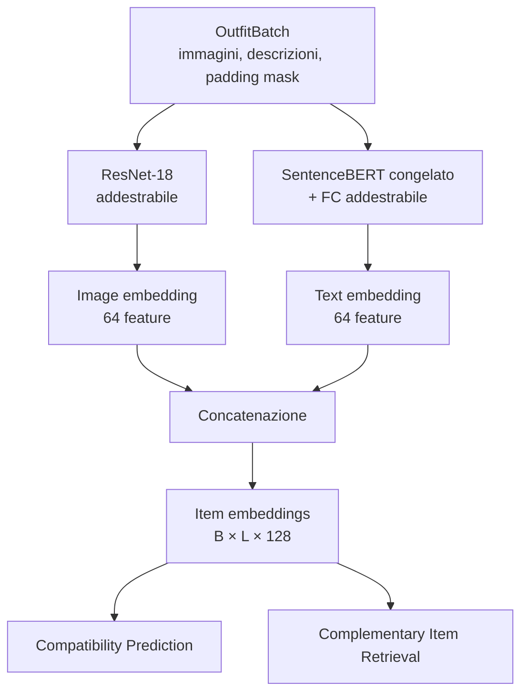
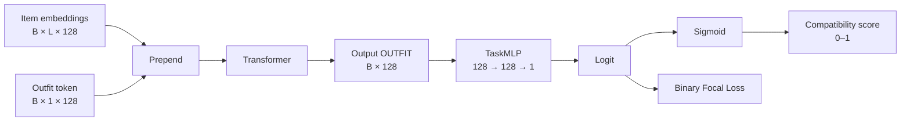
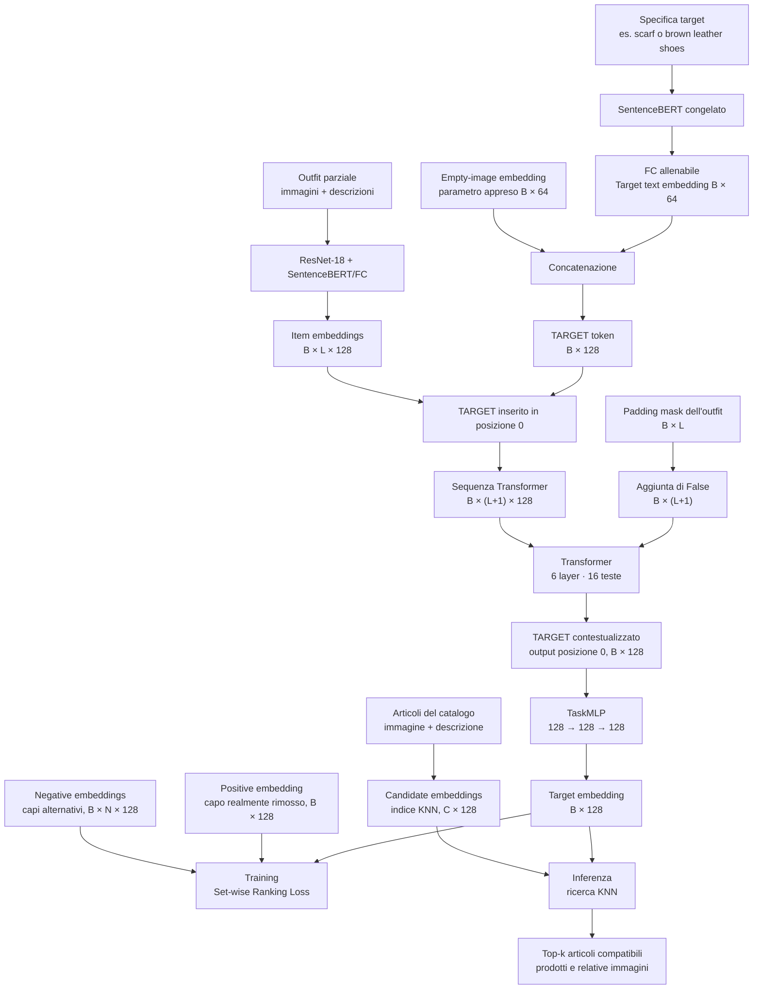

# OutfitTransformer

Implementazione PyTorch dell'architettura descritta nel paper
[OutfitTransformer: Learning Outfit Representations for Fashion Recommendation](https://openaccess.thecvf.com/content/WACV2023/html/Sarkar_OutfitTransformer_Learning_Outfit_Representations_for_Fashion_Recommendation_WACV_2023_paper.html).

Il progetto codifica immagini e descrizioni dei capi, usa self-attention per
modellare le relazioni nell'outfit e fornisce due task:

- **Compatibility Prediction (CP):** assegna un punteggio di compatibilità a un outfit;
- **Complementary Item Retrieval (CIR):** genera l'embedding di un capo compatibile
  con un outfit parziale.

## Indice

- [Stato del progetto](#stato-del-progetto)
- [Architettura comune](#architettura-comune)
  - [Item embedding](#item-embedding)
  - [Transformer](#transformer)
- [Compatibility Prediction](#compatibility-prediction)
- [Complementary Item Retrieval](#complementary-item-retrieval)
  - [Outfit parziale](#outfit-parziale)
  - [Flow del retrieval](#flow-del-retrieval)
  - [Target token e TaskMLP](#target-token-e-taskmlp)
  - [Positivi, negativi e ranking loss](#positivi-negativi-e-ranking-loss)
  - [Training e inferenza](#training-e-inferenza)
- [Dati e batching](#dati-e-batching)
  - [Manifest](#manifest)
  - [Padding mask](#padding-mask)
- [Struttura del progetto](#struttura-del-progetto)
- [Utilizzo](#utilizzo)
- [Test](#test)
- [Limiti attuali](#limiti-attuali)

## Stato del progetto

| Componente | Stato |
|---|---|
| ResNet-18 ImageNet → 64 feature | Implementato |
| SentenceBERT congelato + FC → 64 feature | Implementato |
| Item embedding multimodale da 128 feature | Implementato |
| Transformer, 6 layer e 16 teste | Implementato |
| Outfit token e compatibility score | Implementato |
| Binary Focal Loss | Implementata |
| Target item token e target embedding | Implementati |
| Set-wise ranking loss | Implementata |
| Training loop e optimizer | Non implementati |
| Costruzione automatica degli outfit parziali | Non implementata |
| Negative sampler e curriculum learning | Non implementati |
| Indicizzazione KNN e ricerca top-k | Non implementate |
| Training e valutazione su Polyvore | Non implementati |

Non viene usato positional encoding: l'outfit è trattato come un insieme
non ordinato.

## Architettura comune



Nel diagramma:

- `B` è il numero di outfit nel batch;
- `L` è il massimo numero di capi per outfit dopo il padding;
- ogni capo è rappresentato da 128 feature.

### Item embedding

Per ogni capo vengono unite informazioni visive e testuali:

```text
immagine ──> ResNet-18 ─────────> 64 feature ──┐
                                               ├──> item embedding: 128 feature
testo ─────> SentenceBERT + FC ─> 64 feature ──┘
```

```python
item_embedding = torch.cat(
    (image_embedding, text_embedding),
    dim=-1,
)
```

Prima del Transformer, le prime 64 feature sono visive e le successive 64
sono testuali. Dopo il Transformer le due modalità vengono mescolate dai layer
di attenzione e dalle proiezioni lineari.

### Transformer

Il Transformer usa:

```text
dimensione embedding: 128
layer:                 6
teste di attenzione:   16
positional encoding:   assente
```

Riceve gli item embedding e una padding mask. Le posizioni padded non
partecipano all'attenzione e vengono azzerate nell'output.

## Compatibility Prediction

L'encoder aggiunge un `outfit token` apprendibile davanti ai capi:

```text
[OUTFIT, capo 1, capo 2, ..., capo L]
```



L'output del token in posizione zero è la rappresentazione globale
dell'outfit. `TaskMLP` la trasforma in un singolo logit; la sigmoid produce il
punteggio di compatibilità.

```python
from model import BinaryFocalLoss, CompatibilityPredictor

model = CompatibilityPredictor()
output = model(
    batch.images,
    batch.descriptions,
    batch.padding_mask,
)
loss = BinaryFocalLoss()(output.logits, compatibility_labels)
```

## Complementary Item Retrieval

Il **Complementary Item Retrieval (CIR)** cerca nel catalogo un capo che:

1. appartenga alla categoria o rispetti la descrizione richiesta;
2. sia compatibile con l'intero outfit già disponibile.

Il modello non decide autonomamente quale categoria manca. La specifica del
target deve essere fornita dall'esterno, come categoria (`"scarf"`) o come
testo libero (`"red wool scarf"`). Per esempio, se l'utente ha già cinque capi
e vuole aggiungere una sciarpa, fornisce quei cinque capi come outfit parziale
e `"scarf"` come descrizione target.

Il risultato diretto di `ComplementaryItemRetriever` non è il nome di un
prodotto né un'immagine, ma un **target embedding**: una query numerica che
rappresenta il capo richiesto nel contesto di quello specifico outfit. Durante
l'inferenza, questo vettore deve essere confrontato tramite KNN con gli
embedding degli articoli del catalogo; gli articoli più vicini sono i
complementi restituiti all'utente.

È quindi utile distinguere tre elementi:

- **descrizione target:** ciò che si vuole cercare, fornito dall'utente o dal
  dataset;
- **target embedding:** la query contestualizzata generata dal Transformer;
- **candidate embedding:** la rappresentazione di un articolo reale del
  catalogo, calcolata a partire dalla sua immagine e descrizione.

### Outfit parziale

Un outfit parziale contiene i capi già conosciuti, ma non il capo che il
modello deve cercare. Serve come contesto: il target deve essere compatibile
con tutti i capi presenti, non soltanto con uno di essi.

```text
outfit completo: camicia, pantaloni, scarpe, borsa
capo target:     scarpe
outfit parziale: camicia, pantaloni, borsa
query:           "brown leather shoes"
```

La sua origine dipende dalla fase:

- **durante il training**, un futuro sampler dovrà scegliere un capo da un
  outfit completo. Il capo scelto diventa il positivo; tutti gli altri formano
  l'outfit parziale;
- **durante l'inferenza**, è composto direttamente dai capi già posseduti,
  indossati o selezionati dall'utente.

`ComplementaryItemRetriever` riceve un outfit già parziale. Non sceglie e non
rimuove automaticamente il capo target. Questa responsabilità appartiene al
futuro sampler o training loop, che non è ancora implementato.

Ogni capo dell'outfit parziale dispone sia dell'immagine sia della descrizione:

```text
capo conosciuto = immagine → 64 feature + testo → 64 feature
                                      ↓
                            item embedding: 128
```

Se il batch contiene `B` outfit e, dopo il padding, ogni outfit ha `L`
posizioni, gli item embedding hanno forma:

```text
[B, L, 128]
```

- `B`: numero di outfit elaborati insieme;
- `L`: massimo numero di capi tra gli outfit del batch;
- `128`: 64 feature immagine + 64 feature testo.

Per esempio, con due outfit di tre e due capi:

```text
Outfit 1: camicia, pantaloni, borsa
Outfit 2: maglia,  jeans,      PAD

B = 2
L = 3
item embeddings = [2, 3, 128]
```

### Flow del retrieval

Il diagramma seguente mostra sia il percorso comune che genera il target
embedding, sia i due usi successivi: la ranking loss durante il training e la
ricerca KNN durante l'inferenza.



Nel diagramma, `B` è il numero di outfit nel batch, `L` il massimo numero di
capi per outfit, `N` il numero di negativi per outfit e `C` il numero di
articoli indicizzati nel catalogo.

| Elemento | A cosa serve | Da dove deriva |
|---|---|---|
| **Outfit parziale** | Fornisce il contesto rispetto al quale scegliere un complemento. | Nel training deriva da un outfit completo privato del positivo; in inferenza dai capi posseduti o selezionati dall'utente. |
| **ResNet-18 + SentenceBERT/FC** | Trasformano rispettivamente immagine e descrizione di ciascun capo in feature numeriche. | Sono gli encoder condivisi definiti in `OutfitEncoder`; ResNet-18 parte da pesi ImageNet, SentenceBERT da un modello preaddestrato e la FC viene allenata. |
| **Item embeddings** | Rappresentano i capi conosciuti che il Transformer deve mettere in relazione. | Per ogni capo derivano dalla concatenazione di 64 feature visive e 64 testuali; il padding produce la forma `[B,L,128]`. |
| **Specifica target** | Indica che cosa cercare, per esempio la categoria `"scarf"` o una descrizione più precisa. Non viene predetta dal CIR. | Nel training deriva dalla categoria o descrizione del capo rimosso; in inferenza viene fornita dall'utente o da un eventuale sistema esterno. |
| **SentenceBERT congelato** | Estrae il significato semantico della specifica target. | È il backbone preaddestrato del `TextEncoder`; nel codice i suoi pesi non vengono aggiornati. |
| **FC allenabile / target text embedding** | Adatta le feature linguistiche al dominio e le porta a 64 dimensioni. | È la proiezione lineare del `TextEncoder`, applicata all'output di SentenceBERT e aggiornata durante il training. |
| **Empty-image embedding** | Occupa la metà visiva del target token quando l'immagine da trovare è ancora sconosciuta. | Nel codice è un unico parametro di 64 dimensioni, inizializzato casualmente, appreso dalla ranking loss ed espanso per i `B` outfit. |
| **Concatenazione** | Costruisce un token con la stessa dimensione degli item embedding. | Unisce le 64 feature dell'empty-image embedding alle 64 feature del testo target. |
| **TARGET token** | Agisce come punto di raccolta per la richiesta e per le informazioni provenienti da tutto l'outfit. | Deriva dalla concatenazione precedente e ha forma `[B,128]`. |
| **Inserimento in posizione 0** | Permette di riconoscere e recuperare il TARGET dopo la self-attention. | Il codice antepone un solo TARGET agli `L` item embedding, formando `[B,L+1,128]`. |
| **Padding mask** | Impedisce al Transformer di prestare attenzione alle posizioni PAD. | Deriva dal batching di outfit con lunghezze diverse; viene anteposto `False` perché il TARGET è sempre un token valido. |
| **Transformer** | Contestualizza il TARGET rispetto a tutti i capi e apprende relazioni di compatibilità oltre le singole coppie. | È l'`OutfitContextEncoder` condiviso; la configurazione predefinita usa 6 layer, 16 teste e feature da 128 dimensioni. |
| **TARGET contestualizzato** | Riassume contemporaneamente la richiesta testuale e l'intero outfit parziale. | È l'output del Transformer in posizione zero, cioè `contextual_embeddings[:, 0]`. |
| **TaskMLP** | Proietta il TARGET contestualizzato nello spazio in cui vengono confrontati query e candidati. | È la testa specifica del CIR, allenata insieme al resto del modello tramite la ranking loss. |
| **Target embedding** | È la query numerica finale usata per apprendere le distanze o interrogare il catalogo. | Deriva dall'output del `TaskMLP` e ha forma `[B,128]`. |
| **Positive embedding** | Durante il training indica al target embedding quale articolo deve avvicinare. | Deriva dal vero capo rimosso dall'outfit, codificato indipendentemente con `encode_candidates`. |
| **Negative embeddings** | Durante il training indicano quali articoli allontanare; il negativo più vicino alimenta anche il termine hard-negative. | Derivano dal sampler di capi alternativi e sono codificati con gli stessi encoder del positivo. |
| **Set-wise Ranking Loss** | Riduce la distanza dal positivo e aumenta quella da tutti i negativi e dal negativo più difficile. | Riceve target, positivo e negativi; esiste solo nel ramo di training. |
| **Candidate embeddings / indice KNN** | Rende possibile confrontare la query con molti prodotti senza rieseguire il Transformer per ogni candidato. | Ogni articolo del catalogo è codificato indipendentemente da immagine e testo tramite `encode_candidates`, poi inserito in un indice. |
| **Ricerca KNN e top-k** | Trova gli articoli più vicini al target embedding e restituisce i prodotti, quindi le loro immagini. | È il ramo di inferenza successivo al modello; indicizzazione e KNN fanno parte della pipeline descritta dal paper ma non sono ancora implementati nel repository. |

Il punto centrale è che il testo non viene trasformato direttamente
nell'immagine finale: testo target e outfit producono insieme un target
embedding; sarà la ricerca tra i candidate embedding a collegarlo agli
articoli reali del catalogo.

### Target token e TaskMLP

#### Perché il target usa soltanto il testo

La query descrive un solo capo mancante per ogni outfit, per esempio
`"brown leather shoes"`. Durante la ricerca conosciamo il testo richiesto, ma
non l'immagine: l'obiettivo del retrieval è proprio trovare quell'immagine nel
catalogo.

```text
Outfit 1 → una descrizione target → un target token
Outfit 2 → una descrizione target → un target token
...
Outfit B → una descrizione target → un target token
```

Per questo `target_descriptions` deve contenere esattamente una stringa per
ciascuno dei `B` outfit e il suo text embedding ha forma `[B,64]`.

L'uso del solo testo riguarda esclusivamente il target sconosciuto. I capi già
presenti nell'outfit parziale continuano a usare sia immagine sia testo.

#### Origine dell'empty-image embedding

Ogni item embedding normale contiene una metà visiva e una testuale:

```text
[image embedding: 64 | text embedding: 64] = 128 feature
```

Anche il target token deve avere 128 feature per poter entrare nello stesso
Transformer. Poiché l'immagine target non è disponibile, il codice crea un
parametro allenabile di 64 feature:

```python
self.empty_image_embedding = nn.Parameter(torch.empty(1, 64))
nn.init.normal_(self.empty_image_embedding, std=0.02)
```

Quindi l'empty-image embedding:

- non proviene da ResNet-18;
- non è una vera immagine vuota;
- non rimane necessariamente un vettore di zeri;
- viene inizializzato casualmente e aggiornato dalla ranking loss durante il
  training;
- rappresenta il segnaposto appreso per la parte visiva ancora sconosciuta.

Il parametro iniziale ha forma `[1,64]` ed è condiviso da tutte le query. Nel
forward viene espanso a `[B,64]`, senza creare parametri differenti per ogni
outfit:

```python
empty_image_embeddings = self.empty_image_embedding.expand(B, -1)
```

Il target token concatena il segnaposto visivo e la descrizione:

```text
target item token: 128 feature

┌───────────────────────────┬───────────────────────────┐
│ empty-image embedding: 64 │ target text embedding: 64 │
└───────────────────────────┴───────────────────────────┘
```

#### Perché la forma diventa `[B,L+1,128]`

Per ogni outfit viene aggiunto un solo target token davanti ai suoi `L` item
embedding:

```text
prima: [capo 1, capo 2, ..., capo L]         → L posizioni
dopo:  [TARGET, capo 1, capo 2, ..., capo L] → L + 1 posizioni
```

La dimensione delle feature rimane 128; cambia soltanto il numero di
posizioni:

```text
item embeddings:     [B, L,   128]
target token:        [B, 1,   128]
Transformer input:  [B, L+1, 128]
```

Riprendendo l'esempio precedente:

```text
[2, 3, 128] + un TARGET per outfit = [2, 4, 128]
```

Anche la padding mask riceve una posizione iniziale con valore `False`, perché
il target token è reale e deve partecipare all'attenzione.

#### Cosa significa output in posizione zero

Il Transformer restituisce una sequenza con la stessa disposizione
dell'input:

```text
input:  [TARGET, capo 1, capo 2, ..., capo L]
output: [TARGET', capo 1', capo 2', ..., capo L']
indice:     0       1       2             L
```

La posizione `0` non è il primo capo dell'outfit: è il token speciale `TARGET`
che era stato inserito all'inizio. Dopo la self-attention, `TARGET'` contiene:

```text
descrizione del capo cercato
+ informazioni da tutti i capi dell'outfit parziale
+ relazioni di compatibilità tra quei capi
```

Il codice lo seleziona con:

```python
contextual_target = contextual_embeddings[:, 0]
```

La forma è `[B,128]`: un target contestualizzato per ogni outfit.

Infine `TaskMLP` trasforma questo vettore nel target embedding usato dalla
ranking loss durante il training e dalla ricerca nel catalogo durante
l'inferenza:

```text
TARGET' [B,128] → TaskMLP → target embedding [B,128]
```

`TaskMLP` viene istanziato separatamente nei due task:

| Task | Input | Output | Funzione |
|---|---|---|---|
| Compatibility Prediction | Outfit embedding `[B,128]` | Logit `[B]` | Predice la compatibilità |
| Retrieval | Target token contestualizzato `[B,128]` | Target embedding `[B,128]` | Genera la query per la ricerca |

Nel retrieval `TaskMLP` non seleziona direttamente un prodotto e non predice
una classe.

### Positivi, negativi e ranking loss

Durante il training:

- il **positive embedding** rappresenta il vero capo rimosso dall'outfit;
- i **negative embeddings** rappresentano capi alternativi non compatibili;
- `encode_candidates()` codifica positivi, negativi e articoli del catalogo
  con ResNet-18 e SentenceBERT, senza passare dal Transformer.

```text
target embedding:    [B, 128]
positive embedding:  [B, 128]
negative embeddings: [B, N, 128]
```

La `SetWiseRankingLoss` è:

```text
L = L_All + L_Hard
```

- `L_All` confronta il target con tutti i negativi;
- `L_Hard` si concentra sul negativo più vicino;
- il margine predefinito è `2.0`.

L'obiettivo è avvicinare il target embedding al positivo e allontanarlo dai
negativi.

### Training e inferenza

```text
TRAINING
outfit completo
    ├── capo rimosso ───────────────> positive embedding
    └── outfit parziale + query ────> target embedding
negativi campionati ────────────────> negative embeddings
                                      ↓
                              SetWiseRankingLoss
```

```text
INFERENZA
outfit dell'utente + query
            ↓
    target embedding
            ↓
confronto con il catalogo
            ↓
       risultati top-k
```

Positivi, negativi e ranking loss sono usati solo durante il training.
L'indicizzazione del catalogo e la ricerca top-k non sono ancora implementate.

```python
from model import ComplementaryItemRetriever, SetWiseRankingLoss

model = ComplementaryItemRetriever()
output = model(
    batch.images,
    batch.descriptions,
    batch.padding_mask,
    target_descriptions,
)

loss = SetWiseRankingLoss(margin=2.0)(
    output.target_embedding,
    positive_embeddings,
    negative_embeddings,
)
```

## Dati e batching

### Manifest

`OutfitDataset` legge un manifest JSON:

```json
[
  {
    "outfit_id": "outfit-001",
    "items": [
      {
        "image": "outfit-001/top.jpg",
        "text": "white cotton shirt"
      },
      {
        "image": "outfit-001/trousers.jpg",
        "text": "navy tailored trousers"
      }
    ]
  }
]
```

I percorsi delle immagini sono relativi a `image_root`. Ogni immagine viene:

1. convertita in RGB;
2. ridimensionata a `224 × 224`;
3. convertita in tensor;
4. normalizzata con media e deviazione standard ImageNet.

Il manifest di esempio contiene percorsi dimostrativi: le immagini devono
essere fornite separatamente.

### Padding mask

Gli outfit possono contenere numeri diversi di capi, ma un batch PyTorch deve
avere una forma rettangolare. `collate_outfits()` usa quindi la lunghezza
dell'outfit più grande (`L`) e aggiunge posizioni `PAD` agli outfit più corti.

```text
Outfit 1: maglia   pantaloni   scarpe
Outfit 2: camicia  jeans       PAD
```

In questo esempio:

```text
B = 2 outfit
L = 3 posizioni per outfit
capi reali = 5
```

Il batch risultante contiene:

```text
images:        [2, 3, 3, 224, 224]
descriptions:  2 sequenze di testi
padding_mask:  [2, 3]
```

La padding mask ha un valore booleano per ogni posizione dell'outfit:

```python
padding_mask = [
    [False, False, False],
    [False, False, True],
]
```

```text
                     posizione 0  posizione 1  posizione 2
Outfit 1                    False        False        False
Outfit 2                    False        False         True
                                                       ↑
                                                     PAD
```

- `False` significa che la posizione contiene un capo reale;
- `True` significa che la posizione è padding e deve essere ignorata.

Un singolo valore della maschera controlla l'intero embedding da 128 feature:

```text
padding_mask[1, 2] = True
                    ↓
ignora item_embeddings[1, 2, :]
```

La maschera non modifica separatamente le singole feature.

#### Uso prima del Transformer

`OutfitEncoder.encode_items()` inverte la maschera per trovare i capi validi:

```python
valid_mask = ~padding_mask
```

Soltanto le cinque immagini e descrizioni reali dell'esempio vengono inviate a
ResNet-18 e SentenceBERT. La posizione `PAD` non viene codificata. Gli embedding
validi vengono poi reinseriti nella forma `[B, L, 128]`, lasciando un vettore di
zeri nella posizione padded:

```text
Outfit 2: [embedding camicia] [embedding jeans] [128 zeri]
```

Questo evita calcoli inutili e impedisce al padding di produrre feature
artificiali.

#### Uso nel Transformer

La stessa maschera viene passata al Transformer come
`src_key_padding_mask`. Le posizioni con valore `True` vengono escluse
dall'attenzione, quindi gli altri capi e i task token non usano il `PAD` come
informazione. Dopo il Transformer, le uscite padded vengono nuovamente
impostate a zero.

Quando viene aggiunto un task token, la maschera riceve una nuova posizione
iniziale con valore `False`, perché il token deve partecipare all'attenzione:

```text
mask originale:       [False, False, True]
con OUTFIT o TARGET:  [False, False, False, True]
                       ↑
                    task token
```

Per Compatibility Prediction è il token `OUTFIT`; per retrieval è il token
`TARGET`.

## Struttura del progetto

```text
data/
  batch.py              batch, padding e maschere
  dataset.py            lettura del manifest e delle immagini
  transforms.py         preprocessing ImageNet
  example_manifest.json formato di esempio
model/
  common/               componenti condivisi da CP e CIR
    config.py           configurazione del modello
    image_encoder.py    ResNet-18
    text_encoder.py     SentenceBERT + FC
    transformer_encoder.py
    outfit_encoder.py   item embedding, outfit token e self-attention
    heads.py            TaskMLP
    loss_reduction.py   riduzione comune delle loss
  cp/                   Compatibility Prediction
    compatibility.py    outfit embedding e compatibility score
    focal_loss.py       Binary Focal Loss
  cir/                  Complementary Item Retrieval
    retrieval.py        target token e target embedding
    ranking_loss.py     Set-wise ranking loss
tests/
  test_losses.py
  test_task_models.py
main.py                 esempio dell'encoder comune
```

I file `__init__.py` dei tre package e quello principale mantengono disponibili
gli import pubblici già usati nel progetto, per esempio:

```python
from model import (
    BinaryFocalLoss,
    CompatibilityPredictor,
    ComplementaryItemRetriever,
    OutfitEncoder,
    SetWiseRankingLoss,
)
```

## Utilizzo

Creazione dell'ambiente:

```powershell
python -m venv .venv
.\.venv\Scripts\Activate.ps1
python -m pip install --upgrade pip
python -m pip install -r requirements.txt
```

Esecuzione dell'esempio:

```powershell
python main.py
```

Il primo avvio scarica i pesi ImageNet e il checkpoint SentenceBERT. È
possibile usare un checkpoint SentenceBERT locale:

```powershell
python main.py --text-model "percorso/al/checkpoint"
```

Uso con `DataLoader`:

```python
from torch.utils.data import DataLoader
from data import OutfitDataset, collate_outfits

dataset = OutfitDataset(
    manifest_path="data/manifest.json",
    image_root="data/images",
)
loader = DataLoader(
    dataset,
    batch_size=8,
    shuffle=True,
    collate_fn=collate_outfits,
)
```

## Test

```powershell
python -m unittest discover -s tests -v
```

I test verificano:

- comportamento numerico delle loss;
- forme degli output;
- creazione e inserimento dei task token;
- validazione delle descrizioni target.

## Limiti attuali

Il repository implementa l'architettura e le loss, ma non una pipeline completa
di addestramento o retrieval. Mancano:

1. costruzione automatica degli outfit parziali;
2. selezione del positivo;
3. negative sampling e curriculum learning;
4. training CP e pretraining CP → CIR;
5. optimizer, scheduler e checkpoint;
6. indicizzazione del catalogo e ricerca KNN/top-k;
7. metriche CP, FITB e CIR;
8. integrazione con i dataset Polyvore.
