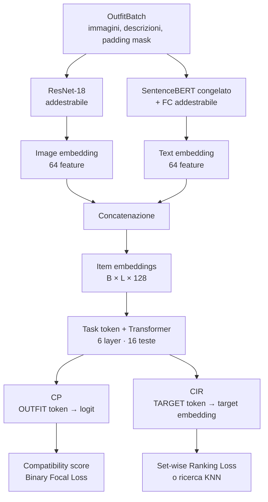

# OutfitTransformer

Implementazione PyTorch dell'architettura descritta nel paper
[OutfitTransformer: Learning Outfit Representations for Fashion Recommendation](https://openaccess.thecvf.com/content/WACV2023/html/Sarkar_OutfitTransformer_Learning_Outfit_Representations_for_Fashion_Recommendation_WACV_2023_paper.html).

Il progetto codifica immagini e descrizioni dei capi e usa self-attention per
modellare le relazioni all'interno di un outfit. Supporta due task:

- **Compatibility Prediction (CP):** assegna un punteggio di compatibilità a
  un outfit;
- **Complementary Item Retrieval (CIR):** genera l'embedding contestualizzato
  di un capo con cui interrogare un catalogo.

## Indice

- [Moduli e documentazione](#moduli-e-documentazione)
- [Quick start](#quick-start)
- [Architettura generale](#architettura-generale)
- [Uso dei modelli](#uso-dei-modelli)
- [Stato del progetto](#stato-del-progetto)
- [Struttura](#struttura)
- [Limiti attuali](#limiti-attuali)

## Moduli e documentazione

| Modulo | Responsabilità | Documentazione |
|---|---|---|
| `model/common` | ResNet-18, SentenceBERT, item embedding, Transformer e `TaskMLP` | [Architettura comune](model/common/README.md) |
| `model/cp` | Compatibility score e Binary Focal Loss | [Compatibility Prediction](model/cp/README.md) |
| `model/cir` | Target embedding e Set-wise Ranking Loss | [Complementary Item Retrieval](model/cir/README.md) |
| `data` | Polyvore, preprocessing, batch e padding mask | [Dati e batching](data/README.md) |
| `training` | Training CP, optimizer, scheduler e checkpoint | [Guida completa al training](training/README.md) |

## Quick start

### 1. Creare l'ambiente

```powershell
python -m venv .venv
.\.venv\Scripts\Activate.ps1
python -m pip install --upgrade pip
python -m pip install -r requirements.txt
```

### 2. Eseguire l'esempio

```powershell
python main.py
```

Il comando costruisce un outfit dimostrativo, esegue il modello CP e stampa
le forme di immagini, maschera, outfit embedding e score di compatibilità.
Per impostazione predefinita carica `checkpoints/cp_best.pt`.

Il modello SentenceBERT viene caricato dal percorso o dalla cache locale e,
se non è già disponibile, scaricato al primo avvio. Per vedere tutte le opzioni:

```powershell
python main.py --help
```

Esempi:

```powershell
# Forza l'esecuzione su CPU
python main.py --device cpu

# Usa CUDA
python main.py --device cuda

# Non scarica i pesi ImageNet di ResNet-18
python main.py --no-pretrained-image

# Usa un checkpoint SentenceBERT locale
python main.py --text-model "C:\modelli\sentence-bert"

# Carica un checkpoint CP addestrato
python main.py --checkpoint checkpoints\cp_best.pt

# Inferenza su una singola immagine
python main.py --images "C:\outfit\shirt.jpg"

# Inferenza su un outfit con più immagini e descrizioni
python main.py `
  --images "C:\outfit\shirt.jpg" "C:\outfit\trousers.jpg" "C:\outfit\shoes.jpg" `
  --descriptions "white cotton shirt" "navy trousers" "brown leather shoes"
```

`--no-pretrained-image` riguarda soltanto ResNet-18. Per evitare il download di
SentenceBERT è necessario passare un checkpoint già presente in locale.
I checkpoint passati con `--checkpoint` devono essere stati prodotti da
`train_cp.py`; se il training usava un modello SentenceBERT diverso dal
predefinito, occorre specificare lo stesso valore con `--text-model`.
`--images` accetta uno o più percorsi e li considera capi dello stesso outfit.
Ogni immagine viene convertita in RGB e preprocessata come nel training. Se
`--descriptions` viene omesso, le descrizioni sono ricavate dai nomi dei file.

#### GPU NVIDIA e AMD

Senza `--device`, `main.py` usa automaticamente `"cuda"` quando
`torch.cuda.is_available()` restituisce `True`; altrimenti usa la CPU.
Specificando esplicitamente `--device cuda`, invece, non esiste fallback: se
il backend GPU non è disponibile, PyTorch genera un errore.

Il nome `"cuda"` può indicare:

- una GPU NVIDIA con una build PyTorch CUDA;
- una GPU AMD supportata con una build PyTorch ROCm, perché
  [ROCm riutilizza intenzionalmente le API `torch.cuda`](https://docs.pytorch.org/docs/stable/notes/hip.html).

Possedere una GPU AMD non è quindi sufficiente: servono un modello supportato,
i driver e una build PyTorch ROCm compatibile. Su Windows il supporto ROCm è
limitato alle combinazioni elencate nella
[matrice ufficiale AMD](https://rocm.docs.amd.com/projects/radeon-ryzen/en/docs-7.0.2/docs/compatibility/compatibilityrad/windows/windows_compatibility.html).

Il backend DirectML usa invece un device creato da `torch_directml.device()` e
non viene rilevato come `"cuda"` dal codice attuale.

Per controllare il backend installato:

```powershell
python -c "import torch; print('GPU:', torch.cuda.is_available()); print('CUDA:', torch.version.cuda); print('ROCm/HIP:', torch.version.hip)"
```

- NVIDIA: `GPU=True` e `CUDA` valorizzato;
- AMD con ROCm: `GPU=True` e `ROCm/HIP` valorizzato;
- nessun backend compatibile: `GPU=False`, quindi conviene omettere
  `--device` oppure usare `--device cpu`.

### 3. Eseguire i test

```powershell
python -m unittest discover -s tests -v
```

È anche possibile eseguire le suite dei singoli task:

```powershell
python -m unittest tests.test_task_models.CompatibilityPredictorTests -v
python -m unittest tests.test_task_models.ComplementaryItemRetrieverTests -v
python -m unittest tests.test_losses -v
```

## Architettura generale



Per ogni capo, ResNet-18 genera 64 feature visive e SentenceBERT con una
proiezione FC genera 64 feature testuali. La concatenazione produce un item
embedding da 128 dimensioni.

Il Transformer:

- riceve un insieme di item embedding;
- non usa positional encoding, perché l'ordine dei capi non deve modificare il
  risultato;
- usa una padding mask per ignorare le posizioni vuote;
- raccoglie il contesto in un task token specifico per CP o CIR.

## Uso dei modelli

### Compatibility Prediction

```python
from model import BinaryFocalLoss, CompatibilityPredictor

model = CompatibilityPredictor()
output = model(
    batch.images,
    batch.descriptions,
    batch.padding_mask,
)
loss = BinaryFocalLoss()(output.logits, compatibility_labels)
scores = output.compatibility_score
```

La loss, le forme degli output e il flusso di training sono descritti nel
[README CP](model/cp/README.md).

### Complementary Item Retrieval

```python
from model import ComplementaryItemRetriever, SetWiseRankingLoss

model = ComplementaryItemRetriever()
output = model(
    batch.images,
    batch.descriptions,
    batch.padding_mask,
    target_descriptions,
)

loss = SetWiseRankingLoss(margin=2.0)(
    output.target_embedding,
    positive_embeddings,
    negative_embeddings,
)
```

La costruzione del target token, la ranking loss e la distinzione tra training
e inferenza sono descritte nel [README CIR](model/cir/README.md).

### Caricamento dei dati

```python
from torch.utils.data import DataLoader

from data import OutfitDataset, collate_outfits
from model import OutfitEncoder

dataset = OutfitDataset(
    manifest_path="data/manifest.json",
    image_root="data/images",
)
loader = DataLoader(
    dataset,
    batch_size=8,
    shuffle=True,
    collate_fn=collate_outfits,
)
encoder = OutfitEncoder()

for batch in loader:
    output = encoder(
        batch.images,
        batch.descriptions,
        batch.padding_mask,
    )
```

Il formato del manifest e la semantica della padding mask sono documentati nel
[README data](data/README.md).

### Training CP su Polyvore

Dopo avere ottenuto l'accesso al dataset gated e avere eseguito
`hf auth login`:

```powershell
pip install -r requirements.txt
python train_cp.py --variant nondisjoint --epochs 20 --batch-size 32
```

Lo script legge le label dai file ufficiali `compatibility_*.txt`, stampa
cache/dataset/progresso batch, valida a ogni epoca, salva un checkpoint per
epoca in `checkpoints/cp_epochs/` e salva il migliore in
`checkpoints/cp_best.pt`.

La valutazione sul test set è separata e viene eseguita soltanto su richiesta:

```powershell
python evaluate_cp.py `
  --variant disjoint `
  --checkpoint checkpoints\cp_best.pt
```

Il comando non aggiorna i pesi e stampa test loss, accuracy e numero di esempi.
Configurazione del loader e opzioni di training sono descritte nei
[dati Polyvore](data/README.md#come-prepariamo-polyvore-per-compatibility-prediction)
e nella [guida completa al training](training/README.md).

## Stato del progetto

| Componente | Stato |
|---|---|
| ResNet-18 ImageNet → 64 feature | Implementato |
| SentenceBERT congelato + FC → 64 feature | Implementato |
| Item embedding multimodale da 128 feature | Implementato |
| Transformer, 6 layer e 16 teste | Implementato |
| Outfit token e compatibility score | Implementato |
| Binary Focal Loss | Implementata |
| Target item token e target embedding | Implementati |
| Set-wise Ranking Loss | Implementata |
| Training loop CP, ADAM, scheduler e checkpoint | Implementati |
| Costruzione automatica degli outfit parziali | Non implementata |
| Negative sampler e curriculum learning | Non implementati |
| Indicizzazione KNN e ricerca top-k | Non implementate |
| Loader e training CP su Polyvore | Implementati |

## Struttura

```text
data/
  README.md             Polyvore, esempi, forme e batching
  batch.py              batch e maschere
  transforms.py         preprocessing ImageNet
  manifest_loader/
    README.md           guida del loader JSON generico
    dataset.py          lettura del manifest locale
    example_manifest.json
  polyvore_loader/
    README.md           guida del loader Polyvore CP
    dataset.py          Parquet, compatibility e metadati
model/
  common/
    README.md           architettura condivisa
    image_encoder.py    ResNet-18
    text_encoder.py     SentenceBERT + FC
    outfit_encoder.py   item embedding e Transformer
  cp/
    README.md           Compatibility Prediction
    compatibility.py    compatibility score
    focal_loss.py       Binary Focal Loss
  cir/
    README.md           Complementary Item Retrieval
    retrieval.py        target e candidate embedding
    ranking_loss.py     Set-wise Ranking Loss
tests/
  test_cp_training.py
  test_losses.py
  test_polyvore_dataset.py
  test_task_models.py
main.py                 esempio dell'encoder comune
train_cp.py             training CP su Polyvore
training/
  README.md             comandi e iperparametri del training CP
  cp.py                 epoche, metriche e checkpoint CP
requirements.txt
```

Gli import pubblici sono esposti dal package `model`:

```python
from model import (
    BinaryFocalLoss,
    CompatibilityPredictor,
    ComplementaryItemRetriever,
    OutfitEncoder,
    OutfitEncoderConfig,
    SetWiseRankingLoss,
)
```

## Limiti attuali

Il repository include ora la pipeline di training CP; la pipeline CIR e le
metriche benchmark complete non sono ancora implementate. Mancano:

1. costruzione automatica degli outfit parziali;
2. selezione del positivo;
3. negative sampling e curriculum learning;
4. trasferimento del checkpoint CP al training CIR;
5. indicizzazione del catalogo e ricerca KNN/top-k;
6. metriche AUC CP, FITB e CIR.
