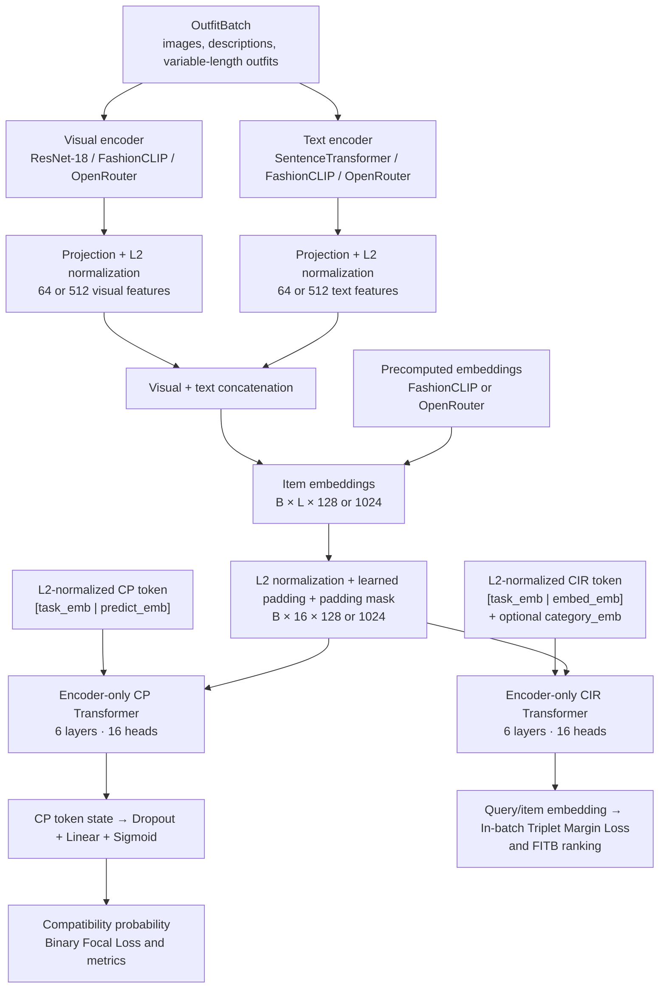
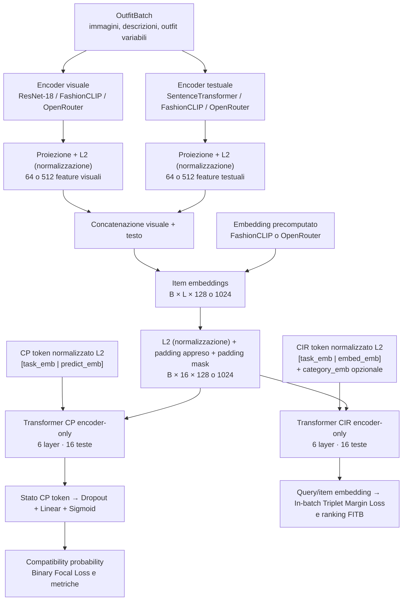

> [!NOTE]
> This README is available in English below and in [Italian / italiano](#versione-italiana).
> La [versione italiana](#versione-italiana) si trova nella seconda parte del documento.

# OutfitTransformer

## English

A project for representing multimodal outfits, estimating their compatibility,
and learning embeddings for complementary item retrieval.

> [!TIP]
> Model weights are available on Hugging Face:
> [FlorindoDev/OutfitTransformer-weights](https://huggingface.co/FlorindoDev/OutfitTransformer-weights).

### Contents

- [Results](#results)
- [Overview](#overview)
- [Modules](#modules)
- [Architecture](#architecture)
- [Environment setup](#environment-setup)
  - [Windows PowerShell](#windows-setup-powershell)
  - [Linux and macOS](#linux-and-macos)
- [Local dataset](#local-dataset)
- [Embedding precomputation](#embedding-precomputation)
- [CP training](#cp-training)
- [CIR training](#cir-training)
- [CP evaluation](#cp-evaluation)
- [CIR evaluation](#cir-evaluation)
- [Italian version](#versione-italiana)

### Results

Results from the reports in [`results/`](results/), using Polyvore
(`mvasil/polyvore-outfits`), the `nondisjoint` subset, the `test` split, and
precomputed embeddings. Metric values are on a 0–1 scale, rounded to four
decimal places; — means the metric does not apply to that task.

| Metric / run detail | CP ([report](results/cp.json)) | CIR FITB ([report](results/cir_validation.json)) |
|---|---:|---:|
| Checkpoint epoch | 76 | 19 |
| Evaluated examples | 20000 | 10000 |
| Accuracy | 0.8478 | — |
| Precision | 0.9489 | — |
| Recall | 0.7352 | — |
| F1 | 0.8285 | — |
| ROC AUC | 0.9513 | — |
| FITB accuracy | — | 0.6807 |
| MRR | — | 0.8169 |
| Recall@2 | — | 0.8782 |

CP uses a classification threshold of `0.5`. CIR uses the `polyvore_fitb`
protocol, Euclidean distance, pessimistic tie handling, and no category embedding.
Despite its filename, `cir_validation.json` records `"split": "test"`;
the CIR results above therefore refer to the test split.

### Overview

The project reads fashion item images and descriptions, creates multimodal
embeddings, and uses task-specific Transformers without positional embeddings
for variable-length outfits. CP assigns a compatibility score; CIR produces
embeddings for partial outfits and positive items and includes Triplet Loss,
training, FITB metrics, checkpoints, and plots. CIR evaluation over the full
catalog is not implemented yet.

For component details and responsibilities, see the [model overview](model/README.md)
and [data pipeline](data/README.md).

### Modules

| Module | Responsibility | Documentation |
|---|---|---|
| `preprocessing` | Isolates garments, cleans backgrounds, and prepares user images. | [README](preprocessing/README.md) |
| `data` | Defines types, transforms, collate functions, and DataLoaders. | [README](data/README.md) |
| `data/polyvore` | Downloads and parses Polyvore images, metadata, and annotations. | [README](data/polyvore/README.md) |
| `evaluation` | Evaluates CP and CIR (FITB) checkpoints on test or validation splits and saves aggregate metrics. | [README](evaluation/README.md) |
| `model` | Exposes the shared architecture and task-specific modules. | [README](model/README.md) |
| `model/common` | Creates, normalizes, and organizes shared multimodal embeddings. | [README](model/common/README.md) |
| `model/cp` | Predicts overall outfit compatibility. | [README](model/cp/README.md) |
| `model/CIR` | Produces partial-outfit and item embeddings and defines the CIR loss. | [README](model/CIR/README.md) |
| `training` | Trains CP and CIR with runtime inputs or precomputed embeddings and manages validation, checkpoints, and plots. | [README](training/README.md) |
| `metrics` | Computes reusable training and evaluation metrics. | [README](metrics/README.md) |

### Architecture


```mermaid
flowchart TD
    A["OutfitBatch<br/>images, descriptions, variable-length outfits"]

    A --> B["Visual encoder<br/>ResNet-18 / FashionCLIP / OpenRouter"]
    A --> C["Text encoder<br/>SentenceTransformer / FashionCLIP / OpenRouter"]

    B --> D["Projection + L2 normalization<br/>64 or 512 visual features"]
    C --> E["Projection + L2 normalization<br/>64 or 512 text features"]

    D --> F["Visual + text concatenation"]
    E --> F

    F --> G["Item embeddings<br/>B × L × 128 or 1024"]
    P["Precomputed embeddings<br/>FashionCLIP or OpenRouter"] --> G
    G --> H["L2 normalization + learned padding + padding mask<br/>B × 16 × 128 or 1024"]

    K["L2-normalized CP token<br/>[task_emb | predict_emb]"] --> L["Encoder-only CP Transformer<br/>6 layers · 16 heads"]
    H --> L
    L --> M["CP token state → Dropout + Linear + Sigmoid"]
    M --> N["Compatibility probability<br/>Binary Focal Loss and metrics"]

    O["L2-normalized CIR token<br/>[task_emb | embed_emb]<br/>+ optional category_emb"] --> Q["Encoder-only CIR Transformer<br/>6 layers · 16 heads"]
    H --> Q
    Q --> R["Query/item embedding → In-batch Triplet Margin Loss<br/>and FITB ranking"]
```

For details on the internal flow, see [shared embeddings](model/common/README.md),
the [CP model](model/cp/README.md), the [CIR model](model/CIR/README.md), and
[metrics](metrics/README.md).

### Environment setup

Run these commands from the project root.

#### Windows setup (PowerShell)

Create and activate the environment:

```powershell
py -m venv .venv
.\.venv\Scripts\Activate.ps1
python -m pip install --upgrade pip
python -m pip install -r requirements.txt
```

#### Linux and macOS

Create and activate the environment:

```bash
python3 -m venv .venv
source .venv/bin/activate
python -m pip install --upgrade pip
python -m pip install -r requirements.txt
```

Polyvore requires an authorized Hugging Face account. Once dataset access has
been granted, save your token locally:

```bash
hf auth login
```

See the [scripts guide](scripts/README.md) for commands available after setup.
Authentication and Polyvore resource resolution are described in the
[dataset guide](data/polyvore/README.md).

### Local dataset

Download the full Polyvore dataset to the default folder:

PowerShell:

```powershell
python -m scripts.download_polyvore
```

Linux (Bash):

```bash
python -m scripts.download_polyvore
```

Each command first looks for Polyvore in `datasets/polyvore-outfits/`, then
in the Hugging Face cache, and downloads only missing resources. The local
folder must mirror the dataset repository structure.

Use `--dataset-root` to choose a different path. Partial local datasets are
supported: remote fallback applies only to missing files.

For details, see the [data pipeline](data/README.md), [Polyvore format and
loading](data/polyvore/README.md), and [downloader flags](scripts/README.md#download-polyvore).

### Embedding precomputation

Precomputation uses the FashionCLIP visual and text towers by default. With
`--openrouter`, it can use a remote multimodal embedding model selected through
`--model-name`; the API key is read from `OPENROUTER_API_KEY`. Both outputs are
L2-normalized, concatenated, and saved in `.pt` shards associated with `item_id`
values. During training, both caches use `--precomputed`; select the cache with
`--embedding-root`.

PowerShell:

```powershell
python -m scripts.precompute_embeddings --subset nondisjoint --split validation
python -m scripts.precompute_embeddings --subset nondisjoint --split train
```

Linux (Bash):

```bash
python -m scripts.precompute_embeddings --subset nondisjoint --split validation
python -m scripts.precompute_embeddings --subset nondisjoint --split train
```

Repeat with `--split test` to prepare the evaluation split as well. Outputs
are created under `precomputed_embeddings/`. An existing cache is only
replaced when `--overwrite` is explicitly provided.

For details, see [multimodal precomputation](scripts/README.md#precomputazione-multimodale),
the [embedding format](scripts/README.md#contenuto-degli-shard), [CP training
usage](training/CP/README.md#preparazione-embedding), and [CIR training
usage](training/CIR/README.md#preparazione-embedding).

### CP training

After preparing the `train` and `validation` embeddings, start the precomputed
profile:

PowerShell:

```powershell
python -m training.CP.train_cp --precomputed
```

Linux and macOS:

```bash
python -m training.CP.train_cp --precomputed
```

Training saves the configuration, checkpoints, best model, and plots under
`checkpoints/`. To choose between `classic`, `new_classic`, and `precomputed`,
configure hyperparameters, or resume from existing weights, see the
[training overview](training/README.md) and [full CP guide](training/CP/README.md).
For the head architecture, see the [CP model](model/cp/README.md).

### CIR training

After preparing the `train` and `validation` embeddings, start precomputed CIR
training. Training samples a random item from each complete outfit on every
access, including when using cached features; validation uses fixed FITB questions:

PowerShell:

```powershell
python -m training.CIR.train_cir `
  --precomputed `
  --checkpoint-dir checkpoints/nondisjoint/cir_precomputed `
  --pretrained-cp checkpoints/nondisjoint/cp_precomputed/best.pt
```

Linux and macOS:

```bash
python -m training.CIR.train_cir \
  --precomputed \
  --checkpoint-dir checkpoints/nondisjoint/cir_precomputed \
  --pretrained-cp checkpoints/nondisjoint/cp_precomputed/best.pt
```

> [!NOTE]
> The file passed to `--pretrained-cp` must be a CP checkpoint with the same
> feature profile. It loads `common.padding_embedding`, the `common.*` encoders
> and projections present in raw profiles, as well as
> `cp.task_embedding.embedding` into `cir.task_embedding.embedding` and all
> `cp.encoder.layers.*` layers into `cir.encoder.layers.*`. The full Transformer
> is therefore transferred even with `--precomputed`.
> `cp.predict_emb` and `cp.head.*` remain specific to classification;
> `embed_emb`, the category embedding, and the retrieval head are initialized in CIR.
> For older CP checkpoints, only the two weights of the removed final LayerNorm
> (`cp.encoder.norm.*`) are ignored, with a console message.
> `--resume` requires a CIR checkpoint compatible with the new architecture.
> See the [CIR README](training/CIR/README.md#inizializzazione-da-cp-e-resume) for details.

Add `--category-emb` to condition queries on the missing item's category.
The best checkpoint is always selected using `val_fitb_accuracy`; validation
also records `val_mrr` and `val_recall@2`. For flags, DDP, mixed precision,
and artifacts, see the [full CIR guide](training/CIR/README.md).

### CP evaluation

First prepare embeddings for the `test` split when the checkpoint uses
precomputed inputs, then run evaluation:

PowerShell:

```powershell
python -m scripts.precompute_embeddings `
  --subset nondisjoint `
  --split test

python -m evaluation.CP.evaluate_cp `
  --checkpoint checkpoints/nondisjoint/cp_precomputed/best.pt
```

Linux (Bash):

```bash
python -m scripts.precompute_embeddings \
  --subset nondisjoint \
  --split test

python -m evaluation.CP.evaluate_cp \
  --checkpoint checkpoints/nondisjoint/cp_precomputed/best.pt
```

The command infers the dataset, subset, feature mode, and architecture from
the checkpoint. It saves accuracy, precision, recall, F1, and ROC AUC under
`results/cp/`.

For details, see the [evaluation overview](evaluation/README.md),
[CP evaluation guide](evaluation/CP/README.md), and [metric definitions](metrics/README.md).

### CIR evaluation

Evaluate the checkpoint on the official Fill-in-the-Blank queries from the
`test` split, using the cache for that split when the model is precomputed.

PowerShell:

```powershell
python -m evaluation.CIR.evaluate_cir `
  --checkpoint checkpoints/nondisjoint/cir_precomputed/best.pt
```

Linux (Bash):

```bash
python -m evaluation.CIR.evaluate_cir \
  --checkpoint checkpoints/nondisjoint/cir_precomputed/best.pt
```

The command infers the architecture, categories, and feature mode from the
checkpoint. It saves FITB accuracy, MRR, and Recall@2 under `results/cir/`.
Use `--split validation` to evaluate the validation split, or `--output` to
change the report location. For the protocol, comparisons with the paper and
repository, and flags, see the [CIR evaluation guide](evaluation/CIR/README.md).

---

## Versione italiana

[Back to English / Torna alla versione inglese](#english)

Progetto per rappresentare outfit multimodali, stimarne la compatibilità e
apprendere embedding per il retrieval di articoli complementari.

> [!TIP]
> I pesi del modello sono disponibili su Hugging Face:
> [FlorindoDev/OutfitTransformer-weights](https://huggingface.co/FlorindoDev/OutfitTransformer-weights).

### Indice

- [Risultati](#risultati)
- [Panoramica](#panoramica)
- [Moduli](#moduli)
- [Architettura generale](#architettura-generale)
- [Creazione dell'ambiente](#creazione-dellambiente)
  - [Windows PowerShell](#windows-powershell)
  - [Linux e macOS](#linux-e-macos)
- [Dataset locale](#dataset-locale)
- [Precomputazione degli embedding](#precomputazione-degli-embedding)
- [Addestramento CP](#addestramento-cp)
- [Addestramento CIR](#addestramento-cir)
- [Valutazione CP](#valutazione-cp)
- [Valutazione CIR](#valutazione-cir)

### Risultati

Risultati dei report nella cartella [`results/`](results/), ottenuti su Polyvore
(`mvasil/polyvore-outfits`), subset `nondisjoint`, split `test`, con embedding
precomputati. Le metriche sono espresse su scala 0–1 e arrotondate a quattro
cifre decimali; — indica una metrica non applicabile al task.

| Metrica / dettaglio esecuzione | CP ([report](results/cp.json)) | CIR FITB ([report](results/cir_validation.json)) |
|---|---:|---:|
| Epoca del checkpoint | 76 | 19 |
| Esempi valutati | 20000 | 10000 |
| Accuracy | 0.8478 | — |
| Precision | 0.9489 | — |
| Recall | 0.7352 | — |
| F1 | 0.8285 | — |
| ROC AUC | 0.9513 | — |
| FITB accuracy | — | 0.6807 |
| MRR | — | 0.8169 |
| Recall@2 | — | 0.8782 |

CP usa una soglia di classificazione di `0.5`. CIR usa il protocollo
`polyvore_fitb`, distanza euclidea, gestione pessimistica dei pareggi e nessun
category embedding. Nonostante il nome, `cir_validation.json` riporta
`"split": "test"`: i risultati CIR in tabella si riferiscono quindi allo split test.

### Panoramica

Il progetto legge immagini e descrizioni di articoli fashion, crea embedding
multimodali e usa Transformer specifici senza positional embedding per i task
su outfit di lunghezza variabile. Il task CP assegna uno score di compatibilità;
il modulo CIR produce embedding per outfit parziali e item positivi e include
Triplet Loss, training, metriche FITB, checkpoint e grafici. Evaluation CIR su
catalogo completo non è ancora implementata.

Per approfondire componenti e responsabilità: [panoramica del modello](model/README.md)
e [pipeline dei dati](data/README.md).

### Moduli

| Modulo | Responsabilità | Documentazione |
|---|---|---|
| `preprocessing` | Isola il capo, pulisce lo sfondo e prepara immagini utente. | [README](preprocessing/README.md) |
| `data` | Definisce tipi, transform, collate e DataLoader. | [README](data/README.md) |
| `data/polyvore` | Scarica e interpreta immagini, metadata e annotazioni Polyvore. | [README](data/polyvore/README.md) |
| `evaluation` | Valuta checkpoint CP e CIR (FITB) su test o validation e salva metriche globali. | [README](evaluation/README.md) |
| `model` | Espone architettura comune e moduli specifici dei task. | [README](model/README.md) |
| `model/common` | Crea, normalizza e organizza gli embedding multimodali condivisi. | [README](model/common/README.md) |
| `model/cp` | Predice la compatibilità complessiva di un outfit. | [README](model/cp/README.md) |
| `model/CIR` | Produce embedding di outfit parziali e item e definisce la loss CIR. | [README](model/CIR/README.md) |
| `training` | Allena CP e CIR con input runtime o embedding precomputati e gestisce validazione, checkpoint e grafici. | [README](training/README.md) |
| `metrics` | Calcola metriche riutilizzabili per training e valutazione. | [README](metrics/README.md) |


### Architettura generale


```mermaid
flowchart TD
    A["OutfitBatch<br/>immagini, descrizioni, outfit variabili"]

    A --> B["Encoder visuale<br/>ResNet-18 / FashionCLIP / OpenRouter"]
    A --> C["Encoder testuale<br/>SentenceTransformer / FashionCLIP / OpenRouter"]

    B --> D["Proiezione + L2 (normalizzazione)<br/>64 o 512 feature visuali"]
    C --> E["Proiezione + L2 (normalizzazione)<br/>64 o 512 feature testuali"]

    D --> F["Concatenazione visuale + testo"]
    E --> F

    F --> G["Item embeddings<br/>B × L × 128 o 1024"]
    P["Embedding precomputato<br/>FashionCLIP o OpenRouter"] --> G
    G --> H["L2 (normalizzazione) + padding appreso + padding mask<br/>B × 16 × 128 o 1024"]

    K["CP token normalizzato L2<br/>[task_emb | predict_emb]"] --> L["Transformer CP encoder-only<br/>6 layer · 16 teste"]
    H --> L
    L --> M["Stato CP token → Dropout + Linear + Sigmoid"]
    M --> N["Compatibility probability<br/>Binary Focal Loss e metriche"]

    O["CIR token normalizzato L2<br/>[task_emb | embed_emb]<br/>+ category_emb opzionale"] --> Q["Transformer CIR encoder-only<br/>6 layer · 16 teste"]
    H --> Q
    Q --> R["Query/item embedding → In-batch Triplet Margin Loss<br/>e ranking FITB"]
```

Per approfondire il flusso interno: [embedding common](model/common/README.md),
[modello CP](model/cp/README.md), [modello CIR](model/CIR/README.md) e
[metriche](metrics/README.md).

### Creazione dell'ambiente

Eseguire i comandi dalla cartella principale del progetto.

#### Windows PowerShell

Creazione ambiente:

```powershell
py -m venv .venv
.\.venv\Scripts\Activate.ps1
python -m pip install --upgrade pip
python -m pip install -r requirements.txt
```

#### Linux e macOS

Creazione ambiente:

```bash
python3 -m venv .venv
source .venv/bin/activate
python -m pip install --upgrade pip
python -m pip install -r requirements.txt
```

Polyvore richiede un account Hugging Face autorizzato. Dopo aver ottenuto
l'accesso al dataset, salvare il token localmente:

```bash
hf auth login
```

Per i comandi disponibili dopo il setup: [guida degli script](scripts/README.md).
Autenticazione e risoluzione delle risorse Polyvore sono descritte nella
[guida del dataset](data/polyvore/README.md).

### Dataset locale

Scaricare intero dataset Polyvore nella cartella predefinita:

PowerShell:

```powershell
python -m scripts.download_polyvore
```

Linux (Bash):

```bash
python -m scripts.download_polyvore
```

Ogni comando cerca prima Polyvore in `datasets/polyvore-outfits/`, poi nella
cache Hugging Face e scarica soltanto le risorse ancora mancanti. La cartella
locale deve replicare la struttura del repository dataset.

Per un percorso diverso, passare `--dataset-root`. I file locali possono
essere parziali: fallback remoto riguarda solo quelli assenti.

Per approfondire: [pipeline dati](data/README.md), [formato e caricamento
Polyvore](data/polyvore/README.md) e [flag del downloader](scripts/README.md#download-polyvore).

### Precomputazione degli embedding

La precomputazione usa per default le tower visuale e testuale FashionCLIP. Con
`--openrouter` può usare un modello embedding multimodale remoto scelto tramite
`--model-name`; la chiave viene letta da `OPENROUTER_API_KEY`. I due output
vengono normalizzati L2, concatenati e salvati in shard `.pt` associati agli
`item_id`. Nel training entrambe le cache usano `--precomputed`; la cache viene
scelta con `--embedding-root`.

PowerShell:

```powershell
python -m scripts.precompute_embeddings --subset nondisjoint --split validation
python -m scripts.precompute_embeddings --subset nondisjoint --split train
```

Linux (Bash):

```bash
python -m scripts.precompute_embeddings --subset nondisjoint --split validation
python -m scripts.precompute_embeddings --subset nondisjoint --split train
```

Ripetere con `--split test` per preparare anche lo split di valutazione. Gli
output vengono creati sotto `precomputed_embeddings/`. Una cache esistente non
viene sostituita senza l'opzione esplicita `--overwrite`.

Per approfondire: [precomputazione multimodale](scripts/README.md#precomputazione-multimodale),
[formato degli embedding](scripts/README.md#contenuto-degli-shard), [uso nel
training CP](training/CP/README.md#preparazione-embedding) e [uso nel training
CIR](training/CIR/README.md#preparazione-embedding).

### Addestramento CP

Dopo aver preparato gli embedding `train` e `validation`, avviare il profilo
precomputed:

PowerShell:

```powershell
python -m training.CP.train_cp --precomputed
```

Linux e macOS:

```bash
python -m training.CP.train_cp --precomputed
```

Il training salva configurazione, checkpoint, best model e grafici sotto
`checkpoints/`. Per scegliere tra `classic`, `new_classic` e `precomputed`,
configurare iperparametri o riprendere pesi esistenti: [panoramica training](training/README.md)
e [guida completa CP](training/CP/README.md). Architettura della testa:
[modello CP](model/cp/README.md).

### Addestramento CIR

Dopo aver preparato embedding `train` e `validation`, avviare CIR precomputed.
Il training sceglie un capo casuale da ogni outfit completo a ogni accesso,
anche con cache di feature; la validation usa domande FITB fisse:

PowerShell:

```powershell
python -m training.CIR.train_cir `
  --precomputed `
  --checkpoint-dir checkpoints/nondisjoint/cir_precomputed `
  --pretrained-cp checkpoints/nondisjoint/cp_precomputed/best.pt
```

Linux e macOS:

```bash
python -m training.CIR.train_cir \
  --precomputed \
  --checkpoint-dir checkpoints/nondisjoint/cir_precomputed \
  --pretrained-cp checkpoints/nondisjoint/cp_precomputed/best.pt
```

> [!NOTE]
> Il file passato a `--pretrained-cp` deve essere un checkpoint CP con lo
> stesso profilo di feature. Carica `common.padding_embedding`, encoder e
> proiezioni `common.*` presenti nei profili raw, più
> `cp.task_embedding.embedding` in `cir.task_embedding.embedding` e tutti i
> layer `cp.encoder.layers.*` in `cir.encoder.layers.*`. Anche con
> `--precomputed` trasferisce quindi il Transformer completo.
> `cp.predict_emb` e `cp.head.*` restano specifici della classificazione;
> `embed_emb`, category embedding e testa retrieval nascono nel CIR.
> Dei vecchi checkpoint CP vengono ignorati soltanto i due pesi della LayerNorm
> finale rimossa (`cp.encoder.norm.*`), con un messaggio in console.
> `--resume` richiede invece un checkpoint CIR compatibile con la nuova
> architettura. Dettagli nel [README CIR](training/CIR/README.md#inizializzazione-da-cp-e-resume).

Per condizionare query sulla categoria del capo mancante, aggiungere
`--category-emb`. Best checkpoint usa sempre `val_fitb_accuracy`; validation
registra anche `val_mrr` e `val_recall@2`. Flag, DDP, mixed precision e
artefatti: [guida completa CIR](training/CIR/README.md).

### Valutazione CP

Preparare prima embedding dello split `test` quando checkpoint usa input
precomputati, poi avviare evaluation:

PowerShell:

```powershell
python -m scripts.precompute_embeddings `
  --subset nondisjoint `
  --split test

python -m evaluation.CP.evaluate_cp `
  --checkpoint checkpoints/nondisjoint/cp_precomputed/best.pt
```

Linux (Bash):

```bash
python -m scripts.precompute_embeddings \
  --subset nondisjoint \
  --split test

python -m evaluation.CP.evaluate_cp \
  --checkpoint checkpoints/nondisjoint/cp_precomputed/best.pt
```

Comando ricava dataset, subset, modalità feature e architettura dal checkpoint.
Salva accuracy, precision, recall, F1 e ROC AUC sotto `results/cp/`.

Per approfondire: [panoramica evaluation](evaluation/README.md), [guida
evaluation CP](evaluation/CP/README.md) e [definizione delle metriche](metrics/README.md).

### Valutazione CIR

Valuta il checkpoint sulle query Fill-in-the-Blank ufficiali dello split
`test`, usando la cache dello stesso split se il modello è precomputed.

PowerShell:

```powershell
python -m evaluation.CIR.evaluate_cir `
  --checkpoint checkpoints/nondisjoint/cir_precomputed/best.pt
```

Linux (Bash):

```bash
python -m evaluation.CIR.evaluate_cir \
  --checkpoint checkpoints/nondisjoint/cir_precomputed/best.pt
```

Il comando ricava architettura, categorie e modalità feature dal checkpoint.
Salva FITB accuracy, MRR e Recall@2 sotto `results/cir/`. Per valutare validation,
passare `--split validation`; per spostare il report, usare `--output`.
Protocollo, confronto con paper/repo e flag nella
[guida evaluation CIR](evaluation/CIR/README.md).
