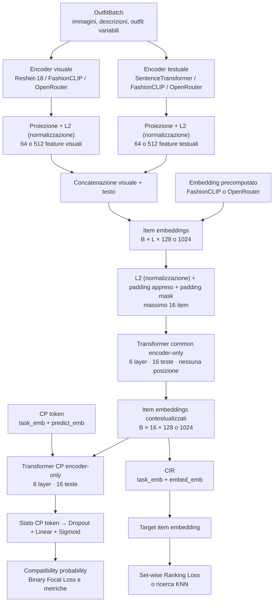

# OutfitTransformer

Progetto per rappresentare outfit multimodali, stimarne la compatibilità e
apprendere embedding per il retrieval di articoli complementari.

## Indice

- [Panoramica](#panoramica)
- [Moduli](#moduli)
- [Architettura generale](#architettura-generale)
- [Creazione dell'ambiente](#creazione-dellambiente)
  - [Windows PowerShell](#windows-powershell)
  - [Linux e macOS](#linux-e-macos)
- [Dataset locale](#dataset-locale)
- [Precomputazione degli embedding](#precomputazione-degli-embedding)
- [Addestramento CP](#addestramento-cp)
- [Valutazione CP](#valutazione-cp)

## Panoramica

Il progetto legge immagini e descrizioni di articoli fashion, crea embedding
multimodali e usa un Transformer senza positional embedding per rappresentare
outfit di lunghezza variabile. Il task CP assegna uno score di compatibilità;
il modulo CIR produce embedding per outfit parziali e item positivi e include
la loss di retrieval. Training ed evaluation CIR non sono ancora implementati.

Per approfondire componenti e responsabilità: [panoramica del modello](model/README.md)
e [pipeline dei dati](data/README.md).

## Moduli

| Modulo | Responsabilità | Documentazione |
|---|---|---|
| `preprocessing` | Isola il capo, pulisce lo sfondo e prepara immagini utente. | [README](preprocessing/README.md) |
| `data` | Definisce tipi, transform, collate e DataLoader. | [README](data/README.md) |
| `data/polyvore` | Scarica e interpreta immagini, metadata e annotazioni Polyvore. | [README](data/polyvore/README.md) |
| `evaluation` | Valuta checkpoint CP su test o validation e salva metriche globali. | [README](evaluation/README.md) |
| `model` | Espone architettura comune e moduli specifici dei task. | [README](model/README.md) |
| `model/common` | Crea embedding multimodali e li contestualizza con il Transformer. | [README](model/common/README.md) |
| `model/cp` | Predice la compatibilità complessiva di un outfit. | [README](model/cp/README.md) |
| `model/CIR` | Produce embedding di outfit parziali e item e definisce la loss CIR. | [README](model/CIR/README.md) |
| `training` | Allena CP con input runtime o embedding precomputati e gestisce validazione, checkpoint e grafici. | [README](training/README.md) |
| `metrics` | Calcola metriche riutilizzabili per training e valutazione. | [README](metrics/README.md) |


## Architettura generale


```mermaid
flowchart TD
    A["OutfitBatch<br/>immagini, descrizioni, outfit variabili"]

    A --> B["Encoder visuale<br/>ResNet-18 / FashionCLIP / OpenRouter"]
    A --> C["Encoder testuale<br/>SentenceTransformer / FashionCLIP / OpenRouter"]

    B --> D["Proiezione + L2 (normalizzazione)<br/>64 o 512 feature visuali"]
    C --> E["Proiezione + L2 (normalizzazione)<br/>64 o 512 feature testuali"]

    D --> F["Concatenazione visuale + testo"]
    E --> F

    F --> G["Item embeddings<br/>B × L × 128 o 1024"]
    P["Embedding precomputato<br/>FashionCLIP o OpenRouter"] --> G
    G --> H["L2 (normalizzazione) + padding appreso + padding mask<br/>massimo 16 item"]
    H --> I["Transformer common encoder-only<br/>6 layer · 16 teste · nessuna posizione"]
    I --> J["Item embeddings contestualizzati<br/>B × 16 × 128 o 1024"]

    K["CP token<br/>task_emb + predict_emb"] --> L["Transformer CP encoder-only<br/>6 layer · 16 teste"]
    J --> L
    L --> M["Stato CP token → Dropout + Linear + Sigmoid"]
    M --> N["Compatibility probability<br/>Binary Focal Loss e metriche"]

    J --> O["CIR<br/>task_emb + embed_emb"]
    O --> Q["Target item embedding"]
    Q --> R["Set-wise Ranking Loss<br/>o ricerca KNN"]
```

Per approfondire il flusso interno: [Transformer common](model/common/README.md),
[modello CP](model/cp/README.md) e [metriche](metrics/README.md).

## Creazione dell'ambiente

Eseguire i comandi dalla cartella principale del progetto.

### Windows PowerShell

Creazione ambiente:

```powershell
py -m venv .venv
.\.venv\Scripts\Activate.ps1
python -m pip install --upgrade pip
python -m pip install -r requirements.txt
```

### Linux e macOS

Creazione ambiente:

```bash
python3 -m venv .venv
source .venv/bin/activate
python -m pip install --upgrade pip
python -m pip install -r requirements.txt
```

Polyvore richiede un account Hugging Face autorizzato. Dopo aver ottenuto
l'accesso al dataset, salvare il token localmente:

```bash
hf auth login
```

Per i comandi disponibili dopo il setup: [guida degli script](scripts/README.md).
Autenticazione e risoluzione delle risorse Polyvore sono descritte nella
[guida del dataset](data/polyvore/README.md).

## Dataset locale

Scaricare intero dataset Polyvore nella cartella predefinita:

PowerShell:

```powershell
python -m scripts.download_polyvore
```

Linux (Bash):

```bash
python -m scripts.download_polyvore
```

Ogni comando cerca prima Polyvore in `datasets/polyvore-outfits/`, poi nella
cache Hugging Face e scarica soltanto le risorse ancora mancanti. La cartella
locale deve replicare la struttura del repository dataset.

Per un percorso diverso, passare `--dataset-root`. I file locali possono
essere parziali: fallback remoto riguarda solo quelli assenti.

Per approfondire: [pipeline dati](data/README.md), [formato e caricamento
Polyvore](data/polyvore/README.md) e [flag del downloader](scripts/README.md#download-polyvore).

## Precomputazione degli embedding

La precomputazione usa per default le tower visuale e testuale FashionCLIP. Con
`--openrouter` può usare un modello embedding multimodale remoto scelto tramite
`--model-name`; la chiave viene letta da `OPENROUTER_API_KEY`. I due output
vengono normalizzati L2, concatenati e salvati in shard `.pt` associati agli
`item_id`. Nel training entrambe le cache usano `--precomputed`; la cache viene
scelta con `--embedding-root`.

PowerShell:

```powershell
python -m scripts.precompute_embeddings --subset nondisjoint --split validation
python -m scripts.precompute_embeddings --subset nondisjoint --split train
```

Linux (Bash):

```bash
python -m scripts.precompute_embeddings --subset nondisjoint --split validation
python -m scripts.precompute_embeddings --subset nondisjoint --split train
```

Ripetere con `--split test` per preparare anche lo split di valutazione. Gli
output vengono creati sotto `precomputed_embeddings/`. Una cache esistente non
viene sostituita senza l'opzione esplicita `--overwrite`.

Per approfondire: [precomputazione multimodale](scripts/README.md#precomputazione-multimodale),
[formato degli embedding](scripts/README.md#contenuto-degli-shard) e [uso nel
training CP](training/CP/README.md#preparazione-embedding).

## Addestramento CP

Dopo aver preparato gli embedding `train` e `validation`, avviare il profilo
precomputed:

PowerShell:

```powershell
python -m training.CP.train_cp --precomputed
```

Linux e macOS:

```bash
python -m training.CP.train_cp --precomputed
```

Il training salva configurazione, checkpoint, best model e grafici sotto
`checkpoints/`. Per scegliere tra `classic`, `new_classic` e `precomputed`,
configurare iperparametri o riprendere pesi esistenti: [panoramica training](training/README.md)
e [guida completa CP](training/CP/README.md). Architettura della testa:
[modello CP](model/cp/README.md).

## Valutazione CP

Preparare prima embedding dello split `test` quando checkpoint usa input
precomputati, poi avviare evaluation:

PowerShell:

```powershell
python -m scripts.precompute_embeddings `
  --subset nondisjoint `
  --split test

python -m evaluation.CP.evaluate_cp `
  --checkpoint checkpoints/nondisjoint/cp_precomputed/best.pt
```

Linux (Bash):

```bash
python -m scripts.precompute_embeddings \
  --subset nondisjoint \
  --split test

python -m evaluation.CP.evaluate_cp \
  --checkpoint checkpoints/nondisjoint/cp_precomputed/best.pt
```

Comando ricava dataset, subset, modalità feature e architettura dal checkpoint.
Salva accuracy, precision, recall, F1 e ROC AUC sotto `results/cp/`.

Per approfondire: [panoramica evaluation](evaluation/README.md), [guida
evaluation CP](evaluation/CP/README.md) e [definizione delle metriche](metrics/README.md).
