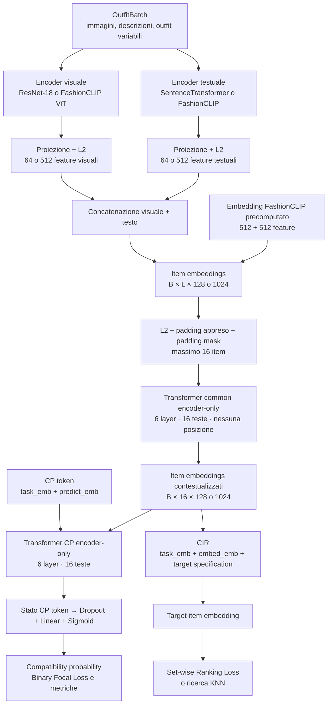

# OutfitTransformer

Progetto per rappresentare outfit multimodali, stimarne la compatibilità e
preparare il futuro retrieval di articoli complementari.

## Indice

- [Panoramica](#panoramica)
- [Moduli](#moduli)
- [Architettura generale](#architettura-generale)
- [Creazione dell'ambiente](#creazione-dellambiente)
  - [Windows PowerShell](#windows-powershell)
  - [Linux e macOS](#linux-e-macos)
- [Precomputazione degli embedding](#precomputazione-degli-embedding)
- [Valutazione CP](#valutazione-cp)

## Panoramica

Il progetto legge immagini e descrizioni di articoli fashion, crea embedding
multimodali e usa un Transformer senza positional embedding per rappresentare
outfit di lunghezza variabile. Il task CP assegna uno score di compatibilità;
il task CIR è previsto ma non ancora implementato.

## Moduli

| Modulo | Responsabilità | Documentazione |
|---|---|---|
| `preprocessing` | Isola il capo, pulisce lo sfondo e prepara immagini utente. | [README](preprocessing/README.md) |
| `data` | Definisce tipi, transform, collate e DataLoader. | [README](data/README.md) |
| `data/polyvore` | Scarica e interpreta immagini, metadata e annotazioni Polyvore. | [README](data/polyvore/README.md) |
| `evaluation` | Valuta checkpoint CP su test o validation e salva metriche globali. | [README](evaluation/README.md) |
| `model` | Espone architettura comune e moduli specifici dei task. | [README](model/README.md) |
| `model/common` | Crea embedding multimodali e li contestualizza con il Transformer. | [README](model/common/README.md) |
| `model/cp` | Predice la compatibilità complessiva di un outfit. | [README](model/cp/README.md) |
| `training` | Allena CP in modalità classic, new classic o CLIP e gestisce validazione, checkpoint e grafici. | [README](training/README.md) |
| `metrics` | Calcola metriche riutilizzabili per training e valutazione. | [README](metrics/README.md) |

## Architettura generale


```mermaid
flowchart TD
    A["OutfitBatch<br/>immagini, descrizioni, outfit variabili"]

    A --> B["Encoder visuale<br/>ResNet-18 o FashionCLIP ViT"]
    A --> C["Encoder testuale<br/>SentenceTransformer o FashionCLIP"]

    B --> D["Proiezione + L2<br/>64 o 512 feature visuali"]
    C --> E["Proiezione + L2<br/>64 o 512 feature testuali"]

    D --> F["Concatenazione visuale + testo"]
    E --> F

    F --> G["Item embeddings<br/>B × L × 128 o 1024"]
    P["Embedding FashionCLIP precomputato<br/>512 + 512 feature"] --> G
    G --> H["L2 + padding appreso + padding mask<br/>massimo 16 item"]
    H --> I["Transformer common encoder-only<br/>6 layer · 16 teste · nessuna posizione"]
    I --> J["Item embeddings contestualizzati<br/>B × 16 × 128 o 1024"]

    K["CP token<br/>task_emb + predict_emb"] --> L["Transformer CP encoder-only<br/>6 layer · 16 teste"]
    J --> L
    L --> M["Stato CP token → Dropout + Linear + Sigmoid"]
    M --> N["Compatibility probability<br/>Binary Focal Loss e metriche"]

    J --> O["CIR<br/>task_emb + embed_emb + target specification"]
    O --> Q["Target item embedding"]
    Q --> R["Set-wise Ranking Loss<br/>o ricerca KNN"]
```

## Creazione dell'ambiente

Eseguire i comandi dalla cartella principale del progetto.

### Windows PowerShell

Creazione ambiente:

```powershell
py -m venv .venv
.\.venv\Scripts\Activate.ps1
python -m pip install --upgrade pip
python -m pip install -r requirements.txt
```

### Linux e macOS

Creazione ambiente:

```bash
python3 -m venv .venv
source .venv/bin/activate
python -m pip install --upgrade pip
python -m pip install -r requirements.txt
```

Polyvore richiede un account Hugging Face autorizzato. Dopo aver ottenuto
l'accesso al dataset, salvare il token localmente:

```bash
hf auth login
```

## Precomputazione degli embedding

La precomputazione esegue una sola volta le tower visuale e testuale
FashionCLIP. I due output vengono normalizzati L2, concatenati e salvati in
shard `.pt` associati agli `item_id`. Questo evita di rieseguire FashionCLIP a
ogni epoca quando gli encoder restano congelati.

```powershell
python -m scripts.precompute_embeddings --variant nondisjoint --split validation
```
```powershell
python -m scripts.precompute_embeddings --variant nondisjoint --split train
```

Ripetere con `--split validation` e `--split test` per gli altri split. Gli
output vengono creati sotto `precomputed_embeddings/`. Una cache esistente non
viene sostituita senza l'opzione esplicita `--overwrite`.

## Valutazione CP

Preparare prima embedding dello split `test` quando checkpoint usa FashionCLIP,
poi avviare evaluation:

```powershell
python -m scripts.precompute_embeddings `
  --variant nondisjoint `
  --split test

python -m evaluation.CP.evaluate_cp `
  --checkpoint checkpoints/nondisjoint/cp_clip/best.pt
```

Comando ricava variante, modalita feature e architettura dal checkpoint. Salva
accuracy, precision, recall, F1 e ROC AUC sotto `results/cp/`. Flag completi e
formato output: [guida evaluation CP](evaluation/CP/README.md).
