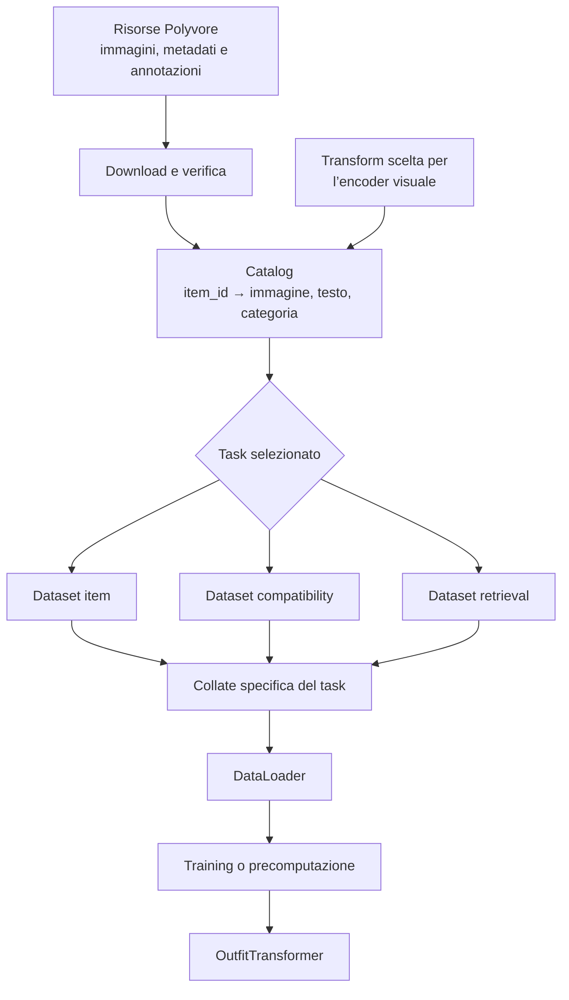

# Dati e batching

## Indice

- [File](#file)
- [Flusso complessivo](#flusso-complessivo)
- [Responsabilità dei componenti](#responsabilità-dei-componenti)
- [`types.py`: contratti dei dati](#typespy-contratti-dei-dati)
- [`transforms.py`: preprocessing delle immagini](#transformspy-preprocessing-delle-immagini)
- [`collate.py`: costruzione dei batch](#collatepy-costruzione-dei-batch)
- [`loaders.py`: configurazione dei DataLoader](#loaderspy-configurazione-dei-dataloader)
- [Dataset disponibili](#dataset-disponibili)
- [Precomputazione degli embedding](#precomputazione-degli-embedding)
- [Dataset Polyvore](#dataset-polyvore)

## File

| File | Responsabilità |
|---|---|
| `types.py` | Definisce item, esempi dei task e batch condivisi. |
| `transforms.py` | Prepara le immagini per ResNet-18 o FashionCLIP. |
| `collate.py` | Unisce gli esempi e li converte nell’input pubblico del modello. |
| `loaders.py` | Configura i `DataLoader` e costruisce le pipeline Polyvore complete. |
| `polyvore/` | Interpreta risorse, identificatori e annotazioni di Polyvore Outfits. |

## Flusso complessivo

## Responsabilità dei componenti

Il modulo dati acquisisce e interpreta le risorse, applica il preprocessing e
costruisce batch. Non contiene logica di ottimizzazione e non decide come
calcolare loss o metriche.

Il modello non scarica dati e non usa direttamente un `DataLoader`. È il
training loop che legge un batch, passa gli outfit al modello e usa label o
candidati per il task selezionato.

Il download avviene durante la costruzione della pipeline. `Dataset.__getitem__`
legge soltanto risorse già disponibili in locale o nella cache Hugging Face.

## `types.py`: contratti dei dati

Definisce il linguaggio comune tra cataloghi, dataset, `DataLoader` e modello.
Se in futuro viene aggiunto un dataset diverso da Polyvore, può produrre gli
stessi tipi senza richiedere modifiche al modello.

| Concetto | Contenuto |
|---|---|
| `FashionItem` | Un articolo con ID, immagine trasformata, descrizione e categoria. |
| `CompatibilityExample` | Un singolo outfit completo e la label binaria associata. |
| `RetrievalExample` | Un outfit parziale, il completamento corretto e i negativi. |
| `ItemBatch` | Articoli indipendenti destinati alla precomputazione. |
| `CompatibilityBatch` | Outfit pronti per CP, ID originali e label `[batch, 1]`. |
| `RetrievalBatch` | Query, positivi, negativi, categorie e relativi ID. |

### Idea generale

`types.py` non legge file e non conosce la struttura di Polyvore. Definisce
invece il formato comune con cui le diverse parti del progetto si scambiano i
dati. È simile a un vocabolario condiviso: il dataset produce oggetti con una
forma nota, la collate li raggruppa e il training sa cosa riceverà.

Il passaggio concettuale è questo:

1. il dataset legge **un campione** dalla sorgente;
2. lo rappresenta come `FashionItem`, `CompatibilityExample` oppure
   `RetrievalExample`;
3. la collate raccoglie più Example e costruisce **un batch**;
4. il training usa quel batch senza dover conoscere il formato originale dei
   file.

Un `Example` rappresenta quindi una singola domanda posta al modello. Per CP la
domanda è «questo outfit è compatibile?»; per retrieval è «quale articolo
completa questo outfit?». Un `Batch` è soltanto un gruppo di queste domande,
preparato per elaborarle insieme.

Questa separazione mantiene indipendenti le responsabilità:

- il dataset decide come leggere un singolo esempio;
- la collate decide come raggruppare più esempi;
- il training decide come usare il batch per calcolare predizioni e loss.

Il dataset non deve quindi conoscere il batch size, il modello o la strategia
di ottimizzazione. Allo stesso modo, il training non deve sapere se i dati
arrivano da JSON, Parquet o da un futuro dataset diverso da Polyvore.

### Pinning della memoria

Il pinning non cambia il significato o il contenuto del batch. È soltanto
un’ottimizzazione del trasferimento dei tensori dalla memoria principale alla
GPU. Quando `pin_memory=True`, il `DataLoader` prepara anche i tensori contenuti
nei batch personalizzati per rendere più efficiente questo trasferimento. Su CPU
può essere lasciato disattivato.

## `transforms.py`: preprocessing delle immagini

Definisce il contratto generale `immagine PIL → tensore` e fornisce le transform
coerenti con gli encoder visuali inclusi nel progetto. Non legge dataset, non
conosce item o outfit e non decide quale encoder usare: la transform viene
scelta quando si costruisce il loader.

La transform è scelta esplicitamente perché dipende dall’encoder visuale:

| Encoder | Preprocessing |
|---|---|
| ResNet-18 | Conversione in tensore, dimensione uniforme e normalizzazione ImageNet. |
| ResNet-18 in training | Aggiunge crop casuale e ribaltamento orizzontale. |
| FashionCLIP | Usa l’image processor associato al checkpoint scelto. |
| Encoder personalizzato | Può ricevere una transform compatibile fornita dall’esterno. |

Il catalogo converte sempre l’immagine in RGB prima di applicare la transform.
La stessa pipeline può quindi includere anche operazioni di preprocessing del
package `preprocessing`, purché alla fine restituisca un tensore `[3, H, W]`.

## `collate.py`: costruzione dei batch

È il ponte tra gli esempi restituiti dai dataset e l’API del modello. Riceve una
lista di esempi, preserva identificatori e categorie, converte ogni
`FashionItem` in `OutfitItem` e produce il tipo di batch corretto per il task.

Ogni flusso ha una collate dedicata:

| Flusso | Risultato concettuale |
|---|---|
| Item | Un gruppo di articoli e una vista come outfit composti da un solo item. |
| Compatibility | Outfit completi e tensore delle label `[batch, 1]`. |
| Retrieval | Outfit parziali, positivi e gruppi di negativi di lunghezza variabile. |

La collate impila soltanto dati uniformi, come le label. Non combina le immagini
in un unico tensore rettangolare e non crea padding: outfit e negativi rimangono
sequenze variabili.

`OutfitTransformer` conosce il proprio limite `max_items`, quindi resta l’unico
componente che tronca gli outfit, aggiunge il padding appreso, costruisce la
padding mask e conserva le lunghezze effettive. Così non esistono due
implementazioni concorrenti del padding.

## `loaders.py`: configurazione dei DataLoader

Coordina dataset, collate e impostazioni PyTorch. Offre due livelli:

- factory generiche, usabili con qualsiasi dataset che restituisca gli Example
  condivisi;
- factory complete Polyvore, che scaricano le risorse necessarie, costruiscono
  catalogo e dataset e selezionano automaticamente la collate del task.

`LoaderConfig` raccoglie batch size, numero di worker, pinning, worker
persistenti, eliminazione dell’ultimo batch incompleto e seed. Richiede valori
coerenti, per esempio worker persistenti solo quando è presente almeno un
worker.

Per compatibility e retrieval lo shuffle viene attivato automaticamente sullo
split di training, salvo scelta esplicita diversa. Il loader item resta invece
ordinato per impostazione predefinita, utile quando gli embedding devono essere
associati in modo riproducibile agli `item_id`.

`loaders.py` costruisce la pipeline ma non esegue il training: non crea modelli,
optimizer, loss o checkpoint.

## Dataset disponibili

Sono separati perché ogni task richiede esempi differenti, ma condividono lo
stesso catalogo:

- il dataset item restituisce un articolo alla volta ed è pensato per analisi o
  precomputazione;
- il dataset compatibility restituisce outfit positivi o negativi con label
  `1` o `0`;
- il dataset retrieval restituisce l’outfit incompleto, il completamento
  corretto e i distrattori ufficiali.

Separare i task evita campi opzionali ambigui e permette di cambiare la logica
di retrieval senza modificare il training compatibility.

## Precomputazione degli embedding

Il loader item permette di elaborare ogni articolo una sola volta e associare
la rappresentazione risultante al suo `item_id`. Il salvataggio e il caricamento
della cache non appartengono al dataset: sono responsabilità del job di
precomputazione.

Gli embedding possono sostituire immagini e testo soltanto se gli encoder e le
proiezioni che li hanno prodotti restano congelati. Se questi componenti devono
essere allenati, il training deve continuare a usare i dati multimodali grezzi.

## Dataset Polyvore

Formato delle risorse, varianti, split e task sono descritti in
[polyvore/README.md](polyvore/README.md).
