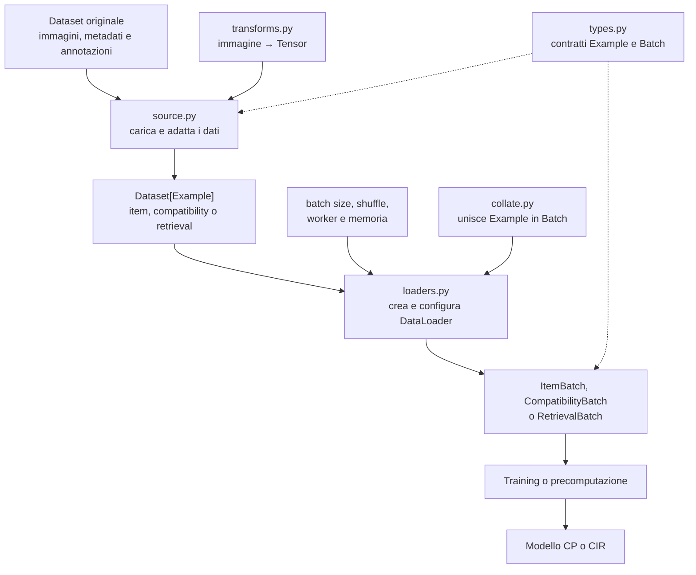

# Dati e batching

## Indice

- [File](#file)
- [Flusso complessivo](#flusso-complessivo)
- [Responsabilità dei componenti](#responsabilità-dei-componenti)
- [`types.py`: contratti dei dati](#typespy-contratti-dei-dati)
- [`source.py`: interfaccia delle sorgenti](#sourcepy-interfaccia-delle-sorgenti)
- [`transforms.py`: preprocessing delle immagini](#transformspy-preprocessing-delle-immagini)
- [`collate.py`: costruzione dei batch](#collatepy-costruzione-dei-batch)
- [`loaders.py`: configurazione dei DataLoader](#loaderspy-configurazione-dei-dataloader)
- [Dataset disponibili](#dataset-disponibili)
- [Precomputazione degli embedding](#precomputazione-degli-embedding)
- [Dataset Polyvore](#dataset-polyvore)

## File

| File | Responsabilità |
|---|---|
| `__init__.py` | Espone l’API pubblica del package `data`. |
| `types.py` | Definisce item, esempi dei task e batch condivisi. |
| `source.py` | Definisce source, split, richieste e registry indipendenti dal dataset concreto. |
| `transforms.py` | Prepara le immagini per ResNet-18 o FashionCLIP. |
| `collate.py` | Unisce gli esempi e li converte nell’input pubblico del modello. |
| `loaders.py` | Configura i `DataLoader` per item, compatibility e retrieval. |
| `polyvore/` | Interpreta risorse, identificatori e annotazioni di Polyvore Outfits. |

## Flusso complessivo



| Componente | Responsabilità | Output |
|---|---|---|
| `transforms.py` | Converte e normalizza immagini nel formato richiesto dall’encoder. | `Tensor [3, H, W]` |
| `types.py` | Definisce contratti comuni per item, esempi e batch. | `FashionItem`, `Example` e `Batch` |
| `source.py` | Carica il dataset originale e adatta i dati ai tipi comuni del progetto. | `Dataset[Example]` |
| `loaders.py` | Decide come leggere più esempi: batch size, shuffle, worker e memoria. | `DataLoader` |
| `collate.py` | Unisce gli esempi letti dal loader e costruisce un batch del task. | `ItemBatch`, `CompatibilityBatch` o `RetrievalBatch` |

## Responsabilità dei componenti

Il modulo dati acquisisce e interpreta le risorse, applica il preprocessing e
costruisce batch. Non contiene logica di ottimizzazione e non decide come
calcolare loss o metriche.

Il modello non scarica dati e non usa direttamente un `DataLoader`. È il
training loop che legge un batch, passa gli outfit al modello e usa label o
candidati per il task selezionato.

Il download avviene durante la costruzione della pipeline. `Dataset.__getitem__`
legge soltanto risorse già disponibili in locale o nella cache Hugging Face.


## `types.py`: contratti dei dati

Definisce il linguaggio comune tra cataloghi, dataset, `DataLoader` e modello.
Se in futuro viene aggiunto un dataset diverso da Polyvore, può produrre gli
stessi tipi senza richiedere modifiche al modello.

| Concetto | Contenuto |
|---|---|
| `FashionItem` | Un articolo con ID, immagine trasformata, descrizione e categoria. |
| `CompatibilityExample` | Un singolo outfit completo e la label binaria associata. |
| `CompatibilityIndexExample` | Un outfit espresso solo tramite `item_id`, usato con feature precomputate. |
| `RetrievalExample` | Un outfit parziale, il completamento corretto e negativi espliciti; negativi vuoti nel training in-batch. |
| `RetrievalIndexExample` | Stesso esempio CIR espresso tramite ID e categoria del target corrente, senza caricare immagini. |
| `ItemBatch` | Articoli indipendenti destinati alla precomputazione. |
| `CompatibilityBatch` | Outfit pronti per CP, ID originali e label `[batch, 1]`. |
| `RetrievalBatch` | Query, positivi, negativi, categorie e relativi ID. |

### Esempio di input e output

Valori illustrativi passati a `FashionItem`:

```text
Input
  item_id:      "132621870"
  image:        Tensor float32 [3, 224, 224]
  description:  "white cotton shirt"
  category:     "tops"

Output
  FashionItem che rappresenta un articolo valido e completo
```

Tre `FashionItem`, una label `1` e un identificatore dell’esempio producono
invece un `CompatibilityExample` contenente un solo outfit positivo. Un outfit
parziale, un item corretto e alcuni negativi producono un `RetrievalExample`.

Se l’immagine avesse forma `[224, 224]`, la descrizione fosse vuota o la label
fosse `2`, non verrebbe prodotto alcun oggetto valido: il tipo segnalerebbe
l’errore.

### Idea generale

`types.py` non legge file e non conosce la struttura di Polyvore. Definisce
invece il formato comune con cui le diverse parti del progetto si scambiano i
dati. È simile a un vocabolario condiviso: il dataset produce oggetti con una
forma nota, la collate li raggruppa e il training sa cosa riceverà.

Il passaggio concettuale è questo:

1. il dataset legge **un campione** dalla sorgente;
2. lo rappresenta come `FashionItem`, `CompatibilityExample` oppure
   `RetrievalExample`;
3. la collate raccoglie più Example e costruisce **un batch**;
4. il training usa quel batch senza dover conoscere il formato originale dei
   file.

Un `Example` rappresenta quindi una singola domanda posta al modello. Per CP la
domanda è «questo outfit è compatibile?»; per retrieval è «quale articolo
completa questo outfit?». Un `Batch` è soltanto un gruppo di queste domande,
preparato per elaborarle insieme.

Questa separazione mantiene indipendenti le responsabilità:

- il dataset decide come leggere un singolo esempio;
- la collate decide come raggruppare più esempi;
- il training decide come usare il batch per calcolare predizioni e loss.

Il dataset non deve quindi conoscere il batch size, il modello o la strategia
di ottimizzazione. Allo stesso modo, il training non deve sapere se i dati
arrivano da JSON, Parquet o da un futuro dataset diverso da Polyvore.

### Pinning della memoria

Il pinning non cambia il significato o il contenuto del batch. È soltanto
un’ottimizzazione del trasferimento dei tensori dalla memoria principale alla
GPU. Quando `pin_memory=True`, il `DataLoader` prepara anche i tensori contenuti
nei batch personalizzati per rendere più efficiente questo trasferimento. Su CPU
può essere lasciato disattivato.

## `transforms.py`: preprocessing delle immagini

Definisce il contratto generale `immagine PIL → tensore` e fornisce le transform
coerenti con gli encoder visuali inclusi nel progetto. Non legge dataset, non
conosce item o outfit e non decide quale encoder usare: la transform viene
scelta quando si costruisce il loader.

La transform è scelta esplicitamente perché dipende dall’encoder visuale:

| Encoder | Preprocessing |
|---|---|
| ResNet-18 | Conversione in tensore, dimensione uniforme e normalizzazione ImageNet. |
| ResNet-18 in training | Aggiunge crop casuale e ribaltamento orizzontale. |
| FashionCLIP | Usa l’image processor associato al checkpoint scelto. |
| Encoder personalizzato | Può ricevere una transform compatibile fornita dall’esterno. |

### Esempio di input e output

```text
Input
  Immagine PIL RGB, dimensione 640 × 480

Transform ResNet-18 senza augmentation
  resize proporzionale → center crop → tensore → normalizzazione ImageNet

Output
  Tensor float32 [3, 224, 224]
```

Con augmentation attiva l’output mantiene forma e normalizzazione, ma crop e
ribaltamento possono cambiare a ogni lettura. Con FashionCLIP la dimensione e la
normalizzazione sono quelle richieste dall’image processor del checkpoint.

Il catalogo converte sempre l’immagine in RGB prima di applicare la transform.
La stessa pipeline può quindi includere anche operazioni di preprocessing del
package `preprocessing`, purché alla fine restituisca un tensore `[3, H, W]`.

## `collate.py`: costruzione dei batch

È il ponte tra gli esempi restituiti dai dataset e l’API del modello. Riceve una
lista di esempi, preserva identificatori e categorie, converte ogni
`FashionItem` in `OutfitItem` e produce il tipo di batch corretto per il task.

Ogni flusso ha una collate dedicata:

| Flusso | Risultato concettuale |
|---|---|
| Item | Un gruppo di articoli e una vista come outfit composti da un solo item. |
| Compatibility | Outfit completi e tensore delle label `[batch, 1]`. |
| Retrieval | Outfit parziali, positivi e gruppi di negativi di lunghezza variabile. |

### Esempio di input e output

```text
Input della collate compatibility
  Example A: outfit [i1, i2, i3], label 1
  Example B: outfit [i4, i5],     label 0

Output
  CompatibilityBatch
  outfit_item_ids: [[i1, i2, i3], [i4, i5]]
  outfits:         lunghezze [3, 2]
  labels:          Tensor [[1.0], [0.0]], forma [2, 1]
```

Il secondo outfit non riceve un item fittizio. Le due lunghezze restano `3` e
`2`; sarà il modello a creare padding e mask durante il forward.

Per il flusso item, una lista di `FashionItem` produce un `ItemBatch`. Per
retrieval, query parziali, positivi e negativi producono un `RetrievalBatch` che
mantiene separati tutti questi ruoli.

La collate impila soltanto dati uniformi, come le label. Non combina le immagini
in un unico tensore rettangolare e non crea padding: outfit e negativi rimangono
sequenze variabili.

`OutfitEmbeddingBatcher` conosce il proprio limite `max_items`, quindi resta
l’unico componente che tronca gli outfit, aggiunge il padding appreso,
costruisce la padding mask e conserva le lunghezze effettive. Così non esistono due
implementazioni concorrenti del padding.

## `loaders.py`: configurazione dei DataLoader

`loaders.py` crea i `DataLoader` PyTorch usati da training, evaluation e
precomputazione. Riceve un dataset, sceglie la collate del task e applica
batch size, shuffle e impostazioni dei worker. Il risultato è un iteratore di
`ItemBatch`, `CompatibilityBatch` o `RetrievalBatch` pronti per il progetto.

Le factory accettano qualsiasi dataset che restituisca gli Example condivisi.
Creazione e lettura del dataset concreto appartengono a `DatasetSource`.

`LoaderConfig` raccoglie batch size, numero di worker, pinning, worker
persistenti, eliminazione dell'ultimo batch incompleto e seed. Richiede valori
coerenti, per esempio worker persistenti solo quando è presente almeno un
worker.

### Componenti passati al DataLoader

`loaders.py` non svolge da solo tutte le operazioni. Quando crea un
`DataLoader`, gli passa oggetti e funzioni definiti negli altri file:

| Parametro del DataLoader | Provenienza | Ruolo |
|---|---|---|
| `dataset` | Dataset restituito da una source oppure chiamante esterno | Restituisce un singolo Example quando riceve un indice. |
| `collate_fn` | `collate.py` | Converte una lista di Example nel Batch specifico del task. |
| `batch_size`, worker, shuffle e altre opzioni | `LoaderConfig` e argomenti della factory | Controllano come gli esempi vengono letti e raggruppati. |

Per compatibility e retrieval lo shuffle viene attivato automaticamente sullo
split di training, salvo scelta esplicita diversa. Il loader item resta invece
ordinato per impostazione predefinita, utile quando gli embedding devono essere
associati in modo riproducibile agli `item_id`.

`loaders.py` costruisce la pipeline ma non esegue il training: non crea modelli,
optimizer, loss o checkpoint.

### Esempio di input e output

```text
Input
  CompatibilityDataset con 1.000 esempi
  LoaderConfig(batch_size=32, num_workers=4, pin_memory=True)
  shuffle=True

Output della factory
  DataLoader configurato con la collate compatibility

Output di una sua iterazione
  CompatibilityBatch con al massimo 32 outfit
  labels con forma [32, 1]
```

La factory restituisce il `DataLoader`, non tutti i dati caricati in memoria.
Gli esempi vengono richiesti al dataset batch dopo batch. Source concreta riceve
subset, split, transform, token e cache; loader risultante usa sempre stesso
contratto pubblico.


## `source.py`: interfaccia delle sorgenti

`source.py` definisce l'API comune tra progetto e dataset. Training, evaluation
e script usano questa interfaccia per chiedere i dati necessari:

```text
«Dammi esempi compatibility dello split train»
```

`get_dataset_source` seleziona adapter corretto. Nel caso attuale restituisce
`PolyvoreSource`, adapter che legge file Polyvore e li converte nei tipi comuni
del progetto.

```text
training/evaluation/script
            ↓
API DatasetSource
            ↓
adapter PolyvoreSource
            ↓
tipi comuni del progetto
```

Workflow dipendono solo dall'interfaccia `DatasetSource`. Dettagli specifici,
come nomi dei file, download e parsing, restano dentro adapter. Per supportare
altro dataset basta creare e registrare nuovo adapter dentro `data`.

### Elementi principali

| Elemento | Cosa fa |
|---|---|
| `DatasetRequest` | Dice quale subset, split e cartella usare. |
| `DatasetSource` | Interfaccia che stabilisce quali dati ogni adapter deve fornire. |
| `RetrievalIndexDataset` | Dataset CIR indicizzato con proprietà `item_ids`: copertura completa di ogni possibile campione, leggibile senza campionare. |
| `get_dataset_source("polyvore")` | Seleziona `PolyvoreSource`. |
| `PolyvoreSource` | Adapter che legge Polyvore e restituisce tipi comuni. |

`retrieval_dataset` e `retrieval_index_dataset` accettano `sample_target=True`
per generare completamenti casuali da outfit completi dello split train.
Il default `False` mantiene le domande FITB ufficiali. Validation e test
rifiutano `sample_target=True` per preservare il benchmark fisso.

Il runner CIR attiva il campionamento solo nel training. La variante raw passa
dal catalogo e dalla collate esistenti; quella indicizzata risolve ID e categoria
senza immagini. La cache embedding conserva il dataset dinamico e valida
`item_ids` senza congelare le coppie o consumare numeri casuali.

### Esempio

```python
from pathlib import Path

from data import DataSplit, DatasetRequest, get_dataset_source

source = get_dataset_source("polyvore")
request = DatasetRequest(
    subset="nondisjoint",
    split=DataSplit.TRAIN,
    root=Path("datasets/polyvore-outfits"),
)
dataset = source.compatibility_index_dataset(request)
example = dataset[0]
```

Passaggi eseguiti:

1. `get_dataset_source` seleziona `PolyvoreSource`;
2. `DatasetRequest` indica dati richiesti;
3. `PolyvoreSource` trova e legge file Polyvore;
4. token Polyvore vengono convertiti in `item_id`;
5. risultato è un `CompatibilityIndexExample` generico.

```text
Output
  example_id: "compatibility:1"
  item_ids:   ("132621870", "153967122", "167174323")
  label:      1
```

Training vede solo `item_ids` e label. Non sa da quale file arrivano.
`loaders.py` trasforma poi questi esempi in batch.

Per modalità con input runtime si usa `compatibility_dataset`, che restituisce
anche immagini e descrizioni. Per `precomputed` si usa
`compatibility_index_dataset`, che carica solo ID necessari per recuperare
embedding precomputati.

## Dataset disponibili

Sono separati perché ogni task richiede esempi differenti, ma condividono lo
stesso catalogo:

- il dataset item restituisce un articolo alla volta ed è pensato per analisi o
  precomputazione;
- il dataset compatibility restituisce outfit positivi o negativi con label
  `1` o `0`;
- il dataset retrieval restituisce l’outfit incompleto, il completamento
  corretto e i distrattori ufficiali.

Separare i task evita campi opzionali ambigui e permette di cambiare la logica
di retrieval senza modificare il training compatibility.

## Precomputazione degli embedding

Il loader item permette di elaborare ogni articolo una sola volta e associare
la rappresentazione risultante al suo `item_id`. Il salvataggio e il caricamento
della cache non appartengono al dataset: sono responsabilità del job
`scripts/precompute_embeddings.py`.

Backend, formato cache, flag ed esempi PowerShell/Linux stanno solo nella
[guida degli script](../scripts/README.md#precomputazione-multimodale).

Gli embedding possono sostituire immagini e testo soltanto se gli encoder e le
proiezioni che li hanno prodotti restano congelati. Se questi componenti devono
essere allenati, il training deve continuare a usare i dati multimodali grezzi.

## Dataset Polyvore

Formato delle risorse, varianti, split e task sono descritti in
[polyvore/README.md](polyvore/README.md).
