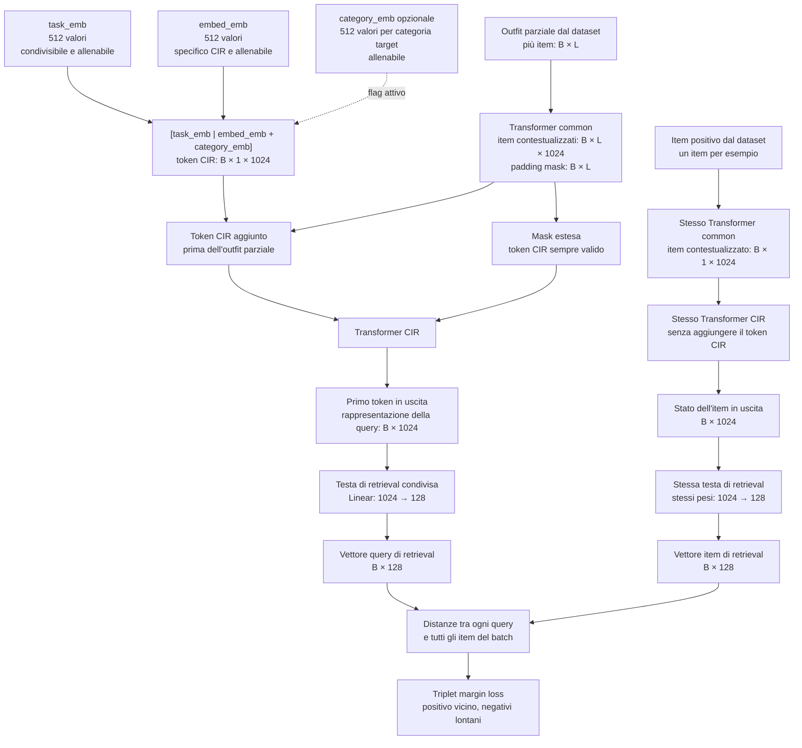
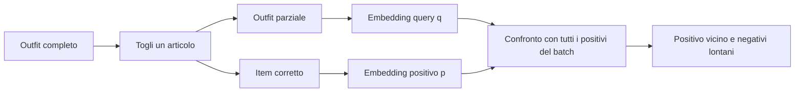

# Complementary Item Retrieval (CIR)

## Indice

- [File](#file)
- [Scopo](#scopo)
- [Architettura](#architettura)
- [Input e output](#input-e-output)
- [Token CIR](#token-cir)
- [Transformer CIR](#transformer-cir)
- [Testa di retrieval](#testa-di-retrieval)
- [Calcolo della loss](#calcolo-della-loss)
- [Condivisione con CP](#condivisione-con-cp)

## File

| File | Cosa fa |
|---|---|
| `category_embedding.py` | Definisce le categorie Polyvore e i relativi vettori allenabili opzionali. |
| `transformer.py` | Costruisce il token CIR e produce gli embedding degli outfit parziali e dei singoli item. |
| `head.py` | Proietta query e item nello stesso spazio vettoriale. |
| `in_batch_triplet_margin_loss.py` | Calcola la triplet margin loss usando i negativi presenti nel batch. |
| `__init__.py` | Espone l'API pubblica del package CIR. |

## Scopo

Il modulo CIR impara a descrivere, con un vettore, il capo che dovrebbe
completare un outfit parziale. Non restituisce direttamente un `item_id` e non
interroga un catalogo: produce gli embedding necessari per allenare il modello.

Query e item positivi sono proiettati nello stesso spazio, di default a 128
dimensioni. L'allenamento avvicina l'outfit parziale al suo completamento
corretto e lo allontana dai completamenti sbagliati.

## Architettura

Il flusso CIR è composto da questi passaggi:

1. il modello common produce gli embedding contestualizzati dell'outfit parziale;
2. CIR aggiunge all'inizio il token che rappresenta l'item mancante;
3. il Transformer CIR aggiorna quel token usando gli item presenti nell'outfit;
4. la testa di retrieval trasforma lo stato del token nell'embedding della query;
5. lo stesso Transformer e la stessa testa producono l'embedding dell'item corretto;
6. la loss confronta ogni query con tutti gli item corretti presenti nel batch.



## Input e output

Il modulo riceve gli embedding prodotti dalla parte common del modello.

Per una query CIR:

- gli embedding contestualizzati descrivono gli item dell'outfit parziale;
- la maschera distingue gli item reali dal padding;
- il risultato è un vettore per ogni outfit.

Per gli item positivi:

- ogni elemento del batch deve contenere esattamente un item reale;
- il risultato è un vettore per ogni item, nello stesso spazio della query.

La dimensione predefinita dell'output è 128, ma può essere modificata nella
configurazione del modello.

## Token CIR

Senza condizionamento per categoria, il token dell'item mancante nasce
concatenando `task_emb` ed `embed_emb`.

- `task_emb` contiene conoscenza generale sulla compatibilità e può essere
  condiviso con CP;
- `embed_emb` contiene informazione specifica del retrieval CIR.

Con la configurazione predefinita, entrambe le parti hanno 512 valori e il token
completo ne ha 1024. I parametri sono inizializzati con una distribuzione normale
avente deviazione standard 0,02.

Con flag disattivato, il token non contiene immagine, descrizione o categoria
dell'item da trovare. Il modello deve quindi dedurre il completamento soltanto
dall'outfit parziale.

Il condizionamento per categoria è controllato da un flag, disattivato per
impostazione predefinita.

`category_emb` può essere immaginato come un vettore con 11 posizioni, una per
ogni categoria Polyvore. In ogni posizione non si trova un singolo numero, ma un
intero embedding allenabile di 512 valori. Matematicamente la sua struttura è
quindi una matrice `11 × 512`:

- le 11 righe rappresentano le categorie;
- ogni riga contiene il vettore di 512 valori della relativa categoria;
- i valori partono da piccoli numeri casuali e vengono appresi durante il
  training.

Per esempio, quando la categoria target è `shoes`, viene selezionata la riga
associata alle scarpe. Quel vettore viene sommato a `embed_emb`, mentre
`task_emb` resta la prima metà del token. Il token completo diventa:

```text
[task_emb | embed_emb + category_emb]
```

Con il flag attivo, ogni outfit del batch deve avere una categoria target. Nel
training questa categoria deriva dal capo corretto rimosso dall'outfit; durante
la ricerca indica invece il tipo di capo desiderato. La loss aggiorna anche il
vettore della categoria selezionata.

Con il flag disattivato, la struttura degli embedding di categoria non viene
creata e il modello deduce il tipo di capo soltanto dall'outfit parziale. Le
categorie ammesse sono
`accessories`, `all-body`, `bags`, `bottoms`, `hats`, `jewellery`, `outerwear`,
`scarves`, `shoes`, `sunglasses` e `tops`.

## Transformer CIR

Il Transformer usa la stessa configurazione architetturale dei moduli common e CP:

| Parametro | Valore predefinito |
|---|---:|
| Dimensione input/output | 1024 |
| Layer | 6 |
| Teste di attenzione | 16 |
| Dimensione feed-forward | 2024 |
| Attivazione | Mish |
| Normalizzazione | Pre-norm e LayerNorm finale |
| Dropout | 0,3 |
| Positional embedding | Assente |

Per la query, il token CIR viene aggiunto prima degli item contestualizzati. La
mask riceve una nuova posizione sempre valida. Lo stato finale del primo token
riassume l'outfit parziale e la richiesta di trovare il capo mancante.

## Testa di retrieval

La testa di retrieval è l'ultimo passaggio sia del ramo query sia del ramo item.
Riceve un vettore da 1024 valori e lo trasforma in un vettore da 128. La stessa
testa, quindi gli stessi pesi appresi, viene usata in entrambi i rami.

È utile distinguere i nomi:

| Nome | Da dove deriva | Cosa rappresenta |
|---|---|---|
| Token CIR iniziale | `[task_emb \| embed_emb]`, oppure `[task_emb \| embed_emb + category_emb]` con flag attivo | Un segnaposto allenabile che chiede «quale item manca?» e può indicarne la categoria target. |
| Rappresentazione della query | Stato finale del token CIR dopo che ha osservato l'outfit parziale nel Transformer CIR | Il riassunto interno della ricerca, con 1024 valori. |
| Vettore query di retrieval | Rappresentazione della query passata alla testa | Il vettore finale da 128 usato per cercare il completamento. |
| Vettore item di retrieval | Rappresentazione di un singolo item passata alla stessa testa | Il vettore finale da 128 che descrive un possibile completamento. |

Non esiste quindi un secondo «token di retrieval». Esiste un solo token CIR,
usato esclusivamente per costruire la query; alla fine vengono prodotti due tipi
di **vettori di retrieval**, uno per la query e uno per gli item.

### Da dove deriva il vettore query

Il dataset fornisce un outfit parziale, per esempio «maglia + scarpe». Il
Transformer common produce un embedding separato da 1024 valori per ciascun
capo. CIR non concatena questi capi in un unico vettore: aggiunge davanti a essi
il token CIR e passa l'intera sequenza al Transformer CIR.

Grazie all'attenzione, il token CIR raccoglie informazione da tutti i capi
presenti. Il suo stato finale da 1024 valori è la rappresentazione interna della
query. Solo a questo punto la testa esegue la proiezione `1024 → 128` e produce
il vettore query di retrieval.

```text
outfit parziale → common → token CIR + embedding dei capi
                              ↓ Transformer CIR
                     stato finale del token CIR (1024)
                              ↓ stessa testa
                     vettore query di retrieval (128)
```

### Da dove deriva il vettore item

Il dataset fornisce anche l'item positivo, cioè il capo che era stato rimosso
dall'outfit. Immagine e descrizione dell'item vengono elaborate dal Transformer
common come un outfit formato da un solo capo. La rappresentazione ottenuta
passa poi nello stesso Transformer CIR, questa volta **senza aggiungere il token
CIR**, e infine nella stessa testa `1024 → 128`.

```text
item positivo → common → rappresentazione del singolo item
                              ↓ stesso Transformer CIR, senza token CIR
                     stato finale dell'item (1024)
                              ↓ stessa testa
                     vettore item di retrieval (128)
```

Durante il training l'item deriva da `positive_item`. Durante una futura ricerca
reale, lo stesso procedimento può essere applicato in anticipo a ogni item del
catalogo, così i suoi vettori da 128 sono pronti per essere confrontati con una
nuova query.

La testa non sceglie il prodotto e non contiene un catalogo. Impara soltanto una
trasformazione che mette query e item nello stesso spazio da 128 dimensioni. La
loss organizza questo spazio facendo avvicinare il vettore query al vettore del
capo corretto e allontanandolo dai vettori considerati sbagliati. Per esempio,
una distanza di 0,4 dal capo corretto indica una corrispondenza migliore di una
distanza di 2,1 da un capo sbagliato.

La normalizzazione degli embedding è disponibile ma disattivata per impostazione
predefinita. Se viene attivata, porta ogni embedding a lunghezza 1: il confronto
dipende così dalla direzione dei vettori e non dalla sola grandezza dei valori.

## Calcolo della loss

### Da dove arrivano query, positivo e negativi

Un esempio Polyvore Fill In The Blank nasce da un outfit completo al quale è
stato tolto un articolo. Il dataset contiene:

- `question`: gli articoli rimasti, cioè l'outfit parziale;
- `blank_position`: la posizione dell'articolo tolto;
- `answers`: l'articolo corretto insieme ad alcuni distrattori ufficiali.

Il dataset usa `blank_position` e gli identificatori dell'outfit per separare la
risposta corretta dalle altre. Restituisce quindi un `partial_outfit`, un
`positive_item` e una lista di `negative_items`.

Per esempio, da «maglia + pantaloni + scarpe» si possono ottenere:

- outfit parziale: «maglia + scarpe»;
- item positivo: «pantaloni»;
- negativi ufficiali: altri articoli proposti come risposte sbagliate.

La loss usa soltanto l'outfit parziale e l'item positivo di ogni esempio. I
negativi ufficiali vengono conservati dal dataset, ma **non entrano in questa
loss**. I negativi sono invece ricavati dagli altri esempi presenti nello stesso
batch.



### Cosa succede nel batch

Immaginiamo un batch di tre esempi:

| Riga | Outfit parziale | Completamento corretto |
|---|---|---|
| 1 | `q1`: giacca + camicia | `p1`: jeans |
| 2 | `q2`: abito | `p2`: décolleté |
| 3 | `q3`: felpa + pantaloni | `p3`: sneaker |

Il modello trasforma i tre outfit parziali in query e i tre completamenti in
vettori confrontabili. Una distanza piccola significa «sembrano una buona
corrispondenza». Poi confronta ogni query con tutti e tre gli item:

| | `p1` jeans | `p2` décolleté | `p3` sneaker |
|---|---:|---:|---:|
| `q1` | **0,8 positivo** | 2,3 | **1,4 negativo più vicino** |
| `q2` | **2,2 negativo più vicino** | **0,6 positivo** | 3,0 |
| `q3` | **3,0 negativo più vicino** | 3,2 | **0,9 positivo** |

La diagonale contiene gli abbinamenti corretti: `q1-p1`, `q2-p2` e `q3-p3`.
Tutte le altre celle sono considerate abbinamenti sbagliati. Per ogni riga la
loss guarda solo il negativo più vicino, cioè quello che il modello rischia
maggiormente di confondere con la risposta corretta. Questo è il *hardest
negative* del batch.

### Quando scatta la penalità

Non basta che il positivo sia un po' più vicino del negativo: tra i due deve
esserci una distanza di sicurezza chiamata **margine**, pari a 2 per
impostazione predefinita.

Per `q1` il positivo dista 0,8 e il negativo più difficile 1,4. Il negativo è
più lontano, ma non abbastanza: per rispettare il margine dovrebbe trovarsi
almeno a `0,8 + 2 = 2,8`. La loss vale quindi:

$$
L = \max(0, 0{,}8 - 1{,}4 + 2) = 1{,}4
$$

Questa penalità spinge il modello ad avvicinare `q1` a `p1`, ad allontanarla da
`p3`, o a fare entrambe le cose. Se invece il negativo fosse distante 3,1, il
margine sarebbe già rispettato e la loss sarebbe zero.

In generale:

$$
L = \max(0, d_{positivo} - d_{\text{negativo più vicino}} + margine)
$$

La loss finale è normalmente la media delle penalità delle righe. Il batch deve
contenere almeno due esempi, altrimenti non esiste un altro item da usare come
negativo. Inoltre, «negativo» significa soltanto «non è la risposta associata a
questa riga»: due prodotti duplicati o due capi comunque compatibili possono
creare un falso negativo, motivo per cui composizione e pulizia del batch sono
responsabilità del futuro training CIR.

## Condivisione con CP

Per condividere davvero `task_emb`, CP e CIR devono usare lo stesso parametro.
In questo caso entrambi i compiti lo aggiornano durante l'allenamento. Altrimenti
CIR usa un parametro proprio e non condiviso.

Il caricamento dei checkpoint e l'eventuale inizializzazione del Transformer
CIR appartengono al futuro training runner, non a questo modulo.
