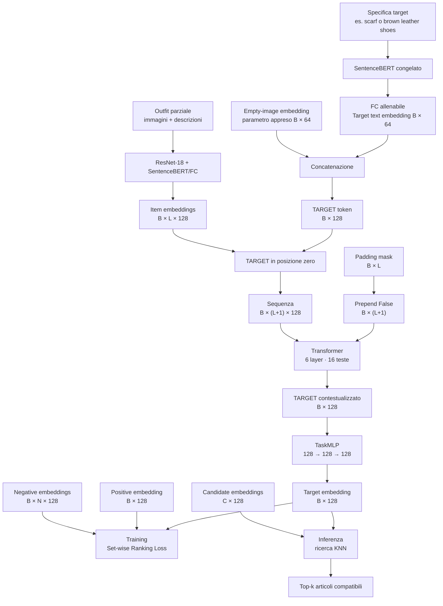

# Complementary Item Retrieval

Il modulo `model/cir` genera una query numerica per cercare nel catalogo un
capo che:

1. appartenga alla categoria o rispetti la descrizione richiesta;
2. sia compatibile con l'intero outfit già disponibile.

Torna al [README principale](../../README.md) oppure consulta
l'[architettura condivisa](../common/README.md).

## Indice

- [Concetti principali](#concetti-principali)
- [Outfit parziale](#outfit-parziale)
- [Flusso completo](#flusso-completo)
- [Target token](#target-token)
- [Utilizzo](#utilizzo)
- [Positivi, negativi e candidati](#positivi-negativi-e-candidati)
- [Set-wise Ranking Loss](#set-wise-ranking-loss)
- [Training](#training)
- [Inferenza](#inferenza)
- [Test](#test)
- [File](#file)

## Concetti principali

Il modello non decide autonomamente quale categoria manca. La specifica del
target deve essere fornita dall'esterno, per esempio:

```text
"scarf"
"red wool scarf"
"brown leather shoes"
```

Il risultato diretto di `ComplementaryItemRetriever` non è il nome di un
prodotto o un'immagine, ma un **target embedding**: una query che rappresenta
il capo richiesto nel contesto dell'outfit.

È utile distinguere:

- **descrizione target:** ciò che si vuole cercare;
- **target embedding:** la query contestualizzata generata dal Transformer;
- **candidate embedding:** la rappresentazione di un articolo reale;
- **indice KNN:** la struttura che confronta la query con il catalogo.

Durante l'inferenza, gli articoli con candidate embedding più vicino al target
embedding costituiscono i risultati top-k.

## Outfit parziale

Un outfit parziale contiene i capi già conosciuti, ma non il capo da cercare:

```text
outfit completo: camicia, pantaloni, scarpe, borsa
capo target:     scarpe
outfit parziale: camicia, pantaloni, borsa
query:           "brown leather shoes"
```

La sua origine dipende dalla fase:

- **training:** un sampler deve rimuovere un capo dall'outfit completo; il capo
  rimosso diventa il positivo e gli altri formano l'outfit parziale;
- **inferenza:** contiene i capi posseduti o selezionati dall'utente.

`ComplementaryItemRetriever` riceve un outfit già parziale. Non sceglie e non
rimuove automaticamente il target.

Ogni capo conosciuto usa immagine e descrizione:

```text
capo conosciuto = immagine → 64 feature + testo → 64 feature
                                      ↓
                            item embedding: 128
```

Con `B` outfit e un massimo di `L` capi:

```text
item embeddings: [B,L,128]
```

## Flusso completo



`B` è il batch size, `L` la lunghezza massima degli outfit, `N` il numero di
negativi per outfit e `C` il numero di articoli nel catalogo.

## Target token

### Perché usa il testo

Durante la ricerca si conosce la descrizione del capo desiderato, ma non la
sua immagine: trovare l'articolo reale è precisamente l'obiettivo del
retrieval.

```text
Outfit 1 → una descrizione target → un target token
Outfit 2 → una descrizione target → un target token
...
Outfit B → una descrizione target → un target token
```

`target_descriptions` deve quindi contenere esattamente una stringa non vuota
per ciascun outfit. L'uso del solo testo riguarda il target sconosciuto; i
capi presenti nell'outfit continuano a usare immagine e testo.

### Empty-image embedding

Un item embedding normale contiene:

```text
[image embedding: 64 | text embedding: 64] = 128 feature
```

Anche il target token deve avere 128 feature. Poiché la sua immagine non è
disponibile, il codice crea un parametro addestrabile:

```python
self.empty_image_embedding = nn.Parameter(torch.empty(1, 64))
nn.init.normal_(self.empty_image_embedding, std=0.02)
```

Questo parametro:

- non proviene da ResNet-18;
- non è una vera immagine vuota;
- viene inizializzato casualmente;
- viene aggiornato dalla ranking loss;
- rappresenta un segnaposto appreso per la parte visiva sconosciuta.

È condiviso tra tutte le query ed espanso per il batch:

```python
empty_image_embeddings = self.empty_image_embedding.expand(B, -1)
```

Il target token concatena segnaposto visivo e testo:

```text
┌───────────────────────────┬───────────────────────────┐
│ empty-image embedding: 64 │ target text embedding: 64 │
└───────────────────────────┴───────────────────────────┘
```

### Forma `[B,L+1,128]`

Per ogni outfit viene anteposto un solo token:

```text
prima: [capo 1, capo 2, ..., capo L]
dopo:  [TARGET, capo 1, capo 2, ..., capo L]
```

Le forme diventano:

```text
item embeddings:    [B,L,128]
target token:       [B,1,128]
Transformer input: [B,L+1,128]
```

La padding mask riceve una posizione iniziale `False`, perché il target token
è sempre valido.

### Output in posizione zero

Il Transformer conserva la disposizione della sequenza:

```text
input:  [TARGET, capo 1, capo 2, ..., capo L]
output: [TARGET', capo 1', capo 2', ..., capo L']
indice:     0       1       2             L
```

`TARGET'` combina:

```text
descrizione del capo cercato
+ informazioni da tutti i capi dell'outfit parziale
+ relazioni di compatibilità tra i capi
```

Il codice seleziona:

```python
contextual_target = contextual_embeddings[:, 0]
```

`TaskMLP` lo trasforma nel target embedding:

```text
TARGET' [B,128] → TaskMLP → target embedding [B,128]
```

Nel retrieval `TaskMLP` non seleziona direttamente un prodotto e non predice
una classe.

## Utilizzo

```python
from model import ComplementaryItemRetriever

model = ComplementaryItemRetriever()
output = model(
    batch.images,
    batch.descriptions,
    batch.padding_mask,
    target_descriptions=[
        "brown leather shoes",
        "white cotton shirt",
    ],
)
```

`RetrievalOutput` contiene:

| Campo | Forma | Significato |
|---|---|---|
| `target_embedding` | `[B,128]` | Query finale per loss o KNN |
| `target_token` | `[B,128]` | Token prima del Transformer |
| `item_embeddings` | `[B,L,128]` | Capi dell'outfit parziale |
| `contextual_embeddings` | `[B,L+1,128]` | Sequenza contestualizzata |
| `padding_mask` | `[B,L+1]` | Maschera comprensiva del TARGET |

## Positivi, negativi e candidati

Durante il training:

- il **positive embedding** rappresenta il vero capo rimosso;
- i **negative embeddings** rappresentano capi alternativi incompatibili;
- `encode_candidates()` codifica positivi e negativi senza Transformer.

```text
target embedding:    [B,128]
positive embedding:  [B,128]
negative embeddings: [B,N,128]
```

La stessa funzione codifica gli articoli del catalogo durante l'indicizzazione:

```python
candidate_embeddings = model.encode_candidates(
    candidate_images,
    candidate_descriptions,
)
```

Questo consente di calcolare una sola volta gli embedding del catalogo e di
usarli in un indice KNN.

## Set-wise Ranking Loss

```python
from model import SetWiseRankingLoss

criterion = SetWiseRankingLoss(margin=2.0)
loss = criterion(
    output.target_embedding,
    positive_embeddings,
    negative_embeddings,
)
```

Per ogni outfit vengono calcolate:

- la distanza euclidea $d^+$ dal positivo;
- le distanze $d_i^-$ da tutti i negativi;
- la distanza $d_h^-$ dal negativo più vicino, cioè quello più difficile.

La loss combina:

$$
L=L_{\mathrm{all}}+L_{\mathrm{hard}}
$$

$$
L_{\mathrm{all}}
=
\frac{1}{N}
\sum_i
\max(0,d^+-d_i^-+m)
$$

$$
L_{\mathrm{hard}}
=
\max(0,d^+-d_h^-+m)
$$

dove $m$ è il margine, pari a `2.0` per impostazione predefinita.

L'obiettivo è avvicinare il target embedding al positivo e allontanarlo sia da
tutti i negativi sia dal negativo più difficile.

## Training

```text
outfit completo
    ├── capo rimosso ───────────────> positive embedding
    └── outfit parziale + query ────> target embedding
negativi campionati ────────────────> negative embeddings
                                      ↓
                              SetWiseRankingLoss
```

Un passo di ottimizzazione, una volta disponibili sampler e dati, segue questo
schema:

```python
optimizer.zero_grad()
output = model(
    batch.images,
    batch.descriptions,
    batch.padding_mask,
    target_descriptions,
)
loss = criterion(
    output.target_embedding,
    positive_embeddings,
    negative_embeddings,
)
loss.backward()
optimizer.step()
```

La ranking loss propaga il gradiente attraverso `target_projection`, target
token, Transformer, ResNet-18 e proiezione testuale. SentenceBERT resta
congelato.

La costruzione automatica degli outfit parziali, il positive sampler, il
negative sampler e il curriculum learning non sono ancora implementati.

## Inferenza

```text
outfit dell'utente + query
            ↓
    target embedding
            ↓
confronto con l'indice del catalogo
            ↓
       risultati top-k
```

Durante l'inferenza non servono positivi, negativi o ranking loss. Servono
invece un catalogo pre-codificato e una ricerca KNN.

L'indicizzazione e la ricerca top-k sono descritte dal paper, ma non sono
ancora implementate nel repository.

## Test

Dalla radice del progetto:

```powershell
python -m unittest tests.test_losses.SetWiseRankingLossTests -v
python -m unittest tests.test_task_models.ComplementaryItemRetrieverTests -v
```

## File

```text
model/cir/
  retrieval.py     target token, target embedding e candidate encoding
  ranking_loss.py  Set-wise Ranking Loss
```
