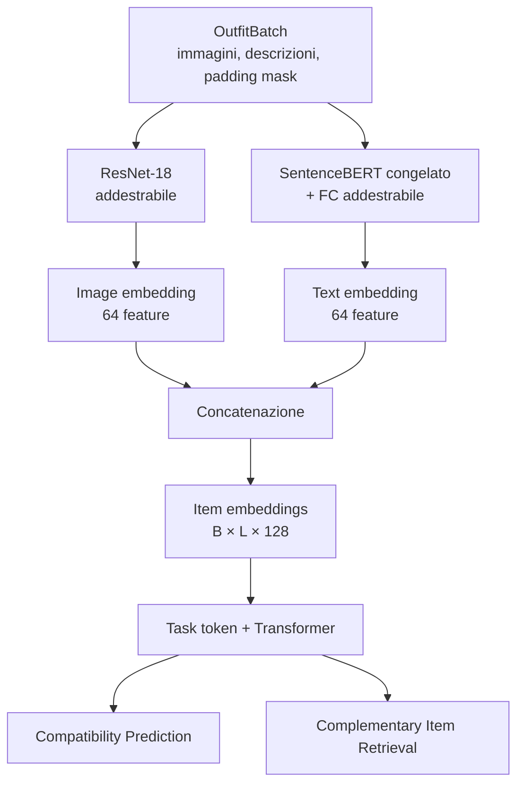

# Architettura comune

I componenti in `model/common` sono condivisi da:

- [Compatibility Prediction](../cp/README.md);
- [Complementary Item Retrieval](../cir/README.md).

Torna al [README principale](../../README.md).

## Flusso



Nel diagramma:

- `B` è il numero di outfit nel batch;
- `L` è il massimo numero di capi per outfit dopo il padding;
- ogni capo è rappresentato da 128 feature.

## Item embedding

Per ogni capo vengono unite informazioni visive e testuali:

```text
immagine ──> ResNet-18 ─────────> 64 feature ──┐
                                               ├──> item embedding: 128 feature
testo ─────> SentenceBERT + FC ─> 64 feature ──┘
```

```python
item_embedding = torch.cat(
    (image_embedding, text_embedding),
    dim=-1,
)
```

Prima del Transformer, le prime 64 feature sono visive e le successive 64
sono testuali. Dopo il Transformer, attenzione e proiezioni lineari mescolano
le due modalità.

### Image encoder

`ImageEncoder` usa ResNet-18 inizializzata con pesi ImageNet e sostituisce la
testa originale con una proiezione a 64 feature. I suoi parametri sono
addestrabili.

### Text encoder

`TextEncoder` usa SentenceBERT per estrarre le feature linguistiche e una
proiezione lineare addestrabile per portarle a 64 dimensioni. Il backbone
SentenceBERT è congelato; la proiezione viene aggiornata durante il training.

## Transformer

La configurazione predefinita usa:

```text
dimensione embedding: 128
layer:                 6
teste di attenzione:   16
positional encoding:   assente
```

L'outfit è trattato come un insieme non ordinato, quindi non viene aggiunto
positional encoding. Il Transformer riceve gli item embedding, un task token
e una padding mask:

- CP antepone il token `OUTFIT`;
- CIR antepone il token `TARGET`.

Le posizioni padded non partecipano all'attenzione e vengono azzerate
nell'output.

## Padding mask

La padding mask ha forma `[B,L]`:

```python
padding_mask = [
    [False, False, False],
    [False, False, True],
]
```

- `False` indica un capo reale;
- `True` indica una posizione `PAD`.

`OutfitEncoder.encode_items()` codifica soltanto i capi reali. Gli embedding
vengono poi reinseriti nella forma rettangolare `[B,L,128]`, lasciando zeri
nelle posizioni padded.

Quando viene anteposto un task token, viene aggiunto un valore `False` alla
maschera perché il token è sempre valido:

```text
mask originale:       [False, False, True]
con task token:       [False, False, False, True]
                       ↑
                    task token
```

Per i dettagli sulla costruzione dei batch consulta il
[README del modulo data](../../data/README.md).

## Configurazione

```python
from model import OutfitEncoder, OutfitEncoderConfig

config = OutfitEncoderConfig(
    image_embedding_dim=64,
    text_embedding_dim=64,
    transformer_layers=6,
    attention_heads=16,
    text_model_name="sentence-transformers/all-MiniLM-L6-v2",
)
model = OutfitEncoder(config)
```

## Output dell'encoder

```python
output = model(
    images=batch.images,
    descriptions=batch.descriptions,
    padding_mask=batch.padding_mask,
)
```

`OutfitEncoderOutput` contiene:

| Campo | Forma | Significato |
|---|---|---|
| `item_embeddings` | `[B,L,128]` | Feature multimodali prima del Transformer |
| `contextual_embeddings` | `[B,L,128]` | Capi contestualizzati |
| `outfit_embedding` | `[B,128]` | Output del token in posizione zero |
| `padding_mask` | `[B,L]` | Maschera degli item restituita dall'encoder |

## File

```text
model/common/
  config.py               configurazione del modello
  image_encoder.py        ResNet-18
  text_encoder.py         SentenceBERT + FC
  transformer_encoder.py  self-attention
  outfit_encoder.py       item embedding, outfit token e contesto
  heads.py                TaskMLP condiviso
  loss_reduction.py       riduzione comune delle loss
```
