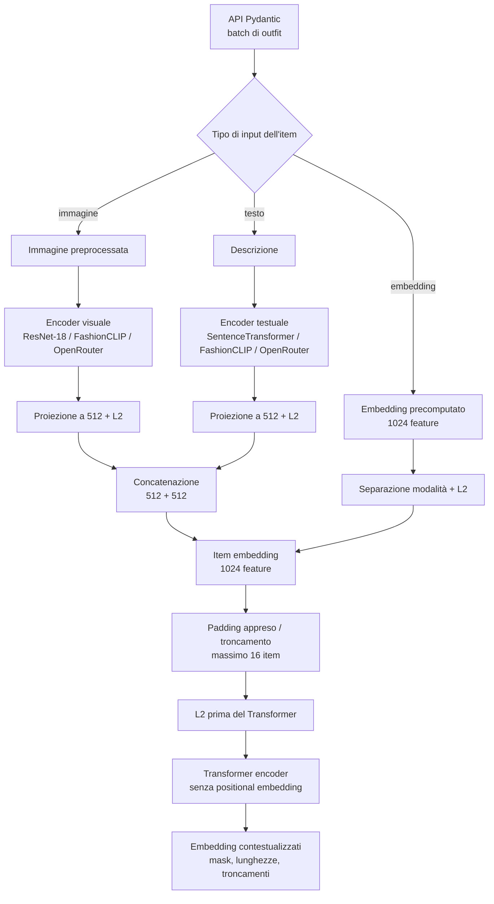

# Common: rappresentazione multimodale degli outfit

## Indice

- [File](#file)
- [Architettura](#architettura)
- [Scopo](#scopo)
- [API del modello](#api-del-modello)
- [Encoder visuale e testuale](#encoder-visuale-e-testuale)
- [Fusione multimodale](#fusione-multimodale)
- [Transformer](#transformer)
- [Padding e troncamento](#padding-e-troncamento)
- [Output](#output)
- [Modularità e limiti](#modularità-e-limiti)
- [Esempi concettuali](#esempi-concettuali)

## File

| File | Cosa fa |
|---|---|
| `visual_encoder.py` | Definisce gli encoder visuali ResNet-18, FashionCLIP ViT e OpenRouter. |
| `text_encoder.py` | Definisce gli encoder testuali SentenceTransformer, FashionCLIP e OpenRouter. |
| `openrouter.py` | Gestisce batching, retry e validazione delle risposte dell'API embedding OpenRouter. |
| `transformer.py` | Gestisce API Pydantic, fusione, padding, Transformer e output. |
| `task_embedding.py` | Definisce l'embedding allenabile condiviso dai moduli specifici CP e CIR. |
| `__init__.py` | Espone i componenti pubblici di `model.common`. |
| `README.md` | Documenta concetti, comportamento e limiti del modulo. |

## Architettura


```mermaid
flowchart TD
    API["API Pydantic<br/>batch di outfit"] --> TYPE{"Tipo di input dell'item"}

    TYPE -->|"immagine"| IMAGE["Immagine preprocessata"]
    TYPE -->|"testo"| TEXT["Descrizione"]
    TYPE -->|"embedding"| PRE["Embedding precomputato<br/>1024 feature"]

    IMAGE --> VE["Encoder visuale<br/>ResNet-18 / FashionCLIP / OpenRouter"]
    TEXT --> TE["Encoder testuale<br/>SentenceTransformer / FashionCLIP / OpenRouter"]
    VE --> VP["Proiezione a 512 + L2"]
    TE --> TP["Proiezione a 512 + L2"]
    VP --> CAT["Concatenazione<br/>512 + 512"]
    TP --> CAT

    CAT --> ITEM["Item embedding<br/>1024 feature"]
    PRE --> PN["Separazione modalità + L2"]
    PN --> ITEM

    ITEM --> PAD["Padding appreso / troncamento<br/>massimo 16 item"]
    PAD --> L2["L2 prima del Transformer"]
    L2 --> TR["Transformer encoder<br/>senza positional embedding"]
    TR --> OUT["Embedding contestualizzati<br/>mask, lunghezze, troncamenti"]
```

## Scopo

`model.common` crea la rappresentazione condivisa per i futuri task
Compatibility Prediction (CP) e Complementary Item Retrieval (CIR). Ogni capo
diventa un vettore che combina aspetto visuale e descrizione testuale; il
Transformer lo aggiorna considerando tutti gli altri capi dell'outfit.

Il modulo produce rappresentazioni comuni. Teste, loss e logica specifica di CP
e CIR non sono ancora incluse.

## API del modello

Qui **API** vuol dire semplicemente: come passiamo i dati al modello e cosa il
modello ci restituisce.

L'input è una lista di outfit. Ogni outfit è una lista di capi rappresentati da
`OutfitItem`. Un capo può contenere:

- immagine e testo, sempre insieme;
- oppure un embedding di 1024 valori già calcolato.

Pydantic controlla solo gli `OutfitItem` in input. Per esempio, segnala un
errore se manca il testo, se manca l'immagine o se vengono forniti sia dati
grezzi sia embedding. Non controlla l'output.

Esempio con un batch formato da un outfit e un capo:

```python
item = OutfitItem(image=image_tensor, text="camicia bianca")
output = model([[item]])
```

La lista interna `[item]` è l'outfit. La lista esterna `[[item]]` è il batch.
Il risultato è un normale `OutfitTransformerOutput`, non un oggetto Pydantic.

Se viene usato un embedding già calcolato, i primi 512 valori sono visuali e i
successivi 512 testuali. Le immagini devono essere già preparate per l'encoder
visuale scelto e avere forme compatibili nello stesso batch.

## Encoder visuale e testuale

Ogni encoder dichiara la dimensione del proprio output. Se non è 512, una
proiezione allenabile la adatta automaticamente.

Encoder visuali disponibili:

- **ResNet-18**: pesi ImageNet predefiniti, classificatore rimosso, backbone
  allenabile per impostazione predefinita;
- **FashionCLIP ViT**: visual tower di FashionCLIP, backbone allenabile per
  impostazione predefinita;
- **OpenRouter**: invia immagini PNG base64 a un modello embedding multimodale
  remoto; non contiene parametri allenabili.

Encoder testuali disponibili:

- **SentenceTransformer**: backbone preaddestrato e congelato per impostazione
  predefinita; proiezione dimensionale allenabile;
- **FashionCLIP text tower**: tokenizzazione inclusa e backbone allenabile per
  impostazione predefinita;
- **OpenRouter**: usa lo stesso modello embedding remoto scelto per le immagini,
  così le due modalità condividono spazio vettoriale e dimensione.

I pesi preaddestrati possono essere scaricati al primo utilizzo. Gli encoder
OpenRouter richiedono un modello con input immagine e output embedding, oltre a
una API key valida.

## Fusione multimodale

Feature visuali e testuali vengono normalizzate L2 separatamente, così nessuna
modalità domina solo per una norma maggiore. I due vettori da 512 feature sono
concatenati in un item embedding da 1024 feature. Prima del Transformer,
l'intero vettore viene normalizzato L2 di nuovo.

Embedding con valori non finiti o norma nulla vengono rifiutati.

## Transformer

Il Transformer contestualizza ogni item rispetto all'intero outfit.

| Parametro | Valore |
|---|---:|
| Input/output | 1024 feature |
| Layer | 6 |
| Teste | 16 |
| Feed-forward network | 1024 → 2024 → 1024 |
| Attivazione | Mish |
| LayerNorm | Pre-norm |
| Dropout | 0.3 |
| Positional embedding | Assente |

Senza positional embedding, l'outfit è trattato come insieme. Cambiare ordine
agli item cambia nello stesso modo l'ordine degli output, senza alterare le
relazioni apprese.

## Padding e troncamento

Ogni outfit viene portato a 16 posizioni tramite un padding vector appreso. Una
padding mask impedisce alle posizioni vuote di influenzare i capi reali.

Outfit oltre 16 item vengono troncati ai primi 16. Il modello conserva lunghezza
effettiva e indicatore di troncamento per ogni outfit.

## Output

Il modello restituisce un `OutfitTransformerOutput`, cioè un contenitore con
cinque tensori:

| Campo | Forma predefinita | Significato |
|---|---|---|
| `item_embeddings` | `[B, 16, 1024]` | Item embedding normalizzati usati come input del Transformer. |
| `contextual_embeddings` | `[B, 16, 1024]` | Item embedding aggiornati usando il contesto dell'intero outfit. |
| `padding_mask` | `[B, 16]` booleana | `False` per item reali, `True` per padding. |
| `lengths` | `[B]` intera | Numero di item realmente elaborati, massimo 16. |
| `truncated` | `[B]` booleana | `True` quando l'outfit originale superava 16 item. |

`B` indica il numero di outfit nel batch. `16` e `1024` dipendono dalla
configurazione e rappresentano rispettivamente massimo numero di item e
dimensione multimodale.

Le posizioni di padding contengono il padding vector appreso e normalizzato.
Chi usa gli output deve consultare `padding_mask` per distinguere queste
posizioni dai capi reali.

Il modulo non restituisce ancora score CP, risultato CIR o singolo embedding
globale dell'outfit: produce le rappresentazioni comuni che tali task useranno.


## Esempi concettuali

### Padding apprendibile

Il padding rende rettangolare un batch con outfit di lunghezze diverse. Con un
massimo ipotetico di quattro posizioni:

```text
Outfit A: maglia, pantaloni, scarpe, PAD
Outfit B: vestito, PAD, PAD, PAD
Mask A:   False, False, False, True
Mask B:   False, True,  True,  True
```

`PAD` è lo stesso vettore allenabile in tutte le posizioni vuote. La mask indica
al Transformer quali posizioni non rappresentano capi reali. Nel comportamento
attuale, questa mask impedisce al padding di influenzare gli item reali: il
parametro è allenabile, ma riceve gradiente utile solo se una loss utilizza
anche gli output padded.

### Normalizzazione L2

La normalizzazione L2 porta la lunghezza di un vettore a `1`, mantenendone la
direzione:

```text
[3, 4] / sqrt(3² + 4²) = [0.6, 0.8]
```

Il modello normalizza prima visuale e testo separatamente, così nessuna modalità
domina solo per la propria scala. Dopo la concatenazione normalizza nuovamente
l'intero item embedding:

```text
Visuale: [3, 4] -> [0.6, 0.8]
Testo:   [0, 2] -> [0, 1]
Fusione: [0.6, 0.8, 0, 1]
L2 finale: [0.424, 0.566, 0, 0.707]
```

Vettori nulli vengono rifiutati perché non possiedono una direzione
normalizzabile.
