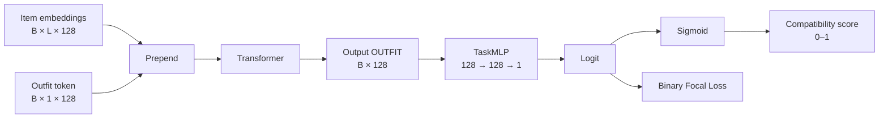

# Compatibility Prediction

Il modulo `model/cp` assegna a un outfit un punteggio di compatibilità compreso
tra 0 e 1.

Torna al [README principale](../../README.md) oppure consulta
l'[architettura condivisa](../common/README.md).

## Indice

- [Flusso](#flusso)
- [Utilizzo](#utilizzo)
- [Binary Focal Loss](#binary-focal-loss)
- [Quali componenti vengono aggiornati](#quali-componenti-vengono-aggiornati)
- [Come viene allenato](#come-viene-allenato)
- [Training CP con Polyvore](#training-cp-con-polyvore)
- [Checkpoint](#checkpoint)
- [File](#file)

## Flusso

L'encoder antepone un token `OUTFIT` apprendibile agli item embedding:

```text
[OUTFIT, capo 1, capo 2, ..., capo L]
```



L'output del token in posizione zero è la rappresentazione globale
dell'outfit. `TaskMLP` la trasforma in un logit; la sigmoid produce il
compatibility score.

## Utilizzo

```python
from model import BinaryFocalLoss, CompatibilityPredictor

model = CompatibilityPredictor()
criterion = BinaryFocalLoss()

output = model(
    batch.images,
    batch.descriptions,
    batch.padding_mask,
)
loss = criterion(output.logits, compatibility_labels)
```

`compatibility_labels` deve avere la stessa forma di `output.logits` e
contenere valori nell'intervallo `[0,1]`:

- `1` indica un outfit compatibile;
- `0` indica un outfit incompatibile.

`CompatibilityOutput` contiene:

| Campo | Forma | Significato |
|---|---|---|
| `logits` | `[B]` | Valori non normalizzati usati dalla loss |
| `compatibility_score` | `[B]` | Probabilità ottenute con la sigmoid |
| `outfit_embedding` | `[B,128]` | Rappresentazione globale dell'outfit |

## Binary Focal Loss

La Binary Focal Loss è una funzione di errore per classificazione binaria che
riduce il contributo degli esempi già classificati facilmente e concentra
l'addestramento su quelli incerti o sbagliati.

### Dal logit alla probabilità

Il modello produce un logit $z$, che la sigmoid trasforma nella probabilità
di compatibilità:

$$
p=\sigma(z)=\frac{1}{1+e^{-z}}
$$

Per esempio, $p=0.9$ significa che il modello considera l'outfit compatibile
con probabilità 90%.

### Probabilità della classe corretta

Durante il training è disponibile l'etichetta reale $y$. Si definisce:

$$
p_t=
\begin{cases}
p & \text{se } y=1\\
1-p & \text{se } y=0
\end{cases}
$$

$p_t$ è quindi la probabilità assegnata alla classe corretta:

| Etichetta $y$ | Predizione $p$ | $p_t$ | Interpretazione |
|---:|---:|---:|---|
| 1 | 0.95 | 0.95 | Corretta e facile |
| 1 | 0.20 | 0.20 | Sbagliata e difficile |
| 0 | 0.05 | 0.95 | Corretta e facile |
| 0 | 0.80 | 0.20 | Sbagliata e difficile |

Non serve assegnare manualmente una difficoltà:

- $p_t$ alto indica un esempio facile;
- $p_t$ vicino a 0.5 indica un esempio incerto;
- $p_t$ basso indica un esempio difficile o classificato erroneamente.

La difficoltà non è permanente. Uno stesso outfit può essere difficile
all'inizio del training e diventare facile quando il modello impara a
riconoscerlo.

### Binary cross-entropy e $-\log(p_t)$

La Binary Cross-Entropy per un singolo esempio può essere scritta come:

$$
\mathrm{BCE}=-\log(p_t)
$$

Il logaritmo trasforma la probabilità assegnata alla classe corretta in una
penalità:

| $p_t$ | $-\log(p_t)$ | Interpretazione |
|---:|---:|---|
| 0.99 | 0.010 | Penalità quasi nulla |
| 0.90 | 0.105 | Penalità piccola |
| 0.50 | 0.693 | Modello incerto |
| 0.10 | 2.303 | Penalità grande |
| 0.01 | 4.605 | Penalità molto grande |

Quando $p_t$ tende a 1, $-\log(p_t)$ tende a 0. Quando $p_t$ tende a 0,
$-\log(p_t)$ cresce rapidamente: una risposta sbagliata data con grande
sicurezza riceve una penalità molto alta.

Il segno meno è necessario perché $\log(p_t)$ è negativo per $0<p_t<1$,
mentre la loss deve essere positiva. Rispetto alla semplice quantità $1-p_t$,
il logaritmo penalizza più severamente gli errori commessi con grande
sicurezza.

### Il peso focale e $\gamma$

Molti esempi facili possono dominare l'addestramento quando le loro loss
vengono sommate. La Focal Loss riduce il loro contributo moltiplicando la BCE
per:

$$
(1-p_t)^\gamma
$$

Senza bilanciamento delle classi:

$$
\mathrm{FL}(p_t)=-(1-p_t)^\gamma\log(p_t)
$$

$\gamma$ controlla quanto aggressivamente vengono ridimensionati gli esempi
facili. Con $\gamma=2$:

| $p_t$ | Peso $(1-p_t)^2$ |
|---:|---:|
| 0.95 | 0.0025 |
| 0.50 | 0.25 |
| 0.10 | 0.81 |

Un esempio facile riceve un peso molto piccolo, mentre un esempio difficile
conserva gran parte della propria penalità. Con $\gamma=0$, il peso è sempre 1
e la Focal Loss coincide con la normale BCE.

### Come collaborano BCE e peso focale

Con $\gamma=2$ e senza considerare per il momento $\alpha$:

$$
\mathrm{FL}=(1-p_t)^2[-\log(p_t)]
$$

| $p_t$ | BCE $-\log(p_t)$ | Peso focale | Focal Loss |
|---:|---:|---:|---:|
| 0.95 | 0.051 | 0.0025 | 0.00013 |
| 0.50 | 0.693 | 0.25 | 0.173 |
| 0.10 | 2.303 | 0.81 | 1.865 |

I fattori hanno ruoli differenti:

$$
\underbrace{-\log(p_t)}_{\text{penalità della predizione}}
\qquad
\underbrace{(1-p_t)^\gamma}_{\text{attenzione data all'esempio}}
$$

La Focal Loss non penalizza maggiormente gli esempi facili: riduce quasi a
zero il loro contributo e concentra gli aggiornamenti sugli errori.

### Il bilanciamento delle classi con $\alpha$

La forma completa è:

$$
\mathrm{FL}(p_t)=-\alpha_t(1-p_t)^\gamma\log(p_t)
$$

In forma espansa:

$$
\mathrm{FL}(p,y)=
-\alpha y(1-p)^\gamma\log(p)
-(1-\alpha)(1-y)p^\gamma\log(1-p)
$$

I due iperparametri hanno scopi distinti:

- $\gamma$ bilancia esempi facili e difficili;
- $\alpha$ bilancia classe positiva e negativa.

Se gli outfit compatibili sono rari, il valore di $\alpha$ può essere scelto
per dare più importanza alla classe positiva.

`BinaryFocalLoss` usa:

```text
alpha:     0.25
gamma:     2.0
reduction: mean
```

Impostando `alpha=None` si disabilita il bilanciamento delle classi.
Impostando `gamma=0` e `alpha=None` si ottiene la normale BCE.

In sintesi:

$$
\boxed{
\text{Focal Loss}
=
\underbrace{-\log(p_t)}_{\text{errore di classificazione}}
\cdot
\underbrace{(1-p_t)^\gamma}_{\text{difficoltà dell'esempio}}
\cdot
\underbrace{\alpha_t}_{\text{peso della classe}}
}
$$

L'implementazione riceve direttamente i logits e usa
`binary_cross_entropy_with_logits`, evitando instabilità numeriche dovute al
calcolo separato di sigmoid e logaritmo.

## Quali componenti vengono aggiornati

La loss viene calcolata sul logit prodotto dal classificatore, ma il gradiente
può attraversare tutta la rete:

```text
immagini e testi
    → encoder
    → Transformer
    → outfit token
    → classifier
    → logit
    → Binary Focal Loss
```

Un passo di training tipico è:

```python
optimizer = torch.optim.AdamW(model.parameters(), lr=1e-4)

optimizer.zero_grad()
output = model(
    batch.images,
    batch.descriptions,
    batch.padding_mask,
)
loss = criterion(output.logits, compatibility_labels)
loss.backward()
optimizer.step()
```

`loss.backward()` calcola i gradienti per i parametri con
`requires_grad=True`; `optimizer.step()` aggiorna soltanto i parametri
registrati nell'optimizer.

Con `model.parameters()` vengono aggiornati:

- classificatore `TaskMLP`;
- outfit token;
- Transformer;
- ResNet-18;
- proiezione FC del text encoder.

Il backbone SentenceBERT rimane congelato.

Per allenare soltanto il classificatore:

```python
optimizer = torch.optim.AdamW(model.classifier.parameters(), lr=1e-4)
```

La Focal Loss stabilisce il segnale d'errore; `requires_grad` e l'optimizer
stabiliscono quali parametri cambiano.

## Come viene allenato

Il training CP è una classificazione binaria su outfit completi. Ogni esempio
contiene:

```text
immagini degli item
descrizioni degli item
padding mask
label 1/0
```

Il modello produce un logit per ogni outfit. La Binary Focal Loss confronta il
logit con la label:

```text
label = 1  -> outfit compatibile
label = 0  -> outfit incompatibile
```

Il ciclo generale è:

1. il `DataLoader` prepara un batch di outfit;
2. `CompatibilityPredictor` codifica immagini e testi;
3. il Transformer costruisce l'outfit embedding;
4. `TaskMLP` produce il logit;
5. `BinaryFocalLoss` calcola l'errore;
6. `loss.backward()` calcola i gradienti;
7. l'optimizer aggiorna i pesi;
8. a fine epoca si calcolano loss e accuracy.

In forma compatta:

```text
batch -> model -> logits -> focal loss -> backward -> optimizer.step()
```

Durante la validation il modello fa solo forward e metriche: niente backward,
niente aggiornamento dei pesi.

Il loop riutilizzabile sta in `training.cp`:

| Funzione | Ruolo |
|---|---|
| `run_cp_epoch()` | Esegue una epoca di train o validation |
| `train_cp()` | Gestisce più epoche, validation, scheduler e checkpoint |

## Training CP con Polyvore

Lo script [train_cp.py](../../train_cp.py) allena il modello usando gli split
ufficiali di `mvasil/polyvore-outfits`.

Per Polyvore gli esempi arrivano così:

```text
compatibility_*.txt      -> label + token set_id_index
<split>.json             -> token set_id_index -> item_id
Parquet                  -> item_id -> immagine
polyvore_item_metadata   -> item_id -> descrizione
```

Il dataset restituisce:

```text
CompatibilityExample(
    images=[N,3,224,224],
    descriptions=tuple di N stringhe,
    label=1.0 oppure 0.0,
)
```

Il training usa ADAM, Binary Focal Loss, validation a ogni epoca, scheduler,
log di avanzamento e checkpoint:

```powershell
python train_cp.py --variant nondisjoint --epochs 20 --batch-size 32
```

Per lo split senza item condivisi:

```powershell
python train_cp.py --variant disjoint
```

I checkpoint predefiniti sono:

```text
checkpoints/cp_epochs/cp_epoch_001.pt
checkpoints/cp_epochs/cp_epoch_002.pt
...
checkpoints/cp_best.pt
```

Per riprendere da un checkpoint:

```powershell
python train_cp.py --epochs 20 --resume checkpoints\cp_epochs\cp_epoch_010.pt
```

Iperparametri principali:

```text
--learning-rate 1e-4
--focal-alpha 0.5
--focal-gamma 2.0
--lr-step-size 10
--lr-gamma 0.5
--log-interval 50
--resume <checkpoint opzionale>
--max-grad-norm <valore opzionale>
```

Tutti gli argomenti, i log stampati, la cache Hugging Face e i checkpoint sono
descritti nella [guida completa al training](../../training/README.md).

## Checkpoint

Un checkpoint è una fotografia dello stato del training salvata alla fine di
un'epoca. Contiene:

```text
epoch                   epoca completata
model_state_dict        pesi di encoder, Transformer e classificatore CP
optimizer_state_dict    stato di ADAM
scheduler_state_dict    stato dello scheduler, se presente
monitored_loss          validation loss usata per confrontare i modelli
train_metrics           loss e accuracy di training
validation_metrics      loss e accuracy di validation
```

Vengono salvati due tipi di checkpoint:

- `checkpoints/cp_epochs/cp_epoch_NNN.pt` conserva i pesi di ogni epoca;
- `checkpoints/cp_best.pt` viene sovrascritto soltanto quando la validation
  loss è strettamente inferiore al miglior valore ottenuto fino a quel momento.

Di conseguenza, `cp_best.pt` contiene il modello selezionato tramite validation,
non necessariamente quello dell'ultima epoca.

Durante l'inferenza vengono caricati soltanto i pesi `model_state_dict`:

```powershell
# Inferenza su immagini scelte manualmente
python main.py --checkpoint checkpoints\cp_best.pt --images "shirt.jpg" "pants.jpg"

# Valutazione finale sullo split test, avviata solo su richiesta
python evaluate_cp.py --variant disjoint --checkpoint checkpoints\cp_best.pt
```

Il test set non seleziona né modifica il checkpoint. Serve esclusivamente per
misurare le prestazioni finali di un modello già scelto tramite validation.

Con `--resume`, invece, vengono ripristinati anche optimizer, scheduler ed
epoca, così il training può continuare:

```powershell
python train_cp.py --epochs 20 --resume checkpoints\cp_best.pt
```

Il modello SentenceBERT e la configurazione dell'architettura devono essere
gli stessi usati per creare il checkpoint; in caso contrario il caricamento
strict dei pesi segnala l'incompatibilità.

## File

```text
model/cp/
  checkpoint.py     caricamento dei pesi CP per inferenza e test
  compatibility.py  outfit embedding e compatibility score
  focal_loss.py      Binary Focal Loss
```

```text
training/
  README.md          comandi e iperparametri
  cp.py              loop di training e validazione CP
train_cp.py          CLI per Polyvore Outfits
```
