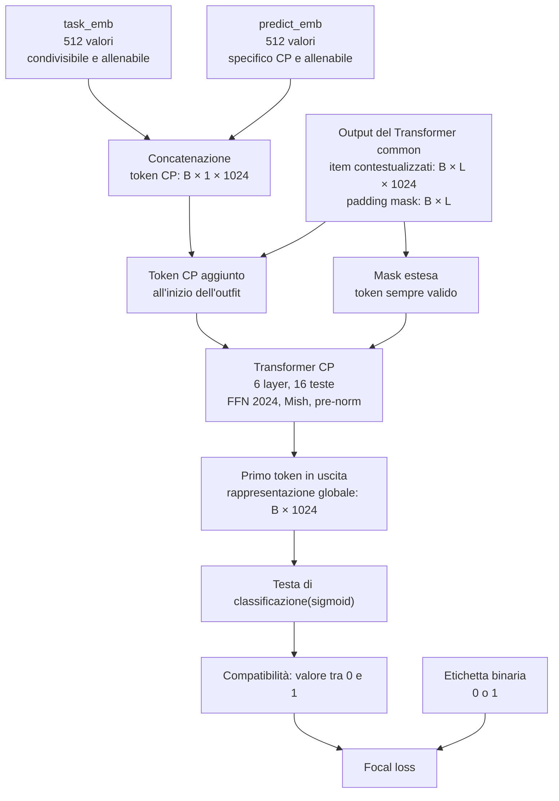

# Compatibility Prediction (CP)

## Indice

- [File](#file)
- [Architettura](#architettura)
- [Scopo](#scopo)
- [Input e output](#input-e-output)
- [Token CP](#token-cp)
- [Transformer CP](#transformer-cp)
- [Testa di classificazione](#testa-di-classificazione)
- [Focal loss](#focal-loss)
- [Padding e ordine degli item](#padding-e-ordine-degli-item)
- [Parametri allenabili e condivisione](#parametri-allenabili-e-condivisione)
- [Vincoli](#vincoli)

## File

| File | Cosa fa |
|---|---|
| `transformer.py` | Costruisce il token CP, elabora outfit e token con il Transformer e produce la probabilità tramite la testa. |
| `head.py` | Converte la rappresentazione globale dell'outfit in uno score di compatibilità. |
| `focal_loss.py` | Calcola la focal loss binaria usata per allenare il classificatore. |

## Architettura

```mermaid
flowchart TD
    COMMON["Output del Transformer common<br/>item contestualizzati: B × L × 1024<br/>padding mask: B × L"]
    TASK["task_emb<br/>512 valori<br/>condivisibile e allenabile"]
    PREDICT["predict_emb<br/>512 valori<br/>specifico CP e allenabile"]
    TOKEN["Concatenazione<br/>token CP: B × 1 × 1024"]
    PREPEND["Token CP aggiunto<br/>all'inizio dell'outfit"]
    MASK["Mask estesa<br/>token sempre valido"]
    TRANSFORMER["Transformer CP<br/>6 layer, 16 teste<br/>FFN 2024, Mish, pre-norm"]
    GLOBAL["Primo token in uscita<br/>rappresentazione globale: B × 1024"]
    HEAD["Testa di classificazione(sigmoid)"]
    SCORE["Compatibilità: valore tra 0 e 1"]
    LABEL["Etichetta binaria<br/>0 o 1"]
    LOSS["Focal loss<br/>"]

    TASK --> TOKEN
    PREDICT --> TOKEN
    TOKEN --> PREPEND
    COMMON --> PREPEND
    COMMON --> MASK
    PREPEND --> TRANSFORMER
    MASK --> TRANSFORMER
    TRANSFORMER --> GLOBAL
    GLOBAL --> HEAD
    HEAD --> SCORE
    SCORE --> LOSS
    LABEL --> LOSS
```

## Scopo

Il modulo CP stima se gli item di un outfit sono compatibili tra loro. Non
codifica immagini o testi direttamente: usa le rappresentazioni già
contestualizzate prodotte da `model.common` e aggiunge un secondo livello di
ragionamento specifico per la classificazione.

Lo score finale appartiene all'intervallo `[0, 1]`: valori vicini a `1`
indicano maggiore compatibilità, valori vicini a `0` minore compatibilità.

## Input e output

L'input è l'output strutturato del Transformer common. CP utilizza due parti:

- gli embedding contestualizzati degli item, con forma predefinita
  `[B, 16, 1024]`;
- la padding mask, che distingue gli item reali dalle posizioni vuote.

`B` è il numero di outfit nel batch. Il risultato è una probabilità per ogni
outfit, con forma `[B, 1]`.

## Token CP

Il primo elemento della nuova sequenza è un token allenabile composto tramite
concatenazione:

- `task_emb`, 512 valori che identificano il contesto di task e possono essere
  condivisi con un altro modulo;
- `predict_emb`, 512 valori specifici della Compatibility Prediction.

La concatenazione produce un token da 1024 valori, compatibile con gli
embedding degli item. Entrambe le parti sono inizializzate con piccoli valori
casuali e vengono ottimizzate durante il training.

Il token viene inserito prima degli item. Dopo il Transformer, il suo stato ha
raccolto informazione da tutti gli item reali e rappresenta quindi l'intero
outfit dal punto di vista della compatibilità.

## Transformer CP

Il Transformer CP usa la stessa configurazione del Transformer common:

| Parametro | Valore predefinito |
|---|---:|
| Dimensione input/output | 1024 |
| Layer | 6 |
| Teste di attenzione | 16 |
| Dimensione feed-forward | 2024 |
| Attivazione | Mish |
| Normalizzazione | Pre-norm e LayerNorm finale |
| Dropout | 0.3 |
| Positional embedding | Assente |

L'output degli item non viene classificato direttamente. Viene selezionato
solo il primo token trasformato, perché è quello incaricato di sintetizzare la
compatibilità globale dell'outfit.

## Testa di classificazione

La testa riceve la rappresentazione globale da 1024 valori e applica:

1. dropout, per ridurre l'overfitting;
2. una proiezione lineare da 1024 valori a un singolo valore;
3. sigmoid, per trasformare il risultato in una probabilità.

La testa non contiene layer nascosti: tutta la rappresentazione della
compatibilità viene appresa dal token e dal Transformer.

## Focal loss

La focal loss è una variante della binary cross-entropy che riduce il peso
degli esempi già classificati correttamente e concentra l'allenamento sugli
esempi più difficili.

I parametri predefiniti sono:

- `alpha = 0.5`: peso simmetrico per classi positive e negative;
- `gamma = 2`: attenuazione quadratica degli esempi facili;
- riduzione `mean`: media della loss sul batch.

Sono disponibili anche le riduzioni `sum` e `none`. La loss riceve le
probabilità già elaborate dalla sigmoid e target binari con la stessa forma.

## Padding e ordine degli item

La mask proveniente da common viene estesa con una posizione iniziale non
mascherata, perché il token CP deve partecipare sempre all'attenzione. Gli item
di padding restano mascherati e non contribuiscono alla rappresentazione
globale.

Non vengono usati positional embedding. Il significato dell'outfit non dipende
quindi dall'ordine degli item: una permutazione degli item e della relativa
mask non modifica lo score atteso.

## Parametri allenabili e condivisione

Transformer CP, testa, `task_emb` e `predict_emb` sono allenabili end-to-end.
`task_emb` appartiene a un'istanza di `TaskEmbedding` definita in
`model.common`. La stessa istanza può essere fornita a CP e CIR, permettendo
aggiornamenti congiunti. `predict_emb` rimane invece proprietà esclusiva del
CP.

## Vincoli

Il modulo rifiuta input incompatibili prima della classificazione:

- batch o sequenze vuote;
- embedding con dimensione diversa da 1024 o valori non finiti;
- mask con forma, tipo booleano o dispositivo non coerenti con gli embedding;
- outfit formati soltanto da padding;
- probabilità fuori da `[0, 1]` o target diversi da `0` e `1` nella focal loss.

Configurazioni diverse dai valori predefiniti restano possibili, purché la
dimensione prodotta da common coincida con quella attesa dal CP.
