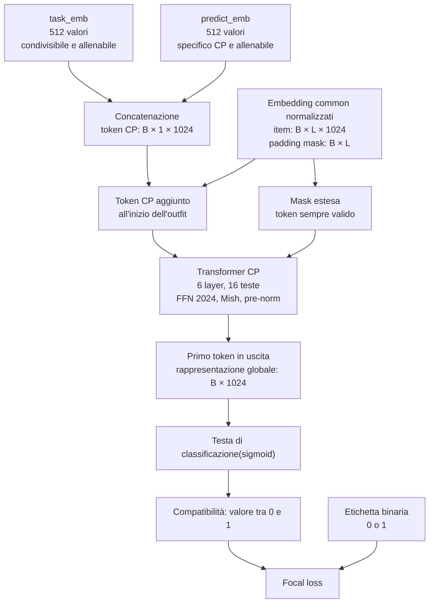

# Compatibility Prediction (CP)

## Indice

- [File](#file)
- [Configurazione CP](#configurazione-cp)
- [Architettura](#architettura)
- [Scopo](#scopo)
- [Input e output](#input-e-output)
- [Token CP](#token-cp)
- [Transformer CP](#transformer-cp)
- [Testa di classificazione](#testa-di-classificazione)
- [Focal loss](#focal-loss)
- [Padding e ordine degli item](#padding-e-ordine-degli-item)
- [Parametri allenabili e condivisione](#parametri-allenabili-e-condivisione)
- [Vincoli](#vincoli)
- [Binary Focal Loss](#binary-focal-loss)

## File

| File | Cosa fa |
|---|---|
| `transformer.py` | Costruisce il token CP, elabora outfit e token con il Transformer e produce la probabilità tramite la testa. |
| `head.py` | Converte la rappresentazione globale dell'outfit in uno score di compatibilità. |
| `focal_loss.py` | Calcola la focal loss binaria usata per allenare il classificatore. |

## Configurazione CP

`CompatibilityConfig` è definita nel file centralizzato
`model/common/config.py`. Contiene i parametri specifici della focal loss:

| Parametro | Default |
|---|---:|
| `focal_alpha` | `0.5` |
| `focal_gamma` | `2.0` |
| `focal_reduction` | `mean` |

`DEFAULT_MODEL_CONFIG.compatibility` contiene questa sezione nel punto di
accesso generale. `DEFAULT_COMPATIBILITY_CONFIG` è un alias dello stesso
oggetto, usato da modello, CLI e training CP.


## Architettura


```mermaid
flowchart TD
    COMMON["Embedding common normalizzati<br/>item: B × L × 1024<br/>padding mask: B × L"]
    TASK["task_emb<br/>512 valori<br/>condivisibile e allenabile"]
    PREDICT["predict_emb<br/>512 valori<br/>specifico CP e allenabile"]
    TOKEN["Concatenazione<br/>token CP: B × 1 × 1024"]
    PREPEND["Token CP aggiunto<br/>all'inizio dell'outfit"]
    MASK["Mask estesa<br/>token sempre valido"]
    TRANSFORMER["Transformer CP<br/>6 layer, 16 teste<br/>FFN 2024, Mish, pre-norm"]
    GLOBAL["Primo token in uscita<br/>rappresentazione globale: B × 1024"]
    HEAD["Testa di classificazione(sigmoid)"]
    SCORE["Compatibilità: valore tra 0 e 1"]
    LABEL["Etichetta binaria<br/>0 o 1"]
    LOSS["Focal loss<br/>"]

    TASK --> TOKEN
    PREDICT --> TOKEN
    TOKEN --> PREPEND
    COMMON --> PREPEND
    COMMON --> MASK
    PREPEND --> TRANSFORMER
    MASK --> TRANSFORMER
    TRANSFORMER --> GLOBAL
    GLOBAL --> HEAD
    HEAD --> SCORE
    SCORE --> LOSS
    LABEL --> LOSS
```

## Scopo

Il modulo CP stima se gli item di un outfit sono compatibili tra loro. Non
codifica immagini o testi direttamente: usa gli embedding multimodali prodotti
da `model.common`. Il Transformer CP esegue l'unica contestualizzazione
specifica per la classificazione.

Lo score finale appartiene all'intervallo `[0, 1]`: valori vicini a `1`
indicano maggiore compatibilità, valori vicini a `0` minore compatibilità.

## Input e output

L'input è un `OutfitEmbeddingBatch` prodotto dalla parte common. CP utilizza:

- gli embedding normalizzati degli item, con forma predefinita
  `[B, 16, 1024]`;
- la padding mask, che distingue gli item reali dalle posizioni vuote.

`B` è il numero di outfit nel batch. Il risultato è una probabilità per ogni
outfit, con forma `[B, 1]`.

## Token CP

Il primo elemento della nuova sequenza è un token allenabile composto tramite
concatenazione:

- `task_emb`, 512 valori che identificano il contesto di task e possono essere
  condivisi con un altro modulo;
- `predict_emb`, 512 valori specifici della Compatibility Prediction.

La concatenazione produce un token da 1024 valori, compatibile con gli
embedding degli item. Entrambe le parti sono inizializzate con piccoli valori
casuali e vengono ottimizzate durante il training.

Il token viene inserito prima degli item. Dopo il Transformer, il suo stato ha
raccolto informazione da tutti gli item reali e rappresenta quindi l'intero
outfit dal punto di vista della compatibilità.

## Transformer CP

Il Transformer CP usa questa configurazione predefinita:

| Parametro | Valore predefinito |
|---|---:|
| Dimensione input/output | 1024 |
| Layer | 6 |
| Teste di attenzione | 16 |
| Dimensione feed-forward | 2024 |
| Attivazione | Mish |
| Normalizzazione | Pre-norm e LayerNorm finale |
| Dropout | 0.3 |
| Positional embedding | Assente |

L'output degli item non viene classificato direttamente. Viene selezionato
solo il primo token trasformato, perché è quello incaricato di sintetizzare la
compatibilità globale dell'outfit.

## Testa di classificazione

La testa riceve la rappresentazione globale da 1024 valori e applica:

1. dropout, per ridurre l'overfitting;
2. una proiezione lineare da 1024 valori a un singolo valore;
3. sigmoid, per trasformare il risultato in una probabilità.

La testa non contiene layer nascosti: tutta la rappresentazione della
compatibilità viene appresa dal token e dal Transformer.

## Focal loss

La focal loss è una variante della binary cross-entropy che riduce il peso
degli esempi già classificati correttamente e concentra l'allenamento sugli
esempi più difficili.

I parametri predefiniti sono:

- `alpha = 0.5`: peso simmetrico per classi positive e negative;
- `gamma = 2`: attenuazione quadratica degli esempi facili;
- riduzione `mean`: media della loss sul batch.

Sono disponibili anche le riduzioni `sum` e `none`. La loss riceve le
probabilità già elaborate dalla sigmoid e target binari con la stessa forma.

## Padding e ordine degli item

La mask proveniente da common viene estesa con una posizione iniziale non
mascherata, perché il token CP deve partecipare sempre all'attenzione. Gli item
di padding restano mascherati e non contribuiscono alla rappresentazione
globale.

Non vengono usati positional embedding. Il significato dell'outfit non dipende
quindi dall'ordine degli item: una permutazione degli item e della relativa
mask non modifica lo score atteso.

## Parametri allenabili e condivisione

Transformer CP, testa, `task_emb` e `predict_emb` sono allenabili end-to-end.
`task_emb` appartiene a un'istanza di `TaskEmbedding` definita in
`model.common`. La stessa istanza può essere fornita a CP e CIR, permettendo
aggiornamenti congiunti. `predict_emb` rimane invece proprietà esclusiva del
CP.

## Vincoli

Il modulo rifiuta input incompatibili prima della classificazione:

- batch o sequenze vuote;
- embedding con dimensione diversa da 1024 o valori non finiti;
- mask con forma, tipo booleano o dispositivo non coerenti con gli embedding;
- outfit formati soltanto da padding;
- probabilità fuori da `[0, 1]` o target diversi da `0` e `1` nella focal loss.

Configurazioni diverse dai valori predefiniti restano possibili, purché la
dimensione prodotta da common coincida con quella attesa dal CP.

## Binary Focal Loss

La Binary Focal Loss è una funzione di errore per classificazione binaria che
riduce il contributo degli esempi già classificati facilmente e concentra
l'addestramento su quelli incerti o sbagliati.

### Dal logit alla probabilità

Il modello produce un logit $z$, che la sigmoid trasforma nella probabilità
di compatibilità:

$$
p=\sigma(z)=\frac{1}{1+e^{-z}}
$$

Per esempio, $p=0.9$ significa che il modello considera l'outfit compatibile
con probabilità 90%.

### Probabilità della classe corretta

Durante il training è disponibile l'etichetta reale $y$. Si definisce:

$$
p_t=
\begin{cases}
p & \text{se } y=1\\
1-p & \text{se } y=0
\end{cases}
$$

$p_t$ è quindi la probabilità assegnata alla classe corretta:

| Etichetta $y$ | Predizione $p$ | $p_t$ | Interpretazione |
|---:|---:|---:|---|
| 1 | 0.95 | 0.95 | Corretta e facile |
| 1 | 0.20 | 0.20 | Sbagliata e difficile |
| 0 | 0.05 | 0.95 | Corretta e facile |
| 0 | 0.80 | 0.20 | Sbagliata e difficile |

Non serve assegnare manualmente una difficoltà:

- $p_t$ alto indica un esempio facile;
- $p_t$ vicino a 0.5 indica un esempio incerto;
- $p_t$ basso indica un esempio difficile o classificato erroneamente.

La difficoltà non è permanente. Uno stesso outfit può essere difficile
all'inizio del training e diventare facile quando il modello impara a
riconoscerlo.

### Binary cross-entropy e $-\log(p_t)$

La Binary Cross-Entropy per un singolo esempio può essere scritta come:

$$
\mathrm{BCE}=-\log(p_t)
$$

Il logaritmo trasforma la probabilità assegnata alla classe corretta in una
penalità:

| $p_t$ | $-\log(p_t)$ | Interpretazione |
|---:|---:|---|
| 0.99 | 0.010 | Penalità quasi nulla |
| 0.90 | 0.105 | Penalità piccola |
| 0.50 | 0.693 | Modello incerto |
| 0.10 | 2.303 | Penalità grande |
| 0.01 | 4.605 | Penalità molto grande |

Quando $p_t$ tende a 1, $-\log(p_t)$ tende a 0. Quando $p_t$ tende a 0,
$-\log(p_t)$ cresce rapidamente: una risposta sbagliata data con grande
sicurezza riceve una penalità molto alta.

Il segno meno è necessario perché $\log(p_t)$ è negativo per $0<p_t<1$,
mentre la loss deve essere positiva. Rispetto alla semplice quantità $1-p_t$,
il logaritmo penalizza più severamente gli errori commessi con grande
sicurezza.

### Il peso focale e $\gamma$

Molti esempi facili possono dominare l'addestramento quando le loro loss
vengono sommate. La Focal Loss riduce il loro contributo moltiplicando la BCE
per:

$$
(1-p_t)^\gamma
$$

Senza bilanciamento delle classi:

$$
\mathrm{FL}(p_t)=-(1-p_t)^\gamma\log(p_t)
$$

$\gamma$ controlla quanto aggressivamente vengono ridimensionati gli esempi
facili. Con $\gamma=2$:

| $p_t$ | Peso $(1-p_t)^2$ |
|---:|---:|
| 0.95 | 0.0025 |
| 0.50 | 0.25 |
| 0.10 | 0.81 |

Un esempio facile riceve un peso molto piccolo, mentre un esempio difficile
conserva gran parte della propria penalità. Con $\gamma=0$, il peso è sempre 1
e la Focal Loss coincide con la normale BCE.

### Come collaborano BCE e peso focale

Con $\gamma=2$ e senza considerare per il momento $\alpha$:

$$
\mathrm{FL}=(1-p_t)^2[-\log(p_t)]
$$

| $p_t$ | BCE $-\log(p_t)$ | Peso focale | Focal Loss |
|---:|---:|---:|---:|
| 0.95 | 0.051 | 0.0025 | 0.00013 |
| 0.50 | 0.693 | 0.25 | 0.173 |
| 0.10 | 2.303 | 0.81 | 1.865 |

I fattori hanno ruoli differenti:

$$
\underbrace{-\log(p_t)}_{\text{penalità della predizione}}
\qquad
\underbrace{(1-p_t)^\gamma}_{\text{attenzione data all'esempio}}
$$

La Focal Loss non penalizza maggiormente gli esempi facili: riduce quasi a
zero il loro contributo e concentra gli aggiornamenti sugli errori.

### Il bilanciamento delle classi con $\alpha$

La forma completa è:

$$
\mathrm{FL}(p_t)=-\alpha_t(1-p_t)^\gamma\log(p_t)
$$

In forma espansa:

$$
\mathrm{FL}(p,y)=
-\alpha y(1-p)^\gamma\log(p)
-(1-\alpha)(1-y)p^\gamma\log(1-p)
$$

I due iperparametri hanno scopi distinti:

- $\gamma$ bilancia esempi facili e difficili;
- $\alpha$ bilancia classe positiva e negativa.

Se gli outfit compatibili sono rari, il valore di $\alpha$ può essere scelto
per dare più importanza alla classe positiva.

`BinaryFocalLoss` usa:

```text
alpha:     0.25
gamma:     2.0
reduction: mean
```

Impostando `alpha=None` si disabilita il bilanciamento delle classi.
Impostando `gamma=0` e `alpha=None` si ottiene la normale BCE.

In sintesi:

$$
\boxed{
\text{Focal Loss}
=
\underbrace{-\log(p_t)}_{\text{errore di classificazione}}
\cdot
\underbrace{(1-p_t)^\gamma}_{\text{difficoltà dell'esempio}}
\cdot
\underbrace{\alpha_t}_{\text{peso della classe}}
}
$$

L'implementazione riceve direttamente i logits e usa
`binary_cross_entropy_with_logits`, evitando instabilità numeriche dovute al
calcolo separato di sigmoid e logaritmo.
