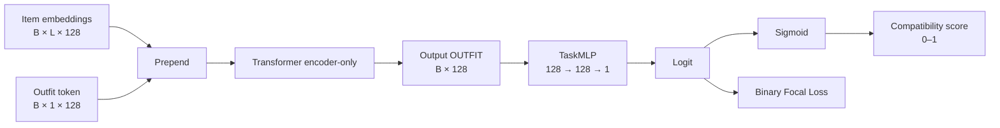

# Compatibility Prediction

Il modulo `model/cp` assegna a un outfit un punteggio di compatibilità compreso
tra 0 e 1.

Torna al [README principale](../../README.md) oppure consulta
l'[architettura condivisa](../common/README.md) e la
[guida alla valutazione](../../evaluate/README.md). Per avviare o riprendere
l'addestramento consulta la [guida al training CP](../../training/cp/README.md).

## Indice

- [Flusso](#flusso)
- [Token OUTFIT](#token-outfit)
- [Transformer encoder-only](#transformer-encoder-only)
- [Utilizzo](#utilizzo)
- [Binary Focal Loss](#binary-focal-loss)
- [File](#file)

## Flusso

L'encoder antepone un token `OUTFIT` apprendibile agli item embedding:

```text
[OUTFIT, capo 1, capo 2, ..., capo L]
```


```mermaid
flowchart LR
    A["Item embeddings<br/>B × L × 128"]
    B["Outfit token<br/>B × 1 × 128"]
    A --> C["Prepend"]
    B --> C
    C --> D["Transformer encoder-only"]
    D --> E["Output OUTFIT<br/>B × 128"]
    E --> F["TaskMLP<br/>128 → 128 → 1"]
    F --> G["Logit"]
    G --> H["Sigmoid"]
    H --> I["Compatibility score<br/>0–1"]
    G --> J["Binary Focal Loss"]
```

L'output del token in posizione zero è la rappresentazione globale
dell'outfit. `TaskMLP` la trasforma in un logit; la sigmoid produce il
compatibility score.

## Token OUTFIT

`OUTFIT` svolge un ruolo simile al token `[CLS]`: offre al Transformer una
posizione dedicata nella quale raccogliere le informazioni sull'intero outfit.
È un unico `nn.Parameter` di forma `[1, 1, 128]`, inizializzato una volta e
condiviso da tutti gli esempi. I suoi 128 valori sono direttamente parametri
del modello, non sono generati dall'attenzione o da un'altra rete.

Nel forward la stessa base viene espansa per il batch e anteposta agli item:

```text
token OUTFIT base condiviso + item dell'outfit
                       ↓ Transformer
outfit embedding contestualizzato e specifico dell'outfit
```

È quindi importante distinguere:

| Elemento | Significato |
|---|---|
| `outfit_token` | Parametro base globale appreso e salvato nel checkpoint |
| `outfit_embedding` | Output in posizione zero, ricalcolato per ciascun outfit |

Il Transformer non crea il token base: usa self-attention, feed-forward e
connessioni residue per trasformarlo in una rappresentazione dipendente dagli
item presenti. Il modo in cui il token riceve il gradiente e viene aggiornato
da Adam è descritto nella sezione
[Cosa aggiorna la backpropagation](../../training/cp/README.md#cosa-aggiorna-la-backpropagation).

## Transformer encoder-only

Il CP usa esclusivamente un **Transformer encoder-only**, implementato con
`nn.TransformerEncoderLayer` e `nn.TransformerEncoder`. Non sono presenti un
decoder, cross-attention o generazione autoregressiva: tutti i token validi
dell'outfit interagiscono tramite self-attention bidirezionale.

Gli embedding visivi e testuali, entrambi di dimensione 64, vengono concatenati
in un item embedding di dimensione 128. Prima dell'encoder viene aggiunto il
token apprendibile `OUTFIT`; la sua rappresentazione finale riassume l'intero
outfit ed è passata alla testa di classificazione.

| Iperparametro | Valore |
|---|---:|
| Tipo | Encoder-only |
| Dimensione embedding (`d_model`) | 128 |
| Layer encoder | 6 |
| Teste di attenzione (`nhead`) | 16 |
| Dimensione feed-forward | 512 |
| Dropout | 0.1 |
| Attivazione | ReLU |
| `batch_first` | `True` |
| `norm_first` | `False` |
| Positional embedding | Nessuno |
| Mascheramento | Solo padding, non causale |

La dimensione FFN 512, rapporto standard per un embedding da
128. In ognuno dei 6 layer opera su ciascun token come
`128 → 512 → ReLU → dropout → 128`; non coincide con la FC `512 → 64` della
ResNet né con la testa di classificazione. `Dropout=0.1` e post-norm
(`norm_first=False`) sono i default standard mantenuti dal progetto.

L'assenza di positional embedding rende l'encoder equivariante alle
permutazioni: cambiare l'ordine dei capi non cambia il significato
dell'outfit.

## Utilizzo

```python
from model import BinaryFocalLoss, CompatibilityPredictor

model = CompatibilityPredictor()
criterion = BinaryFocalLoss()

output = model(
    batch.images,
    batch.descriptions,
    batch.padding_mask,
)
loss = criterion(output.logits, compatibility_labels)
```

`compatibility_labels` deve avere la stessa forma di `output.logits` e
contenere valori nell'intervallo `[0,1]`:

- `1` indica un outfit compatibile;
- `0` indica un outfit incompatibile.

`CompatibilityOutput` contiene:

| Campo | Forma | Significato |
|---|---|---|
| `logits` | `[B]` | Valori non normalizzati usati dalla loss |
| `compatibility_score` | `[B]` | Probabilità ottenute con la sigmoid |
| `outfit_embedding` | `[B,128]` | Rappresentazione globale dell'outfit |

## Binary Focal Loss

La Binary Focal Loss è una funzione di errore per classificazione binaria che
riduce il contributo degli esempi già classificati facilmente e concentra
l'addestramento su quelli incerti o sbagliati.

### Dal logit alla probabilità

Il modello produce un logit $z$, che la sigmoid trasforma nella probabilità
di compatibilità:

$$
p=\sigma(z)=\frac{1}{1+e^{-z}}
$$

Per esempio, $p=0.9$ significa che il modello considera l'outfit compatibile
con probabilità 90%.

### Probabilità della classe corretta

Durante il training è disponibile l'etichetta reale $y$. Si definisce:

$$
p_t=
\begin{cases}
p & \text{se } y=1\\
1-p & \text{se } y=0
\end{cases}
$$

$p_t$ è quindi la probabilità assegnata alla classe corretta:

| Etichetta $y$ | Predizione $p$ | $p_t$ | Interpretazione |
|---:|---:|---:|---|
| 1 | 0.95 | 0.95 | Corretta e facile |
| 1 | 0.20 | 0.20 | Sbagliata e difficile |
| 0 | 0.05 | 0.95 | Corretta e facile |
| 0 | 0.80 | 0.20 | Sbagliata e difficile |

Non serve assegnare manualmente una difficoltà:

- $p_t$ alto indica un esempio facile;
- $p_t$ vicino a 0.5 indica un esempio incerto;
- $p_t$ basso indica un esempio difficile o classificato erroneamente.

La difficoltà non è permanente. Uno stesso outfit può essere difficile
all'inizio del training e diventare facile quando il modello impara a
riconoscerlo.

### Binary cross-entropy e $-\log(p_t)$

La Binary Cross-Entropy per un singolo esempio può essere scritta come:

$$
\mathrm{BCE}=-\log(p_t)
$$

Il logaritmo trasforma la probabilità assegnata alla classe corretta in una
penalità:

| $p_t$ | $-\log(p_t)$ | Interpretazione |
|---:|---:|---|
| 0.99 | 0.010 | Penalità quasi nulla |
| 0.90 | 0.105 | Penalità piccola |
| 0.50 | 0.693 | Modello incerto |
| 0.10 | 2.303 | Penalità grande |
| 0.01 | 4.605 | Penalità molto grande |

Quando $p_t$ tende a 1, $-\log(p_t)$ tende a 0. Quando $p_t$ tende a 0,
$-\log(p_t)$ cresce rapidamente: una risposta sbagliata data con grande
sicurezza riceve una penalità molto alta.

Il segno meno è necessario perché $\log(p_t)$ è negativo per $0<p_t<1$,
mentre la loss deve essere positiva. Rispetto alla semplice quantità $1-p_t$,
il logaritmo penalizza più severamente gli errori commessi con grande
sicurezza.

### Il peso focale e $\gamma$

Molti esempi facili possono dominare l'addestramento quando le loro loss
vengono sommate. La Focal Loss riduce il loro contributo moltiplicando la BCE
per:

$$
(1-p_t)^\gamma
$$

Senza bilanciamento delle classi:

$$
\mathrm{FL}(p_t)=-(1-p_t)^\gamma\log(p_t)
$$

$\gamma$ controlla quanto aggressivamente vengono ridimensionati gli esempi
facili. Con $\gamma=2$:

| $p_t$ | Peso $(1-p_t)^2$ |
|---:|---:|
| 0.95 | 0.0025 |
| 0.50 | 0.25 |
| 0.10 | 0.81 |

Un esempio facile riceve un peso molto piccolo, mentre un esempio difficile
conserva gran parte della propria penalità. Con $\gamma=0$, il peso è sempre 1
e la Focal Loss coincide con la normale BCE.

### Come collaborano BCE e peso focale

Con $\gamma=2$ e senza considerare per il momento $\alpha$:

$$
\mathrm{FL}=(1-p_t)^2[-\log(p_t)]
$$

| $p_t$ | BCE $-\log(p_t)$ | Peso focale | Focal Loss |
|---:|---:|---:|---:|
| 0.95 | 0.051 | 0.0025 | 0.00013 |
| 0.50 | 0.693 | 0.25 | 0.173 |
| 0.10 | 2.303 | 0.81 | 1.865 |

I fattori hanno ruoli differenti:

$$
\underbrace{-\log(p_t)}_{\text{penalità della predizione}}
\qquad
\underbrace{(1-p_t)^\gamma}_{\text{attenzione data all'esempio}}
$$

La Focal Loss non penalizza maggiormente gli esempi facili: riduce quasi a
zero il loro contributo e concentra gli aggiornamenti sugli errori.

### Il bilanciamento delle classi con $\alpha$

La forma completa è:

$$
\mathrm{FL}(p_t)=-\alpha_t(1-p_t)^\gamma\log(p_t)
$$

In forma espansa:

$$
\mathrm{FL}(p,y)=
-\alpha y(1-p)^\gamma\log(p)
-(1-\alpha)(1-y)p^\gamma\log(1-p)
$$

I due iperparametri hanno scopi distinti:

- $\gamma$ bilancia esempi facili e difficili;
- $\alpha$ bilancia classe positiva e negativa.

Se gli outfit compatibili sono rari, il valore di $\alpha$ può essere scelto
per dare più importanza alla classe positiva.

`BinaryFocalLoss` usa:

```text
alpha:     0.25
gamma:     2.0
reduction: mean
```

Impostando `alpha=None` si disabilita il bilanciamento delle classi.
Impostando `gamma=0` e `alpha=None` si ottiene la normale BCE.

In sintesi:

$$
\boxed{
\text{Focal Loss}
=
\underbrace{-\log(p_t)}_{\text{errore di classificazione}}
\cdot
\underbrace{(1-p_t)^\gamma}_{\text{difficoltà dell'esempio}}
\cdot
\underbrace{\alpha_t}_{\text{peso della classe}}
}
$$

L'implementazione riceve direttamente i logits e usa
`binary_cross_entropy_with_logits`, evitando instabilità numeriche dovute al
calcolo separato di sigmoid e logaritmo.

## File

```text
model/cp/
  checkpoint.py     caricamento dei pesi CP per inferenza e test
  compatibility.py  outfit embedding e compatibility score
  focal_loss.py      Binary Focal Loss
```
