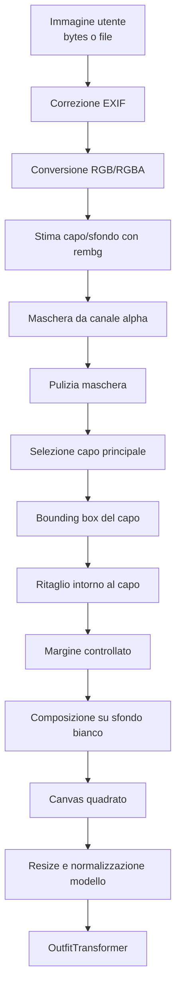

# Preprocessing immagini

Modulo per preparare immagini utente prima di passarle al modello.

Obiettivo finale:

```text
foto capo utente
-> capo isolato
-> sfondo bianco
-> immagine quadrata
-> input modello
```

## Indice

- [Flusso completo](#flusso-completo)
- [Stato attuale](#stato-attuale)
- [Moduli](#moduli)
- [Uso rapido](#uso-rapido)
- [Prossimi passi](#prossimi-passi)
- [Note](#note)

## Flusso completo

Il grafico mostra il flusso logico del preprocessing. Lo stato di avanzamento
dei singoli step e' indicato nella sezione [Stato attuale](#stato-attuale).



### Cosa fa ogni passaggio

| Passaggio | Cosa fa | Cosa passa al prossimo passaggio |
|---|---|---|
| Immagine utente | Riceve l'immagine caricata dall'utente, come file o bytes. | Immagine grezza da aprire con Pillow. |
| Correzione EXIF | Applica l'orientamento salvato nei metadati della foto, utile soprattutto per immagini da telefono. | `PIL.Image` orientata correttamente. |
| Conversione RGB/RGBA | Porta l'immagine in un formato prevedibile. `RGBA` serve quando vogliamo usare la trasparenza. | `PIL.Image` normalizzata in `RGB` o `RGBA`. |
| Stima capo/sfondo con rembg | Usa un modello di background removal per stimare quali pixel appartengono al capo e quali allo sfondo. Non crea ancora lo sfondo bianco finale. | Immagine `RGBA` con un canale alpha: capo piu' opaco, sfondo piu' trasparente. |
| Maschera da canale alpha | Legge la trasparenza dell'immagine e la converte in una maschera binaria. | Maschera `L`, dove `0` e' sfondo e `255` e' capo. |
| Pulizia maschera | Rimuove rumore, puntini isolati e piccoli buchi nella maschera. | Maschera piu' stabile e pulita. |
| Selezione capo principale | Se ci sono piu' aree visibili, tiene la componente principale, di solito quella piu' grande. | Maschera del capo scelto. |
| Bounding box del capo | Calcola il rettangolo minimo che contiene il capo nella maschera. | Coordinate del rettangolo: `left`, `top`, `right`, `bottom`. |
| Ritaglio intorno al capo | Usa il bounding box per tagliare via lo spazio inutile attorno al capo. | Immagine e maschera ritagliate intorno al capo. |
| Margine controllato | Aggiunge un po' di spazio attorno al capo per non farlo toccare ai bordi. | Capo ritagliato con padding/margine. |
| Composizione su sfondo bianco | Incolla il capo sopra un fondo bianco, usando la maschera/alpha. | Immagine con capo su sfondo bianco. |
| Canvas quadrato | Inserisce l'immagine in un quadrato, centrando il capo senza deformarlo. | Immagine quadrata pronta per le transform del modello. |
| Resize e normalizzazione modello | Applica dimensione, tensorizzazione e normalizzazione attese dal modello. | Tensore immagine nel formato usato da `OutfitTransformer`. |
| OutfitTransformer | Usa l'immagine preprocessata come input del modello. | Output del modello: score, classe o risposta dipendente dal task. |

### Chi toglie davvero lo sfondo?

`rembg` non mette direttamente uno sfondo bianco e non produce ancora
l'immagine finale pronta per l'utente o per il modello.

Quello che fa `rembg` e':

```text
immagine RGB/RGBA
-> stima capo/sfondo
-> immagine RGBA con canale alpha
```

Il canale alpha dice quali pixel devono restare visibili e quali devono
diventare trasparenti:

```text
alpha alto  -> pixel considerato capo
alpha basso -> pixel considerato sfondo
```

Quindi, tecnicamente:

- il modello usato da `rembg` stima dove si trova il capo;
- `background.py` salva questa stima dentro un'immagine `RGBA`;
- `mask.py` legge l'alpha e crea una maschera tecnica `0/255`;
- gli step successivi usano quella maschera per tagliare, centrare e comporre;
- `canvas.py` sara' il punto in cui lo sfondo trasparente viene sostituito con bianco.

In altre parole:

```text
rembg       -> rende lo sfondo trasparente tramite alpha
mask.py     -> capisce quali pixel sono capo e quali sfondo
canvas.py   -> sostituisce lo sfondo trasparente con bianco
```

Fino allo step `Composizione su sfondo bianco`, lo sfondo non e' ancora
veramente bianco: e' soprattutto "ignorato" grazie alla trasparenza/maschera.

## Stato attuale

| Step | Stato | File |
|---|---|---|
| Lettura immagine da path o bytes | Implementato | `image_loader.py` |
| Correzione orientamento EXIF | Implementato | `image_loader.py` |
| Conversione in `RGB` o `RGBA` | Implementato | `image_loader.py` |
| Stima capo/sfondo con `rembg` | Implementato | `background.py` |
| Cambio modello `rembg` via config | Implementato | `background.py` |
| Cache sessioni `rembg` | Implementato | `background.py` |
| Estrazione maschera da canale alpha | Implementato | `mask.py` |
| Pulizia maschera | Implementato | `mask.py` |
| Selezione capo principale | Implementato | `mask.py` |
| Bounding box del capo | Implementato | `crop.py` |
| Ritaglio capo | Implementato | `crop.py` |
| Margine controllato | Implementato | `crop.py` |
| Sfondo bianco | Implementato | `canvas.py` |
| Canvas quadrato | Implementato | `canvas.py` |

## Moduli

### `image_loader.py`

Responsabilita:

- legge immagini da `bytes` o path;
- corregge orientamento EXIF con Pillow;
- converte immagine in `RGB` o `RGBA`;
- ritorna sempre una `PIL.Image` caricata e pronta.

API principali:

```python
load_image_from_bytes(image_bytes, mode="RGB")
load_image_from_path(path, mode="RGB")
normalize_image(image, mode="RGB")
```

### `background.py`

Responsabilita:

- usa `rembg` per stimare capo/sfondo e ottenere un'immagine con alpha;
- permette cambio modello tramite `BackgroundRemovalConfig`;
- riusa sessioni `rembg` con cache;
- ritorna immagine `RGBA`, dove la trasparenza rappresenta lo sfondo stimato.

API principali:

```python
config = BackgroundRemovalConfig(model_name="isnet-general-use")
image_no_bg = remove_background(image, config)
```

Modello cambia cosi:

```python
BackgroundRemovalConfig(model_name="birefnet-general")
BackgroundRemovalConfig(model_name="u2net")
BackgroundRemovalConfig(model_name="u2netp")
```

### `mask.py`

Responsabilita:

- prende canale alpha da immagine `RGBA`;
- trasforma la trasparenza in una maschera binaria `L`;
- pulisce la maschera con OpenCV + numpy;
- tiene solo la componente principale della maschera;
- usa soglie configurabili per decidere cosa e' capo e cosa e' sfondo;
- combina rimozione sfondo + maschera in un solo helper.

API principali:

```python
mask = extract_alpha_mask(image_no_bg, AlphaMaskConfig(alpha_threshold=0))
clean_mask = clean_binary_mask(mask, MaskCleaningConfig())
main_mask = keep_main_component(clean_mask, MainComponentConfig())
image_no_bg, mask = remove_background_and_extract_mask(image)
```

#### Estrazione maschera da alpha

Questa parte prende la trasparenza prodotta da `rembg` e la trasforma in una
maschera tecnica:

```python
extract_alpha_mask(image_no_bg, AlphaMaskConfig(alpha_threshold=0))
```

Funziona cosi':

1. converte l'immagine in `RGBA`;
2. estrae il canale `A`, cioe' il canale alpha;
3. confronta ogni valore alpha con `alpha_threshold`;
4. produce una nuova immagine in scala di grigi (`L`) con solo due valori:

```text
0   = sfondo
255 = capo
```

Il canale alpha indica quanto un pixel e' visibile:

| Valore alpha | Significato | Con `alpha_threshold=0` diventa |
|---:|---|---:|
| `0` | completamente trasparente | `0` |
| `1` | appena visibile | `255` |
| `128` | semi-trasparente | `255` |
| `255` | completamente visibile | `255` |

Esempio con una piccola matrice alpha:

```text
Alpha originale:

[
  [0,   0,   0,   0],
  [0,  25, 180,   0],
  [0, 255, 255,   0],
  [0,   0,   0,   0],
]

Maschera con alpha_threshold=0:

[
  [0,   0,   0,   0],
  [0, 255, 255,   0],
  [0, 255, 255,   0],
  [0,   0,   0,   0],
]
```

Con una soglia piu' alta, ad esempio `alpha_threshold=100`, i pixel quasi
trasparenti vengono scartati:

```text
Alpha originale:

[
  [0,   0,   0,   0],
  [0,  25, 180,   0],
  [0, 255, 255,   0],
  [0,   0,   0,   0],
]

Maschera con alpha_threshold=100:

[
  [0,   0,   0,   0],
  [0,   0, 255,   0],
  [0, 255, 255,   0],
  [0,   0,   0,   0],
]
```

Questa maschera non e' l'immagine finale per l'utente. Serve come dato tecnico
per capire dove si trova il capo e per fare gli step successivi:

```text
maschera -> pulizia -> bounding box -> crop -> margine -> sfondo bianco -> quadrato
```

#### Pulizia maschera

Questa parte riceve una maschera e la rende piu' stabile prima degli step
successivi:

> Nota: ci sono due threshold diversi.
>
> ```text
> extract_alpha_mask()
> -> threshold sul canale alpha dell'immagine RGBA
> -> crea la maschera iniziale 0/255
>
> clean_binary_mask()
> -> threshold sulla maschera gia' esistente
> -> garantisce che la maschera resti 0/255 prima di OpenCV
> ```
>
> Quindi `clean_binary_mask()` non rifa' la conversione alpha -> maschera.
> Fa solo un controllo di sicurezza sulla maschera ricevuta.

```python
clean_mask = clean_binary_mask(
    mask,
    MaskCleaningConfig(
        mask_threshold=127,
        opening_kernel_size=3,
        closing_kernel_size=5,
        min_component_area=64,
    ),
)
```

La pulizia fa quattro cose:

| Step | Cosa fa | Perche' serve |
|---|---|---|
| Threshold | Garantisce che la maschera sia binaria, quindi solo `0` e `255`. | Protegge anche da maschere arrivate da resize, salvataggi o altri modelli, dove possono comparire valori grigi intermedi. |
| Opening | Erosione + dilatazione. | Toglie puntini bianchi isolati e rumore piccolo. |
| Closing | Dilatazione + erosione. | Chiude piccoli buchi neri e bordi sporchi. |
| Component filtering | Elimina componenti con area troppo piccola. | Scarta residui lontani dal capo. |

Nel flusso attuale `extract_alpha_mask()` produce gia' una maschera `0/255`.
Il threshold dentro `clean_binary_mask()` resta comunque utile come controllo di
sicurezza: rende la funzione indipendente e robusta anche se in futuro riceve
maschere da fonti diverse.

Esempio semplificato:

```text
Maschera prima:

[
  [0,   0,   0,   0,   0],
  [0, 255,   0, 255,   0],
  [0, 255,   0,   0,   0],
  [0, 255, 255,   0,   0],
  [0,   0,   0, 255,   0],
]

Maschera dopo:

[
  [0,   0,   0,   0,   0],
  [0, 255, 255,   0,   0],
  [0, 255, 255,   0,   0],
  [0, 255, 255,   0,   0],
  [0,   0,   0,   0,   0],
]
```

#### Selezione capo principale

Questa parte riceve una maschera binaria e tiene solo la componente con area
maggiore:

```python
main_mask = keep_main_component(
    clean_mask,
    MainComponentConfig(
        mask_threshold=127,
        min_component_area=1,
    ),
)
```

Serve quando `rembg` lascia piu' aree foreground nella stessa immagine:

```text
maschera pulita con piu' componenti
-> connected components con OpenCV
-> componente foreground piu' grande
-> nuova maschera 0/255 con solo capo principale
```

Se non esiste nessun pixel foreground, oppure la componente piu' grande e'
piu' piccola di `min_component_area`, la funzione ritorna una maschera vuota.

### `crop.py`

Responsabilita:

- calcola il minimo bounding box da una maschera con OpenCV;
- ritaglia immagine e maschera con `Pillow.crop`;
- aggiunge un margine percentuale attorno al capo;
- mantiene la maschera allineata all'immagine ritagliata.

API principali:

```python
bounding_box = find_foreground_bounding_box(main_mask)
crop_result = crop_garment_with_margin(
    image_no_bg,
    main_mask,
    GarmentCropConfig(margin_ratio=0.10),
)
```

`crop_result.image` contiene il capo ritagliato con margine.
`crop_result.mask` contiene la maschera ritagliata con lo stesso margine.
`crop_result.bounding_box` contiene le coordinate originali del capo.

### `canvas.py`

Responsabilita:

- compone il capo sopra uno sfondo RGB, bianco di default;
- usa la maschera opzionale per rimuovere residui fuori dal capo principale;
- preserva alpha morbido del capo quando disponibile;
- ridimensiona senza deformare;
- centra l'immagine in un canvas quadrato.

Questo modulo fa gli ultimi due step visivi del preprocessing:

```text
capo ritagliato con alpha + maschera
-> capo su sfondo bianco
-> immagine quadrata centrata
```

L'obiettivo e' ottenere una immagine finale `RGB`, senza trasparenza, pronta
per le transform del modello.

`compose_on_background()` prende il capo `RGBA`, usa l'alpha per fonderlo sopra
uno sfondo bianco e ritorna un'immagine `RGB`:

```python
compose_on_background(image, mask=None, background_color=(255, 255, 255))
```

Se viene passata anche la maschera, questa viene applicata all'alpha. Cosi'
eventuali residui fuori dal capo principale spariscono, mentre i bordi morbidi
del capo restano piu' naturali.

`center_on_square_canvas()` ridimensiona senza deformare e centra l'immagine in
un quadrato bianco:

```python
center_on_square_canvas(image, CanvasConfig(size=512))
```

Esempi:

```text
crop 300x600 -> resize 256x512 -> canvas 512x512
crop 700x350 -> resize 512x256 -> canvas 512x512
```

`CanvasConfig` controlla dimensione, colore dello sfondo e upscale:

```python
CanvasConfig(
    size=512,
    background_color=(255, 255, 255),
    allow_upscale=True,
)
```

Nel flusso normale si usa direttamente:

```python
create_square_garment_image(
    crop_result.image,
    crop_result.mask,
    CanvasConfig(size=512),
)
```

che combina:

```text
compose_on_background()
-> center_on_square_canvas()
```

API principali:

```python
image_on_white = compose_on_background(crop_result.image, crop_result.mask)
square_image = center_on_square_canvas(image_on_white, CanvasConfig(size=512))
square_image = create_square_garment_image(
    crop_result.image,
    crop_result.mask,
    CanvasConfig(size=512),
)
```

## Uso rapido

```python
from preprocessing import (
    AlphaMaskConfig,
    BackgroundRemovalConfig,
    CanvasConfig,
    GarmentCropConfig,
    MainComponentConfig,
    MaskCleaningConfig,
    clean_binary_mask,
    crop_garment_with_margin,
    create_square_garment_image,
    load_image_from_path,
    remove_background,
    extract_alpha_mask,
    keep_main_component,
)

image = load_image_from_path("shirt.jpg", mode="RGBA")

background_config = BackgroundRemovalConfig(model_name="isnet-general-use")
image_no_bg = remove_background(image, background_config)

mask = extract_alpha_mask(
    image_no_bg,
    AlphaMaskConfig(alpha_threshold=0),
)
clean_mask = clean_binary_mask(mask, MaskCleaningConfig())
main_mask = keep_main_component(clean_mask, MainComponentConfig())
crop_result = crop_garment_with_margin(
    image_no_bg,
    main_mask,
    GarmentCropConfig(margin_ratio=0.10),
)
square_image = create_square_garment_image(
    crop_result.image,
    crop_result.mask,
    CanvasConfig(size=512),
)

image_no_bg.save("shirt.no-bg.png")
mask.save("shirt.mask.png")
clean_mask.save("shirt.clean-mask.png")
main_mask.save("shirt.main-mask.png")
crop_result.image.save("shirt.crop.png")
crop_result.mask.save("shirt.crop-mask.png")
square_image.save("shirt.square.png")
```

## Prossimi passi

Ordine consigliato:

1. collegare tutti gli step in una `pipeline.py`;
2. aggiungere controlli qualita' su maschera vuota, capo troppo piccolo o crop troppo estremo.

## Note

- `RGB` e' utile per input modello a 3 canali.
- `RGBA` e' utile durante preprocessing per usare trasparenza/alpha.
- La maschera serve per calcoli tecnici: crop, margine, centratura e controlli.
- La pulizia maschera usa `numpy` e `opencv-python-headless`.
- `rembg` scarica i modelli al primo uso.
- `rembg` dichiara supporto Python `>=3.11,<3.14`; usare Python 3.12/3.13 per runtime piu stabile.
