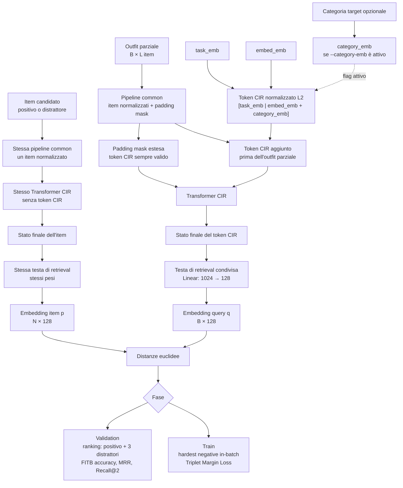

# Training Complementary Item Retrieval

## Indice

- [File](#file)
  - [Acronimi usati](#acronimi-usati)
- [Modalità](#modalità)
- [Architettura](#architettura)
- [Configurazione predefinita](#configurazione-predefinita)
- [Flag CLI](#flag-cli)
- [Inizializzazione da CP e resume](#inizializzazione-da-cp-e-resume)
- [Categoria target](#categoria-target)
- [Loss, metriche e best model](#loss-metriche-e-best-model)
- [Preparazione embedding](#preparazione-embedding)
- [Avvio](#avvio)
- [Artefatti](#artefatti)

Training CIR usa esempi Polyvore Fill In The Blank già preparati. Il train
ottimizza la Triplet Margin Loss con negativi in-batch; la validation ordina il
positivo e i tre distrattori ufficiali. Il best checkpoint usa sempre
`val_fitb_accuracy`.

## File

| File | Cosa fa |
|---|---|
| [`config.py`](config.py) | Definisce profili, iperparametri e configurazione CIR, ne valida le combinazioni e determina le directory predefinite. |
| [`data.py`](data.py) | Costruisce dataset e DataLoader FITB per input raw o precomputed, prepara i batch e gestisce i sampler DDP. |
| [`distributed.py`](distributed.py) | Inizializza e chiude il runtime DDP, assegnando rank, world size, backend e device a ogni processo. |
| [`model.py`](model.py) | Compone embedding common e modello CIR e produce gli embedding dei rami query e item. |
| [`trainer.py`](trainer.py) | Gestisce forward, Triplet Loss, backpropagation, accumulo, AMP, DDP, validation, early stopping e checkpoint. |
| [`plots.py`](plots.py) | Genera dopo ogni epoca i grafici cumulativi di loss e metriche FITB. |
| [`pretraining.py`](pretraining.py) | Trasferisce nel CIR i pesi `common.*`, tutti i layer del Transformer CP e il task embedding. |
| [`train_cir.py`](train_cir.py) | Espone la CLI e collega configurazione, dati, modello, inizializzazione e ciclo di training. |
| [`__init__.py`](__init__.py) | Espone configurazione, modello e caricamento CP come API pubblica del package. |

### Acronimi usati

- **DDP: Distributed Data Parallel**: modalità PyTorch che esegue una copia
  del modello su ogni GPU o processo, divide i dati tra i processi e sincronizza
  i gradienti durante il training.
- **FITB: Fill In The Blank**: task in cui viene rimosso un item da un outfit
  e il modello deve riconoscere il completamento corretto tra un positivo e tre
  distrattori. È il formato usato per la validation CIR.
- **AMP: Automatic Mixed Precision**: esegue su CUDA le operazioni compatibili
  in precisione ridotta, mantenendo in precisione più alta quelle sensibili.
  Riduce generalmente memoria e tempo di calcolo; il `GradScaler` protegge la
  backpropagation da gradienti FP16 troppo piccoli.

## Modalità

| Flag | Feature degli item | Dimensione | Parti allenabili | Precomputazione |
|---|---|---:|---|---|
| `--classic` | ResNet-18 ImageNet + SentenceBERT | `64 + 64 = 128` | ResNet-18, proiezioni, Transformer CIR, token e testa; backbone SentenceBERT congelato | Non richiesta |
| `--new-classic` | ResNet-18 ImageNet + SentenceBERT | `512 + 512 = 1024` | ResNet-18, proiezioni, Transformer CIR, token e testa; backbone SentenceBERT congelato | Non richiesta |
| `--precomputed` | Embedding da modello compatibile | `512 + 512 = 1024` | Transformer CIR, token e testa retrieval | Richiesta per train e validation |

Default è `new_classic`. Profili e dimensioni coincidono con training CP.
`--classic`, `--new-classic` e `--precomputed` sono mutuamente esclusivi.

## Architettura



Il ramo query aggiunge il token CIR, mentre il ramo item elabora ogni candidato
senza quel token. I due rami condividono pipeline common, Transformer CIR e
testa di retrieval, così query e item vengono proiettati nello stesso spazio.
Il token completo viene normalizzato L2 dopo la concatenazione e l'eventuale
somma della categoria. Il Transformer non applica una LayerNorm finale
aggiuntiva; restano le normalizzazioni interne dei suoi layer.

## Configurazione predefinita

| Aspetto | Valore |
|---|---|
| Dataset | `polyvore`, subset `nondisjoint` |
| Modalità feature | `new_classic` |
| Epoche | 200 |
| Microbatch | 64 per processo/GPU |
| Accumulo gradienti | 4 microbatch |
| Batch effettivo | 256 per processo/GPU; con DDP viene moltiplicato per `world_size` |
| Loss train | In-batch Triplet Margin Loss, margine `2.0`, reduction `mean` |
| Embedding retrieval | 128 dimensioni, non normalizzato |
| Ottimizzatore | AdamW, LR massima `2e-5`, weight decay `0.01` |
| Scheduler | OneCycleLR: `pct_start=0.3`, cosine, `div_factor=25`, `final_div_factor=10000` |
| Gradient clipping | Norma globale `1.0`, sempre attivo |
| Seed | 42, applicato a Python, NumPy, PyTorch, CUDA e shuffle |
| Best model | `val_fitb_accuracy`, fisso e massimizzato |
| Early stopping | Disabilitato; attivabile con patience |
| Mixed precision | Disabilitata; opzionale su CUDA |
| DDP | Disabilitato; opzionale tramite `torchrun` |
| Worker | 0 per processo, configurabili |
| Pretraining CP | Disabilitato; trasferisce `common.*` e task embedding condiviso |
| Resume | Carica soltanto pesi CIR; optimizer, scheduler e history nuovi |

## Flag CLI

| Flag | Default | Cosa fa |
|---|---|---|
| `-h`, `--help` | — | Mostra guida dei comandi e termina. |
| `--classic` | disabilitato | Usa immagini e testi originali con profilo `64 + 64`. |
| `--new-classic` | abilitato | Usa immagini e testi originali con profilo `512 + 512`. |
| `--precomputed` | disabilitato | Usa cache embedding con dimensioni compatibili. |
| `--dataset` | `polyvore` | Seleziona source registrata nell'API pubblica `data`. |
| `--subset` | `nondisjoint` | Seleziona subset dataset. |
| `--embedding-root` | `precomputed_embeddings/patrickjohncyh-fashion-clip` | Sceglie root cache; training aggiunge `<subset>/<split>`. |
| `--dataset-root` | `datasets/polyvore-outfits` | Cerca qui dataset e annotazioni prima di cache/download. |
| `--checkpoint-dir` | `checkpoints/<subset>/cir_<mode>` | Directory configurazione, checkpoint e grafici; con categoria il default termina in `_category`. |
| `--cache-dir` | `None` | Imposta cache Hugging Face. |
| `--epochs` | `200` | Numero massimo epoche. |
| `--batch-size` | `64` | Esempi per microbatch e processo; deve essere almeno 2. |
| `--gradient-accumulation-steps` | `4` | Microbatch accumulati prima di optimizer step. |
| `--learning-rate` | `2e-5` | LR massimo OneCycleLR e LR AdamW. |
| `--weight-decay` | `0.01` | Weight decay AdamW esplicito. |
| `--triplet-margin` | `2.0` | Distanza minima richiesta tra positivo e hardest negative. |
| `--loss-reduction` | `mean` | Aggrega loss per microbatch con `mean` o `sum`. |
| `--retrieval-embedding-dim` | `128` | Dimensione finale condivisa da query e item. |
| `--normalize-embeddings` | disabilitato | Applica normalizzazione L2 agli embedding finali. |
| `--category-emb` | disabilitato | Usa token `L2([task_emb \| embed_emb + category_emb])`. |
| `--seed` | `42` | Imposta seed riproducibile; ogni rank DDP usa offset del proprio rank. |
| `--early-stopping-patience` | `None` | Ferma dopo N epoche senza miglioramento FITB. |
| `--early-stopping-min-delta` | `0.0` | Miglioramento minimo FITB per aggiornare best e azzerare patience. |
| `--num-workers` | `0` | Processi DataLoader per processo di training. Con `0`, il caricamento avviene nel processo principale. |
| `--pin-memory` | disabilitato | Abilita pinned memory, utile con CUDA. |
| `--mixed-precision` | disabilitato | Abilita autocast FP16 e GradScaler; richiede CUDA. |
| `--ddp` | disabilitato | Usa DistributedDataParallel; avvio richiesto con `torchrun`. |
| `--device` | `auto` | Sceglie CUDA, poi MPS, poi CPU; in DDP CUDA usa `LOCAL_RANK`. |
| `--log-every` | `10` | Logga loss e LR ogni N microbatch e all'ultimo. |
| `--pretrained-cp` | `None` | Carica pipeline common, Transformer completo e task embedding da un checkpoint CP compatibile. |
| `--resume` | `None` | Carica soli pesi da checkpoint CIR con stessa architettura e stessi flag modello. |
| `--token` | token locale Hugging Face | Usa token esplicito per risorse mancanti. |
| `--no-token` | disabilitato | Forza accesso senza autenticazione. |

Flag CP esclusivi (`--focal-alpha`, `--focal-gamma`, `--focal-reduction` e
`--best-metric`) non esistono nel CIR. Best metric CIR non è selezionabile:
resta `val_fitb_accuracy`.

## Inizializzazione da CP e resume

I due flag hanno comportamenti diversi.

### `--pretrained-cp`: inizializzazione da CP

`--pretrained-cp <checkpoint-CP>` avvia un nuovo training CIR e trasferisce
tutte le componenti condivise utilizzate dal CIR, incluso il Transformer
allenato dal CP:

| Sorgente nel checkpoint CP | Destinazione CIR | Modalità |
|---|---|---|
| `common.padding_embedding` | stessa chiave | Tutte |
| `common.visual_encoder.*` | stesse chiavi | `classic`, `new_classic` |
| `common.text_encoder.*` | stesse chiavi | `classic`, `new_classic` |
| `common.visual_projection.*` | stesse chiavi, quando presenti | `classic`, `new_classic` |
| `common.text_projection.*` | stesse chiavi, quando presenti | `classic`, `new_classic` |
| `cp.task_embedding.embedding` | `cir.task_embedding.embedding` | Tutte |
| `cp.encoder.layers.*` | `cir.encoder.layers.*` | Tutte: attenzione, feed-forward e LayerNorm interne di tutti i layer |

`common.*` comprende parametri e buffer degli encoder, incluse statistiche
BatchNorm. In `precomputed` non esistono encoder runtime o proiezioni: vengono
quindi trasferiti `common.padding_embedding`, task embedding e tutti i layer
del Transformer. Il Transformer caricato resta allenabile durante il fine-tuning CIR.

Non vengono caricati:

- `cp.predict_emb`;
- `cp.head.*`;
- optimizer, scheduler, numero epoca e history CP.

`cir.embed_emb`, eventuale `cir.category_embedding.*` e `cir.head.*` mantengono
nuova inizializzazione: non esistono nel modello CP locale. Nel repository di
riferimento il modello unico conserva anche token e testa retrieval nei
checkpoint CP, ma la loss CP non li allena. `cp.predict_emb` e `cp.head.*`
sono specifici della classificazione e non sostituiscono token e testa CIR.

Il caricamento richiede stesso profilo (`classic`, `new_classic` o
`precomputed`) e architettura compatibile per common e Transformer. Pesi
condivisi mancanti, layer aggiuntivi o forme diverse causano errore prima del
trasferimento. Sono supportate anche chiavi con prefisso DDP `module.`.

Per usare i CP precedenti alla rimozione della LayerNorm finale,
`--pretrained-cp` ignora esclusivamente `cp.encoder.norm.weight` e
`cp.encoder.norm.bias`, segnalando le chiavi in console. Le LayerNorm interne
vengono caricate normalmente. Questa inizializzazione non conserva esattamente
il comportamento del vecchio CP: ora mancano la LayerNorm finale e il token
viene normalizzato. Nessuna altra architettura precedente viene convertita.

### `--resume`: ripresa da CIR

`--resume <checkpoint-CIR>` non accetta checkpoint CP. Carica invece tutti i
pesi `common.*` e `cir.*` di un modello CIR compatibile. Anche in questo caso
optimizer, scheduler, contatore epoche e history ripartono da zero.
`--pretrained-cp` e `--resume` sono mutuamente esclusivi.
`--resume` resta un caricamento stretto: i vecchi checkpoint CIR con
`cir.encoder.norm.*` non sono compatibili con l'architettura attuale.

## Categoria target

Senza `--category-emb`, query usa:

```text
L2([task_emb | embed_emb])
```

Con flag attivo usa:

```text
L2([task_emb | embed_emb + category_emb])
```

Categoria target deriva sempre dall'item positivo mancante. Con input raw arriva
da `FashionItem.category`. Con `--precomputed`, loader legge direttamente
`semantic_category` da `polyvore_item_metadata.json`; non decodifica immagini e
non carica righe immagine. Metadata viene letto solo quando flag categoria è
attivo.

L2 agisce sull'intero token concatenato, portandone la norma a 1, come per gli
item della pipeline common. Non normalizza separatamente le due metà.
Le 11 righe di `category_emb` sono parametri allenabili. Il checkpoint conserva
flag e matrice; un resume deve usare stessa configurazione categoria.

## Loss, metriche e best model

Durante train, ogni query confronta proprio positivo con positivi delle altre
righe del microbatch. Hardest negative viene scelto dentro microbatch da 64, non
nel batch accumulato da 256. Accumulo riduce memoria, ma non amplia pool negativi.
Ultimo gruppo incompleto di accumulo usa scala corretta; ultimo microbatch train
con meno di 64 elementi viene scartato per garantire almeno un negativo.

Validation usa positivo e negativi ufficiali di ogni esempio FITB:

| Metrica | Formula operativa | Uso |
|---|---|---|
| `val_fitb_accuracy` | Frazione di query con positivo al rank 1 | Selezione `best.pt` ed early stopping |
| `val_mrr` | Media di `1 / rank_positivo` | Qualità dell'intero ordinamento |
| `val_recall@2` | Frazione di positivi nei primi due risultati | Capacità di recupero Top-2 |

Ranking usa distanza euclidea crescente. Parità esatte vengono risolte in modo
conservativo a favore dei candidati concorrenti, evitando FITB ottimistica con
embedding collassati.

`val_loss` usa lo stesso margine, ma hardest negative tra distrattori FITB
espliciti; `train_loss` usa hardest negative in-batch. Entrambe servono per
diagnosi, non per scegliere checkpoint.

## Preparazione embedding

`--precomputed` richiede cache distinte:

```text
<embedding-root>/<subset>/train
<embedding-root>/<subset>/validation
```

Manifest devono avere stesso `model_fingerprint`, dataset, subset, split e
dimensione del Transformer. Loader CIR controlla copertura di outfit parziale,
positivo e tutti i negativi prima del training.

## Avvio

Profilo predefinito:

```powershell
python -m training.CIR.train_cir
```

```bash
python -m training.CIR.train_cir
```

Embedding precomputati con categoria target:

```powershell
python -m training.CIR.train_cir `
  --precomputed `
  --category-emb `
  --checkpoint-dir checkpoints/nondisjoint/cir_precomputed_category_01
```

```bash
python -m training.CIR.train_cir \
  --precomputed \
  --category-emb \
  --checkpoint-dir checkpoints/nondisjoint/cir_precomputed_category_01
```

Inizializzazione da checkpoint CP:

```powershell
python -m training.CIR.train_cir `
  --precomputed `
  --checkpoint-dir checkpoints/nondisjoint/cir_precomputed `
  --pretrained-cp checkpoints/nondisjoint/cp_precomputed/best.pt
```

```bash
python -m training.CIR.train_cir \
  --precomputed \
  --checkpoint-dir checkpoints/nondisjoint/cir_precomputed \
  --pretrained-cp checkpoints/nondisjoint/cp_precomputed/best.pt
```

Early stopping e mixed precision:

```powershell
python -m training.CIR.train_cir `
  --new-classic `
  --mixed-precision `
  --pin-memory `
  --early-stopping-patience 10
```

```bash
python -m training.CIR.train_cir \
  --new-classic \
  --mixed-precision \
  --pin-memory \
  --early-stopping-patience 10
```

DDP su due GPU:

```powershell
torchrun --standalone --nproc-per-node=2 -m training.CIR.train_cir `
  --precomputed `
  --ddp `
  --mixed-precision `
  --pin-memory
```

```bash
torchrun --standalone --nproc-per-node=2 -m training.CIR.train_cir \
  --precomputed \
  --ddp \
  --mixed-precision \
  --pin-memory
```

Nuovo run dai soli pesi di un checkpoint CIR:

```powershell
python -m training.CIR.train_cir `
  --precomputed `
  --category-emb `
  --resume checkpoints/nondisjoint/cir_precomputed_category_01/best.pt `
  --checkpoint-dir checkpoints/nondisjoint/cir_precomputed_category_02
```

## Artefatti

| Artefatto | Contenuto |
|---|---|
| `config.json` | Dataset, feature, architettura CIR, optimizer, scheduler e runtime risolto. |
| `epochs/cir_epoch_NNN.pt` | Pesi, configurazione, metriche epoca, history e selezione best. |
| `best.pt` | Copia atomica dell'epoca con massima `val_fitb_accuracy`. |
| `plots/cir_loss_*.png` | Train loss e validation loss cumulative. |
| `plots/cir_fitb_accuracy_*.png` | FITB accuracy validation. |
| `plots/cir_mrr_*.png` | MRR validation. |
| `plots/cir_recall_at_2_*.png` | Recall@2 validation. |
| `plots/cir_validation_metrics_*.png` | Confronto cumulativo delle tre metriche CIR. |
| Console | Loss/LR per microbatch e riepilogo metriche per epoca. |

Scritture checkpoint e JSON sono atomiche. Directory con run esistente non
viene sovrascritta.
