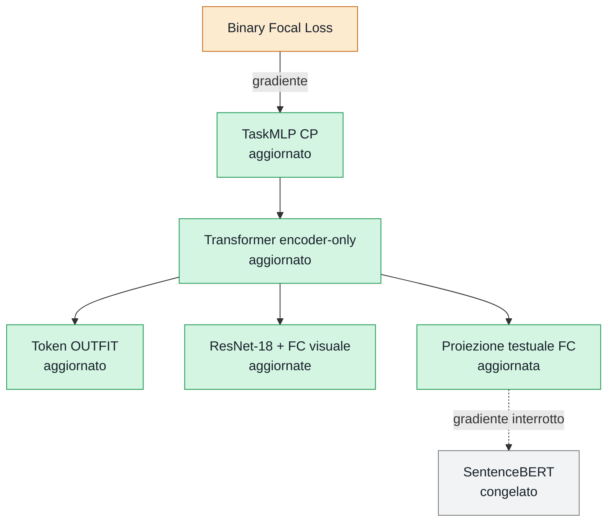

# Training

Il package `training` separa il codice di addestramento in base al task:

- [Training CP](#training-cp), implementato in [`training/cp`](cp/);
- [Training CIR](#training-cir), previsto ma non ancora implementato.

## Training CP

Il training di Compatibility Prediction stabilisce se un outfit è compatibile.
La CLI, il loop di epoca e la guida completa sono raccolti nella cartella
[`training/cp`](cp/):

```powershell
python -m training.cp.train_cp
```

Consulta la [guida completa al training CP](cp/README.md) per dataset,
iperparametri, checkpoint, resume e valutazione sul test set.

### Cosa aggiorna la backpropagation



Il gradiente parte dalla Focal Loss, attraversa classificatore e Transformer
encoder-only, poi aggiorna il token `OUTFIT`, il ramo visuale e la proiezione
testuale.
Si arresta prima di SentenceBERT, eseguito con pesi congelati e
`torch.no_grad()`.

## Training CIR

Il training di Complementary Item Retrieval non è ancora implementato. Quando
verrà aggiunto avrà una cartella dedicata `training/cir`, separata dal CP, e
riutilizzerà l'encoder comune con il token `TARGET`, la proiezione CIR e la
Set-wise Ranking Loss.

Consulta la [pagina del futuro training CIR](cir/README.md) e il
[README del modello CIR](../model/cir/README.md).
