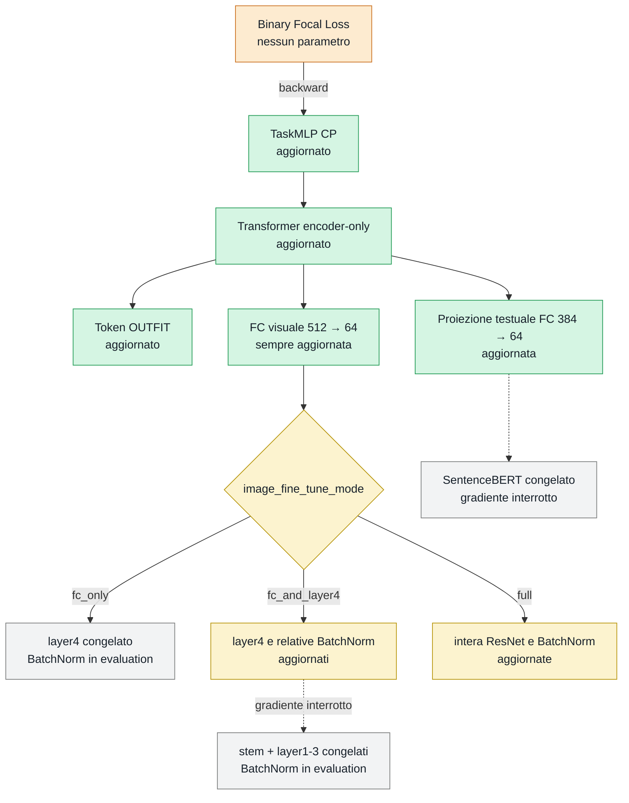

# Training

Il package separa il training per task:

- [Compatibility Prediction](cp/README.md): implementato;
- [Serie di training CP](run_trianing_series/README.md): runner dei quattro esperimenti;
- [Complementary Item Retrieval](cir/README.md): non ancora implementato.

## Indice

- [Parametri e iperparametri comuni](#parametri-e-iperparametri-comuni)
  - [Parametri della rete](#parametri-della-rete)
  - [Iperparametri del training normale](#iperparametri-del-training-normale)
  - [Iperparametri del fine-tuning](#iperparametri-del-fine-tuning)
- [Compatibility Prediction](#compatibility-prediction)
  - [Cosa viene aggiornato nel training](#cosa-viene-aggiornato-nel-training)
  - [Checkpoint e resume](#checkpoint-e-resume)
  - [ResNet-18](#resnet-18)
- [Complementary Item Retrieval](#complementary-item-retrieval)
- [Esempi](#esempi)

## Parametri e iperparametri comuni

### Parametri della rete

| Nome del parametro | Valore | A cosa serve |
|---|---:|---|
| Input immagine | `3 × 224 × 224` | resize e normalizzazione ImageNet |
| Encoder immagine | ResNet-18 | pesi iniziali ImageNet |
| Feature ResNet | `512` | output backbone prima della FC visuale |
| FC visuale | `Linear(512, 64)` | produce image embedding |
| Image embedding | `64` | metà visuale dell'item embedding |
| Encoder testo | `sentence-transformers/all-MiniLM-L6-v2` | SentenceBERT congelato |
| Feature SentenceBERT | `384` | output del backbone testuale |
| FC testuale | `Linear(384, 64)` | unica parte testuale allenabile |
| Text embedding | `64` | metà testuale dell'item embedding |
| Fusione item | concatenazione | image `64` + text `64` |
| Item embedding / `d_model` | `128` | divisibile per il numero di teste |
| Task token | `1 × 128` | `OUTFIT` per CP, `TARGET` per CIR |
| Layer Transformer encoder | `6` | pesi distinti per layer |
| Teste attention | `16` | self-attention multi-head |
| Dimensione per testa | `8` | `128 / 16` |
| FFN Transformer | `128 → 512 → 128` | espansione interna per token |
| Attivazione Transformer | ReLU | attivazione FFN |
| Dropout Transformer | `0.1` | attention, FFN e connessioni residue |
| Normalizzazione | post-norm | `norm_first=False` |
| Positional encoding | assente | outfit trattato come insieme |
| Padding mask | booleana | esclude item padded dall'attention |
| CP TaskMLP | `128 → 128 → 1` | ReLU tra i due layer lineari |
| Output CP | logit + sigmoid | logit per loss, score per inferenza |
| ResNet allenabile nel training normale | `full` | intera ResNet e BatchNorm |
| ResNet allenabile nel fine-tuning | `fc_and_layer4` | default nuova fase |
| SentenceBERT allenabile | no | sempre in evaluation e senza gradienti |

### Iperparametri del training normale

| Nome dell'iperparametro | Valore | A cosa serve |
|---|---:|---|
| Variante del dataset | `disjoint` | Seleziona lo split `disjoint` o `nondisjoint` del dataset. |
| Numero di epoche | `30` | Stabilisce quante volte il modello percorre l'intero training set. |
| Batch size | `50` | Stabilisce quanti outfit vengono elaborati prima di ogni aggiornamento dei pesi. |
| Ottimizzatore | Adam | Aggiorna tutti i parametri allenabili usando i gradienti calcolati dalla loss. |
| Primo momento di Adam (β₁) | `0.9` | Controlla la media mobile del gradiente. |
| Secondo momento di Adam (β₂) | `0.999` | Controlla la media mobile del gradiente al quadrato. |
| Stabilità numerica di Adam (ε) | `1e-8` | Evita divisioni numericamente instabili durante l'aggiornamento dei pesi. |
| Learning rate base | `1e-5` | Regola l'ampiezza degli aggiornamenti di FC visuale, proiezione testuale, task token e testa CP. |
| Learning rate del Transformer | Learning rate base | Permette al Transformer di usare un'ampiezza di aggiornamento distinta. |
| Learning rate di ResNet | Learning rate base | Permette ai blocchi allenabili di ResNet di usare un'ampiezza di aggiornamento distinta. |
| Weight decay | `0.0` | Applica la regolarizzazione dei pesi nell'ottimizzatore. |
| Scheduler del learning rate base | StepLR | Modifica il learning rate base durante il training; può essere disabilitato o sostituito da CosineAnnealingLR. |
| Scheduler del Transformer | Scheduler base | Consente di variare separatamente il learning rate del Transformer. |
| Scheduler di ResNet | Scheduler base | Consente di variare separatamente il learning rate dei blocchi ResNet. |
| Periodo di StepLR | `10` epoche | Indica ogni quante epoche ridurre il learning rate. |
| Fattore di riduzione di StepLR | `0.5` | Moltiplica il learning rate per questo valore a ogni riduzione. |
| Learning rate minimo del cosine scheduler | `0.0` | Imposta il limite inferiore raggiungibile da CosineAnnealingLR. |
| Periodo di StepLR del Transformer | Periodo di StepLR base | Permette di scegliere una frequenza di riduzione distinta per il Transformer. |
| Fattore di riduzione di StepLR del Transformer | Fattore di StepLR base | Permette di scegliere una riduzione distinta per il Transformer. |
| Learning rate minimo cosine del Transformer | Minimo cosine base | Permette di scegliere un limite inferiore distinto per il Transformer. |
| Periodo di StepLR di ResNet | Periodo di StepLR base | Permette di scegliere una frequenza di riduzione distinta per ResNet. |
| Fattore di riduzione di StepLR di ResNet | Fattore di StepLR base | Permette di scegliere una riduzione distinta per ResNet. |
| Learning rate minimo cosine di ResNet | Minimo cosine base | Permette di scegliere un limite inferiore distinto per ResNet. |
| Funzione di loss | Binary Focal Loss | Misura l'errore della Compatibility Prediction dando più rilievo agli esempi difficili. |
| Peso della classe positiva nella Focal Loss (α) | `0.5` | Bilancia il contributo degli esempi positivi e negativi alla loss. |
| Focusing parameter della Focal Loss (γ) | `2.0` | Riduce il peso degli esempi facili; valori maggiori concentrano l'apprendimento su quelli difficili. |
| Dropout del Transformer | `0.1` | Riduce l'overfitting azzerando casualmente parte delle attivazioni durante il training. |
| Posizione della LayerNorm | post-norm | Applica la normalizzazione dopo ogni connessione residua del Transformer. |
| Norma massima del gradiente | Disabilitata | Se impostata, limita la norma globale dei gradienti per stabilizzare il training. |
| Metrica di selezione del modello | ROC AUC di validation | Determina quale checkpoint viene considerato il migliore. |
| Pazienza dell'early stopping | Disabilitata | Se impostata, interrompe il training dopo il numero indicato di epoche senza miglioramenti. |
| Miglioramento minimo dell'early stopping | `0.0` | Definisce la variazione minima della metrica necessaria per considerare un'epoca migliore. |
| Porzione allenabile di ResNet | Rete completa | Determina quali parti dell'encoder visuale ricevono aggiornamenti. |
| Inizializzazione di ResNet | Pesi ImageNet | Fornisce al backbone visuale feature pre-addestrate invece di pesi casuali. |
| Modello SentenceBERT | `all-MiniLM-L6-v2` | Codifica il testo degli item in feature semantiche; il modello resta congelato. |
| Shuffle del training set | Abilitato | Cambia l'ordine dei campioni a ogni epoca per ridurre dipendenze dall'ordinamento. |
| Seed casuale | `42` | Rende riproducibili le operazioni casuali di Python, NumPy e PyTorch. |

### Iperparametri del fine-tuning

| Nome dell'iperparametro | Valore | A cosa serve |
|---|---:|---|
| Numero di epoche aggiuntive | `10` | Stabilisce la durata della nuova fase di fine-tuning. |
| Variante del dataset | Valore del checkpoint, altrimenti `disjoint` | Mantiene lo stesso split dei dati della fase precedente oppure ne seleziona uno nuovo. |
| Batch size | `50` | Stabilisce quanti outfit vengono elaborati prima di ogni aggiornamento dei pesi. |
| Ottimizzatore | Adam | Aggiorna i parametri allenabili; in alternativa può essere usato AdamW. |
| Learning rate base | `1e-5` | Regola l'ampiezza degli aggiornamenti dei parametri non appartenenti al Transformer o al backbone ResNet. |
| Learning rate del Transformer | Learning rate base | Permette al Transformer di usare un'ampiezza di aggiornamento distinta. |
| Learning rate di ResNet | Learning rate base | Permette ai blocchi allenabili di ResNet di usare un'ampiezza di aggiornamento distinta. |
| Weight decay | `1e-4` | Regolarizza i pesi del nuovo ottimizzatore per limitare l'overfitting. |
| Primo momento dell'ottimizzatore (β₁) | `0.9` | Controlla la media mobile del gradiente in Adam o AdamW. |
| Secondo momento dell'ottimizzatore (β₂) | `0.999` | Controlla la media mobile del gradiente al quadrato. |
| Stabilità numerica dell'ottimizzatore (ε) | `1e-8` | Evita divisioni numericamente instabili durante gli aggiornamenti. |
| Scheduler del learning rate base | StepLR | Modifica il learning rate base durante il fine-tuning; può essere disabilitato o sostituito da CosineAnnealingLR. |
| Scheduler del Transformer | Scheduler base | Consente di variare separatamente il learning rate del Transformer. |
| Scheduler di ResNet | Scheduler base | Consente di variare separatamente il learning rate dei blocchi ResNet. |
| Periodo di StepLR | `10` epoche | Indica ogni quante epoche ridurre il learning rate. |
| Fattore di riduzione di StepLR | `0.5` | Moltiplica il learning rate per questo valore a ogni riduzione. |
| Learning rate minimo del cosine scheduler | `0.0` | Imposta il limite inferiore raggiungibile da CosineAnnealingLR. |
| Periodo di StepLR del Transformer | Periodo di StepLR base | Permette di scegliere una frequenza di riduzione distinta per il Transformer. |
| Fattore di riduzione di StepLR del Transformer | Fattore di StepLR base | Permette di scegliere una riduzione distinta per il Transformer. |
| Learning rate minimo cosine del Transformer | Minimo cosine base | Permette di scegliere un limite inferiore distinto per il Transformer. |
| Periodo di StepLR di ResNet | Periodo di StepLR base | Permette di scegliere una frequenza di riduzione distinta per ResNet. |
| Fattore di riduzione di StepLR di ResNet | Fattore di StepLR base | Permette di scegliere una riduzione distinta per ResNet. |
| Learning rate minimo cosine di ResNet | Minimo cosine base | Permette di scegliere un limite inferiore distinto per ResNet. |
| Funzione di loss | Focal Loss | Misura l'errore della Compatibility Prediction; può essere sostituita dalla Binary Cross-Entropy. |
| Peso della classe positiva nella Focal Loss (α) | `0.5` | Bilancia il contributo degli esempi positivi e negativi alla loss. |
| Focusing parameter della Focal Loss (γ) | `1.0` | Riduce il peso degli esempi facili durante il fine-tuning. |
| Metrica di selezione del modello | ROC AUC di validation | Determina quale checkpoint della nuova fase viene considerato il migliore. |
| Pazienza dell'early stopping | Disabilitata | Se impostata, interrompe il fine-tuning dopo il numero indicato di epoche senza miglioramenti. |
| Miglioramento minimo dell'early stopping | `0.0` | Definisce la variazione minima necessaria per considerare migliorata la metrica monitorata. |
| Norma massima del gradiente | Disabilitata | Se impostata, limita la norma globale dei gradienti per stabilizzare il fine-tuning. |
| Porzione allenabile di ResNet | FC e layer 4 | Aggiorna la testa visuale e l'ultimo blocco residuo, lasciando congelati i blocchi precedenti. |
| Dropout del Transformer | Valore del checkpoint | Mantiene il dropout della fase precedente, salvo una scelta esplicita diversa. |
| Modello SentenceBERT | Valore del checkpoint | Riutilizza lo stesso encoder testuale della fase precedente. |
| Seed casuale | `42` | Rende riproducibili le operazioni casuali della nuova fase. |

## Compatibility Prediction

La pipeline CP è composta da runner di epoca, orchestratore, history,
checkpoint manager e plotter indipendenti. L'API breve `train_cp()` compone i
componenti standard; `CPTrainer` permette di sostituire il runner o collegare
callback senza duplicare persistenza e metriche.

Ogni epoca produce:

- train loss, accuracy e ROC AUC;
- validation loss, accuracy e ROC AUC;
- checkpoint dell'epoca ed eventuale nuovo best;
- quattro grafici cumulativi: loss, accuracy, ROC AUC train/validation e
  validation accuracy/AUC.

I default del training normale seguono gli iperparametri dichiarati nel paper:
batch size 50, Adam a `1e-5`, StepLR ogni 10 epoche con fattore `0.5` e
ResNet-18 end-to-end. Il paper non dichiara epoche, weight decay o criterio del
best; il progetto usa rispettivamente 30, `0.0` e validation AUC.

### Cosa viene aggiornato nel training

Il grafo mostra il percorso del gradiente durante `loss.backward()`. Dopo il
backward viene applicato il gradient clipping soltanto quando configurato;
Adam aggiorna i parametri allenabili che hanno ricevuto un gradiente.


```mermaid
flowchart TD
    A["Binary Focal Loss<br/>nessun parametro"] -->|backward| B["TaskMLP CP<br/>aggiornato"]
    B --> C["Transformer encoder-only<br/>aggiornato"]

    C --> D["Token OUTFIT<br/>aggiornato"]
    C --> E["FC visuale 512 → 64<br/>sempre aggiornata"]
    C --> F["Proiezione testuale FC 384 → 64<br/>aggiornata"]

    E --> G{"image_fine_tune_mode"}
    G -->|fc_only| H["layer4 congelato<br/>BatchNorm in evaluation"]
    G -->|fc_and_layer4| I["layer4 e relative BatchNorm<br/>aggiornati"]
    I -.->|gradiente interrotto| J["stem + layer1-3 congelati<br/>BatchNorm in evaluation"]
    G -->|full| L["intera ResNet e BatchNorm<br/>aggiornate"]

    F -.-> K["SentenceBERT congelato<br/>gradiente interrotto"]

    classDef trained fill:#d5f5e3,stroke:#239b56,color:#17202a
    classDef conditional fill:#fcf3cf,stroke:#b7950b,color:#17202a
    classDef frozen fill:#f2f3f4,stroke:#7b7d7d,color:#17202a
    classDef loss fill:#fdebd0,stroke:#ca6f1e,color:#17202a

    class B,C,D,E,F trained
    class G,I,L conditional
    class H,J,K frozen
    class A loss
```

In tutte le modalità vengono quindi aggiornati:

- classificatore `TaskMLP` del CP;
- tutti i parametri del Transformer encoder-only;
- token apprendibile `OUTFIT`;
- FC visuale `Linear(512, 64)`;
- proiezione testuale `Linear(384, 64)`.

Con `fc_and_layer4` vengono aggiornati anche `layer4` e le sue BatchNorm. Con
`full` viene aggiornata l'intera ResNet, comprese tutte le BatchNorm. Con
`fc_only`, tutto il backbone prima della FC resta congelato. SentenceBERT resta
sempre congelato.

Durante validation il modello usa `eval()` e gradienti disabilitati: nessun
parametro e nessuna statistica BatchNorm vengono aggiornati.

### Checkpoint e resume

I comandi per avviare una nuova run o riprenderne una esistente sono raccolti
nella sezione [Esempi](#esempi) in fondo alla pagina.

Nell'esempio `resume_01`, le nuove epoche vengono salvate in
`resume_01\epochs` e i nuovi grafici in `resume_01\plots`.
`resume_01\best.pt` viene invece creato soltanto se una
nuova epoca migliora la metrica di selezione salvata nel checkpoint di
partenza. Se non avviene alcun miglioramento, il best originale resta
`checkpoints\cp_best.pt`.

`--epochs` indica l'ultima epoca totale. Riprendendo un checkpoint terminato
all'epoca 20 con `--epochs 40`, il training continua dall'epoca 21 alla 40;
non esegue altre 40 epoche.

Optimizer, scheduler, history, migliore metrica e RNG vengono ripristinati dal
checkpoint nuovo. Learning rate, weight decay e configurazione StepLR salvati
nel checkpoint prevalgono sugli stessi flag CLI. Cambiare
`--image-fine-tune-mode` è invece consentito e permette un fine-tuning a fasi.

`fine_tune_cp --resume` effettua lo stesso ripristino completo per una fase di
fine-tuning interrotta. In questo caso la configurazione salvata, inclusi
optimizer, scheduler, loss, seed, dataset, modalità ResNet e numero finale di
epoche, è autorevole. `fine_tune_cp --source-checkpoint` carica invece soltanto
i pesi e avvia una nuova fase con stato pulito; è la modalità da usare per
cambiare gli iperparametri o la politica ResNet.

I checkpoint legacy restano caricabili, ma non possono fornire history, RNG e
migliore metrica precedenti completi. Per questo non supportano il resume esatto
del fine-tuning, ma possono ancora essere usati come `--source-checkpoint`.

### ResNet-18

La FC visuale è sempre allenabile. Il flag
`--image-fine-tune-mode` controlla il resto:

- `fc_only`: congela tutti i blocchi ResNet e le relative BatchNorm;
- `fc_and_layer4`: allena `layer4`, le sue BatchNorm e la FC.
- `full`: allena l'intera ResNet, incluse tutte le BatchNorm e la FC.

`--no-pretrained-image` controlla solo l'inizializzazione ImageNet e non rende
automaticamente allenabili i blocchi congelati. Combinandolo con
`--image-fine-tune-mode full` si allena invece l'intera ResNet da pesi casuali.

SentenceBERT resta congelato; la sua proiezione FC, il token `OUTFIT`, il
Transformer e il classificatore CP restano allenabili.

### Early stopping

Training e fine-tuning possono arrestarsi sulla stessa metrica di validation
usata per il best checkpoint:

```powershell
python -m training.cp.train_cp `
  --early-stopping-patience 4 `
  --early-stopping-min-delta 0.0001
```

Senza `--early-stopping-patience` è disabilitato. Checkpoint e grafici
dell'ultima epoca vengono completati prima dello stop.

Dettagli, flag, resume, formato checkpoint, grafici ed esempi:
[guida completa CP](cp/README.md).

## Complementary Item Retrieval

Il training CIR non è ancora implementato. Riutilizzerà l'encoder comune, il
token `TARGET`, la proiezione CIR e la Set-wise Ranking Loss. Consulta la
[pagina CIR](cir/README.md) e il [modello CIR](../model/cir/README.md).

## Esempi

Tutti i comandi di esempio del training CP sono raccolti qui e sono identici
nella guida generale e nella guida specifica CP.

### Avvio e configurazione

```powershell
# Configurazione predefinita
python -m training.cp.train_cp

# Allena layer4 e FC visuale
python -m training.cp.train_cp `
  --variant disjoint `
  --epochs 20 `
  --batch-size 50 `
  --image-fine-tune-mode fc_and_layer4

# Fine-tuning completo della ResNet
python -m training.cp.train_cp `
  --image-fine-tune-mode full

# Scheduler indipendenti: cosine per il Transformer e StepLR per ResNet
python -m training.cp.train_cp `
  --epochs 30 `
  --image-fine-tune-mode fc_and_layer4 `
  --learning-rate 1e-5 `
  --transformer-learning-rate 5e-6 `
  --resnet-learning-rate 1e-6 `
  --scheduler none `
  --transformer-scheduler cosine `
  --transformer-min-learning-rate 1e-7 `
  --resnet-scheduler step `
  --resnet-lr-step-size 5 `
  --resnet-lr-gamma 0.2

# Sceglie il checkpoint migliore tramite validation AUC
python -m training.cp.train_cp `
  --best-metric val_auc

# Ferma dopo 4 epoche senza un aumento AUC superiore a 0.0001
python -m training.cp.train_cp `
  --early-stopping-patience 4 `
  --early-stopping-min-delta 0.0001

# Usa una GPU specifica e riduce la frequenza dei log batch
python -m training.cp.train_cp `
  --device cuda:0 `
  --log-interval 100

# Riduce il batch size quando la VRAM è limitata
python -m training.cp.train_cp --batch-size 8

# Usa un modello SentenceBERT locale
python -m training.cp.train_cp `
  --text-model D:\models\all-MiniLM-L6-v2
```

### Artefatti e grafici

```powershell
# Salva checkpoint e grafici di una nuova run in cartelle dedicate
python -m training.cp.train_cp `
  --epochs 30 `
  --checkpoint checkpoints\experiment_01\best.pt `
  --checkpoint-dir checkpoints\experiment_01\epochs `
  --plot-dir checkpoints\experiment_01\plots

# Cambia soltanto la directory dei grafici
python -m training.cp.train_cp `
  --plot-dir artifacts\cp_plots

# Disabilita i grafici
python -m training.cp.train_cp --no-plots
```

### Resume

```powershell
# Riprende dal checkpoint migliore
python -m training.cp.train_cp `
  --epochs 40 `
  --resume checkpoints\cp_best.pt `
  --image-fine-tune-mode fc_only

# Riprende da una specifica epoca
python -m training.cp.train_cp `
  --epochs 40 `
  --resume checkpoints\cp_epochs\cp_epoch_020.pt `
  --image-fine-tune-mode fc_and_layer4

# Riprende salvando i nuovi artefatti in cartelle separate
python -m training.cp.train_cp `
  --epochs 40 `
  --resume checkpoints\cp_best.pt `
  --image-fine-tune-mode fc_only `
  --checkpoint checkpoints\resume_01\best.pt `
  --checkpoint-dir checkpoints\resume_01\epochs `
  --plot-dir checkpoints\resume_01\plots
```

### Fase di fine-tuning

```powershell
# Sblocca layer4 con LR dieci volte inferiore al resto del modello
python -m training.cp.fine_tune_cp `
  --source-checkpoint checkpoints\experiment_01\best.pt `
  --additional-epochs 10 `
  --output-dir checkpoints\experiment_01_stage2 `
  --image-fine-tune-mode fc_and_layer4 `
  --learning-rate 1e-5 `
  --resnet-learning-rate 1e-6 `
  --best-metric val_auc `
  --early-stopping-patience 4 `
  --early-stopping-min-delta 0.0001

# Nuova fase BCE + AdamW + cosine scheduler
python -m training.cp.fine_tune_cp `
  --source-checkpoint checkpoints\cp_epochs\cp_epoch_005.pt `
  --additional-epochs 8 `
  --output-dir checkpoints\bce_finetune `
  --optimizer adamw `
  --scheduler cosine `
  --loss bce `
  --image-fine-tune-mode fc_only

# StepLR per il Transformer e cosine per ResNet nella nuova fase
python -m training.cp.fine_tune_cp `
  --source-checkpoint checkpoints\experiment_01\best.pt `
  --additional-epochs 12 `
  --output-dir checkpoints\experiment_01_group_schedulers `
  --image-fine-tune-mode fc_and_layer4 `
  --learning-rate 1e-5 `
  --transformer-learning-rate 5e-6 `
  --resnet-learning-rate 1e-6 `
  --scheduler none `
  --transformer-scheduler step `
  --transformer-lr-step-size 4 `
  --transformer-lr-gamma 0.5 `
  --resnet-scheduler cosine `
  --resnet-min-learning-rate 1e-8

# Riprende esattamente una fase di fine-tuning interrotta
python -m training.cp.fine_tune_cp `
  --resume checkpoints\experiment_01_stage2\epochs\cp_epoch_012.pt
```

Il resume usa la directory e la configurazione originali. Per abilitare il
gradient clipping, disattivato per default nelle nuove run, aggiungere per
esempio `--max-grad-norm 1.0`.

### Help CLI

```powershell
python -m training.cp.train_cp --help
python -m training.cp.fine_tune_cp --help
python -m training.run_trianing_series.run_training_series --help
python -m training.run_trianing_series.run_paper_end_to_end_series --help
```

### Serie completa

Il comando seguente esegue in ordine il baseline end-to-end del paper, la base
FC-only, `fc_and_layer4` fino al plateau AUC e infine full per poche epoche con
LR backbone molto basso:

```powershell
python -m training.run_trianing_series.run_training_series
```

Usare `--dry-run` per vedere i comandi e `--start-stage N` per ripartire da
uno stage già preparato. I checkpoint hanno directory
`01_paper_end_to_end`, `02_fc_only_base`, `03_layer4_plateau` e
`04_full_low_lr`. Lo stage paper usa 30 epoche per default perché il paper non
ne dichiara il numero; `--paper-epochs` lo modifica.

### Serie paper-like end-to-end

Per confrontare soltanto parametri non dichiarati dal paper, mantenendo ogni
run end-to-end:

```powershell
python -m training.run_trianing_series.run_paper_end_to_end_series --dry-run
python -m training.run_trianing_series.run_paper_end_to_end_series `
  --stages 1 2 3 6
```

Lo stage 1 usa default standard; gli altri cambiano un solo fattore tra seed,
dropout, pre/post-norm, weight decay, clipping e Focal alpha. Dettagli e tabella
comparativa nella [guida delle serie CP](run_trianing_series/README.md#serie-paper-like-end-to-end).
