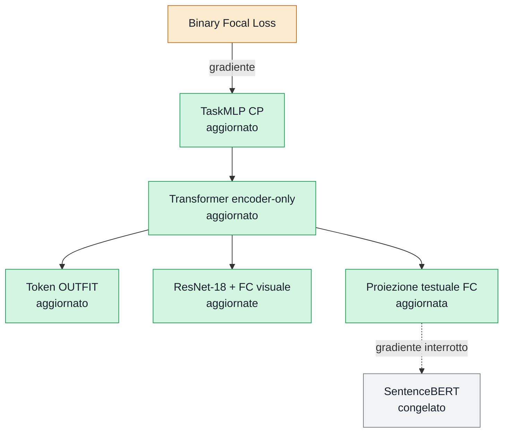

# Training

Il package `training` separa il codice di addestramento in base al task:

- [Training CP](#training-cp), implementato in [`training/cp`](cp/);
- [Training CIR](#training-cir), previsto ma non ancora implementato.

## Training CP

Il training di Compatibility Prediction stabilisce se un outfit è compatibile.
La CLI, il loop di epoca e la guida completa sono raccolti nella cartella
[`training/cp`](cp/):

```powershell
python -m training.cp.train_cp
```

Consulta la [guida completa al training CP](cp/README.md) per dataset,
iperparametri, checkpoint, resume e valutazione sul test set.

### Cosa aggiorna la backpropagation


```mermaid
flowchart TD
    A["Binary Focal Loss<br/>"] -->|gradiente| B["TaskMLP CP<br/>aggiornato"]
    B --> C["Transformer encoder-only<br/>aggiornato"]

    C --> D["Token OUTFIT<br/>aggiornato"]
    C --> E["ResNet-18 + FC visuale<br/>aggiornate"]
    C --> F["Proiezione testuale FC<br/>aggiornata"]
    F -.->|"gradiente interrotto"| G["SentenceBERT<br/>congelato"]

    classDef trained fill:#d5f5e3,stroke:#239b56,color:#17202a
    classDef frozen fill:#f2f3f4,stroke:#7b7d7d,color:#17202a
    classDef loss fill:#fdebd0,stroke:#ca6f1e,color:#17202a

    class B,C,D,E,F trained
    class G frozen
    class A loss
```

Il gradiente parte dalla Focal Loss, attraversa classificatore e Transformer
encoder-only, poi aggiorna il token `OUTFIT`, il ramo visuale e la proiezione
testuale.
Si arresta prima di SentenceBERT, eseguito con pesi congelati e
`torch.no_grad()`.

## Training CIR

Il training di Complementary Item Retrieval non è ancora implementato. Quando
verrà aggiunto avrà una cartella dedicata `training/cir`, separata dal CP, e
riutilizzerà l'encoder comune con il token `TARGET`, la proiezione CIR e la
Set-wise Ranking Loss.

Consulta la [pagina del futuro training CIR](cir/README.md) e il
[README del modello CIR](../model/cir/README.md).

## Come il batch usa i pesi

Durante il forward il modello riceve un batch di outfit, non un singolo outfit
alla volta. Dopo l'encoding visuale e testuale, gli item del batch hanno una
forma di questo tipo:

```python
X.shape = [B, L, D]
```

Dove:

- `B` e il numero di outfit nel batch;
- `L` e il numero massimo di item per outfit, dopo padding;
- `D` e la dimensione dell'embedding di ogni item.

Per esempio, con 4 outfit, 6 item massimi per outfit e embedding da 128:

```python
X.shape = [4, 6, 128]
```

Nel Transformer gli stessi pesi vengono applicati a tutti gli item di tutti gli
outfit. Per la matrice delle query:

```python
Wq.shape = [128, 128]
Q = X @ Wq
Q.shape = [4, 6, 128]
```

Questa operazione equivale concettualmente a:

```python
Q[0] = X[0] @ Wq
Q[1] = X[1] @ Wq
Q[2] = X[2] @ Wq
Q[3] = X[3] @ Wq
```

Ogni `X[i]` ha forma `[6, 128]`, quindi ogni prodotto produce una matrice
`[6, 128]`. PyTorch esegue tutto insieme in modo vettorializzato e restituisce
un unico tensore `Q` di forma `[4, 6, 128]`.

I pesi `Wq` sono quindi condivisi: non esiste una matrice diversa per ogni
outfit. La dimensione `B` serve a processare piu outfit in parallelo, mentre la
dimensione `L` mantiene separati gli item di ciascun outfit. Lo stesso schema
vale per `Wk` e `Wv`, usati per costruire key e value.
