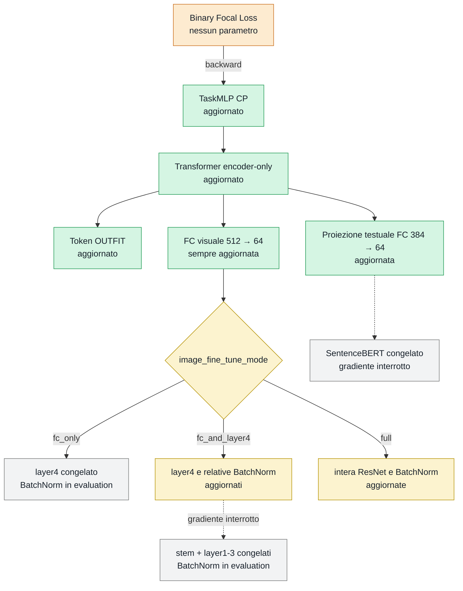

# Training

Il package separa il training per task:

- [Compatibility Prediction](cp/README.md): implementato;
- [Complementary Item Retrieval](cir/README.md): non ancora implementato.

## Indice

- [Compatibility Prediction](#compatibility-prediction)
  - [Cosa viene aggiornato nel training](#cosa-viene-aggiornato-nel-training)
  - [Checkpoint e resume](#checkpoint-e-resume)
  - [ResNet-18](#resnet-18)
- [Complementary Item Retrieval](#complementary-item-retrieval)
- [Esempi](#esempi)

## Compatibility Prediction

La pipeline CP è composta da runner di epoca, orchestratore, history,
checkpoint manager e plotter indipendenti. L'API breve `train_cp()` compone i
componenti standard; `CPTrainer` permette di sostituire il runner o collegare
callback senza duplicare persistenza e metriche.

Ogni epoca produce:

- train loss, accuracy e ROC AUC;
- validation loss, accuracy e ROC AUC;
- checkpoint dell'epoca ed eventuale nuovo best;
- quattro grafici cumulativi: loss, accuracy, ROC AUC train/validation e
  validation accuracy/AUC.

### Cosa viene aggiornato nel training

Il grafo mostra il percorso del gradiente durante `loss.backward()`. Dopo il
backward viene applicato il gradient clipping; Adam aggiorna soltanto i
parametri allenabili che hanno ricevuto un gradiente.


```mermaid
flowchart TD
    A["Binary Focal Loss<br/>nessun parametro"] -->|backward| B["TaskMLP CP<br/>aggiornato"]
    B --> C["Transformer encoder-only<br/>aggiornato"]

    C --> D["Token OUTFIT<br/>aggiornato"]
    C --> E["FC visuale 512 → 64<br/>sempre aggiornata"]
    C --> F["Proiezione testuale FC 384 → 64<br/>aggiornata"]

    E --> G{"image_fine_tune_mode"}
    G -->|fc_only| H["layer4 congelato<br/>BatchNorm in evaluation"]
    G -->|fc_and_layer4| I["layer4 e relative BatchNorm<br/>aggiornati"]
    I -.->|gradiente interrotto| J["stem + layer1-3 congelati<br/>BatchNorm in evaluation"]
    G -->|full| L["intera ResNet e BatchNorm<br/>aggiornate"]

    F -.-> K["SentenceBERT congelato<br/>gradiente interrotto"]

    classDef trained fill:#d5f5e3,stroke:#239b56,color:#17202a
    classDef conditional fill:#fcf3cf,stroke:#b7950b,color:#17202a
    classDef frozen fill:#f2f3f4,stroke:#7b7d7d,color:#17202a
    classDef loss fill:#fdebd0,stroke:#ca6f1e,color:#17202a

    class B,C,D,E,F trained
    class G,I,L conditional
    class H,J,K frozen
    class A loss
```

In tutte le modalità vengono quindi aggiornati:

- classificatore `TaskMLP` del CP;
- tutti i parametri del Transformer encoder-only;
- token apprendibile `OUTFIT`;
- FC visuale `Linear(512, 64)`;
- proiezione testuale `Linear(384, 64)`.

Con `fc_and_layer4` vengono aggiornati anche `layer4` e le sue BatchNorm. Con
`full` viene aggiornata l'intera ResNet, comprese tutte le BatchNorm. Con
`fc_only`, tutto il backbone prima della FC resta congelato. SentenceBERT resta
sempre congelato.

Durante validation il modello usa `eval()` e gradienti disabilitati: nessun
parametro e nessuna statistica BatchNorm vengono aggiornati.

### Checkpoint e resume

I comandi per avviare una nuova run o riprenderne una esistente sono raccolti
nella sezione [Esempi](#esempi) in fondo alla pagina.

Nell'esempio `resume_01`, le nuove epoche vengono salvate in
`resume_01\epochs` e i nuovi grafici in `resume_01\plots`.
`resume_01\best.pt` viene invece creato soltanto se una
nuova epoca migliora la metrica di selezione salvata nel checkpoint di
partenza. Se non avviene alcun miglioramento, il best originale resta
`checkpoints\cp_best.pt`.

`--epochs` indica l'ultima epoca totale. Riprendendo un checkpoint terminato
all'epoca 20 con `--epochs 40`, il training continua dall'epoca 21 alla 40;
non esegue altre 40 epoche.

Optimizer, scheduler, history, migliore metrica e RNG vengono ripristinati dal
checkpoint nuovo. Learning rate, weight decay e configurazione StepLR salvati
nel checkpoint prevalgono sugli stessi flag CLI. Cambiare
`--image-fine-tune-mode` è invece consentito e permette un fine-tuning a fasi.

Quando serve cambiare anche optimizer, learning rate, scheduler, loss o seed,
usare `python -m training.cp.fine_tune_cp`: carica soltanto i pesi del modello
e avvia una nuova fase con stato di training pulito. Supporta anche un learning
rate separato per i blocchi ResNet allenabili.

I checkpoint legacy restano caricabili, ma non possono fornire history, RNG e
migliore metrica precedenti completi.

### ResNet-18

La FC visuale è sempre allenabile. Il flag
`--image-fine-tune-mode` controlla il resto:

- `fc_only`: congela tutti i blocchi ResNet e le relative BatchNorm;
- `fc_and_layer4`: allena `layer4`, le sue BatchNorm e la FC.
- `full`: allena l'intera ResNet, incluse tutte le BatchNorm e la FC.

`--no-pretrained-image` controlla solo l'inizializzazione ImageNet e non rende
automaticamente allenabili i blocchi congelati. Combinandolo con
`--image-fine-tune-mode full` si allena invece l'intera ResNet da pesi casuali.

SentenceBERT resta congelato; la sua proiezione FC, il token `OUTFIT`, il
Transformer e il classificatore CP restano allenabili.

Dettagli, flag, resume, formato checkpoint, grafici ed esempi:
[guida completa CP](cp/README.md).

## Complementary Item Retrieval

Il training CIR non è ancora implementato. Riutilizzerà l'encoder comune, il
token `TARGET`, la proiezione CIR e la Set-wise Ranking Loss. Consulta la
[pagina CIR](cir/README.md) e il [modello CIR](../model/cir/README.md).

## Esempi

Tutti i comandi di esempio del training CP sono raccolti qui e sono identici
nella guida generale e nella guida specifica CP.

### Avvio e configurazione

```powershell
# Configurazione predefinita
python -m training.cp.train_cp

# Allena layer4 e FC visuale
python -m training.cp.train_cp `
  --variant disjoint `
  --epochs 20 `
  --batch-size 32 `
  --image-fine-tune-mode fc_and_layer4

# Fine-tuning completo della ResNet
python -m training.cp.train_cp `
  --image-fine-tune-mode full

# Sceglie il checkpoint migliore tramite validation AUC
python -m training.cp.train_cp `
  --best-metric val_auc

# Usa una GPU specifica e riduce la frequenza dei log batch
python -m training.cp.train_cp `
  --device cuda:0 `
  --log-interval 100

# Riduce il batch size quando la VRAM è limitata
python -m training.cp.train_cp --batch-size 8

# Usa un modello SentenceBERT locale
python -m training.cp.train_cp `
  --text-model D:\models\all-MiniLM-L6-v2
```

### Artefatti e grafici

```powershell
# Salva checkpoint e grafici di una nuova run in cartelle dedicate
python -m training.cp.train_cp `
  --epochs 30 `
  --checkpoint checkpoints\experiment_01\best.pt `
  --checkpoint-dir checkpoints\experiment_01\epochs `
  --plot-dir checkpoints\experiment_01\plots

# Cambia soltanto la directory dei grafici
python -m training.cp.train_cp `
  --plot-dir artifacts\cp_plots

# Disabilita i grafici
python -m training.cp.train_cp --no-plots
```

### Resume

```powershell
# Riprende dal checkpoint migliore
python -m training.cp.train_cp `
  --epochs 40 `
  --resume checkpoints\cp_best.pt `
  --image-fine-tune-mode fc_only

# Riprende da una specifica epoca
python -m training.cp.train_cp `
  --epochs 40 `
  --resume checkpoints\cp_epochs\cp_epoch_020.pt `
  --image-fine-tune-mode fc_and_layer4

# Riprende salvando i nuovi artefatti in cartelle separate
python -m training.cp.train_cp `
  --epochs 40 `
  --resume checkpoints\cp_best.pt `
  --image-fine-tune-mode fc_only `
  --checkpoint checkpoints\resume_01\best.pt `
  --checkpoint-dir checkpoints\resume_01\epochs `
  --plot-dir checkpoints\resume_01\plots
```

### fase di fine-tuning

```powershell
# Sblocca layer4 con LR dieci volte inferiore al resto del modello
python -m training.cp.fine_tune_cp `
  --source-checkpoint checkpoints\experiment_01\best.pt `
  --additional-epochs 10 `
  --output-dir checkpoints\experiment_01_stage2 `
  --image-fine-tune-mode fc_and_layer4 `
  --learning-rate 1e-5 `
  --image-backbone-learning-rate 1e-6 `
  --best-metric val_auc

# Nuova fase BCE + AdamW + cosine scheduler
python -m training.cp.fine_tune_cp `
  --source-checkpoint checkpoints\cp_epochs\cp_epoch_005.pt `
  --additional-epochs 8 `
  --output-dir checkpoints\bce_finetune `
  --optimizer adamw `
  --scheduler cosine `
  --loss bce `
  --image-fine-tune-mode fc_only

# Continua da un checkpoint prodotto da una fase di fine-tuning
python -m training.cp.fine_tune_cp `
  --source-checkpoint checkpoints\experiment_01_stage2\epochs\cp_epoch_012.pt `
  --additional-epochs 5 `
  --output-dir checkpoints\experiment_01_stage2_continued `
  --image-fine-tune-mode fc_and_layer4 `
  --learning-rate 5e-6 `
  --image-backbone-learning-rate 5e-7 `
  --best-metric val_auc
```

### Help CLI

```powershell
python -m training.cp.train_cp --help
python -m training.cp.fine_tune_cp --help
```
