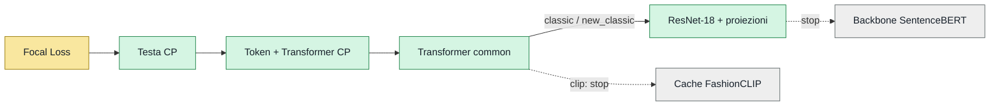

# Training

Documentazione collegata: [panoramica del modello](../model/README.md),
[Transformer common](../model/common/README.md),
[modello Compatibility Prediction](../model/cp/README.md) e
[guida del training CP](CP/README.md).

## Indice

- [File](#file)
- [Cosa aggiorna la backpropagation](#cosa-aggiorna-la-backpropagation)
- [Modalità CP](#modalità-cp)
- [Modello e backpropagation](#modello-e-backpropagation)
- [Ottimizzazione](#ottimizzazione)
- [Validazione e best model](#validazione-e-best-model)
- [Riproducibilità e device](#riproducibilità-e-device)
- [Checkpoint e monitoraggio](#checkpoint-e-monitoraggio)
- [Avvio](#avvio)

## File

| Area | File | Responsabilità concettuale |
|---|---|---|
| Common | [`common/runtime.py`](common/runtime.py) | Gestisce seed riproducibile e scelta automatica del device. |
| Common | [`common/metrics.py`](common/metrics.py) | Accumula loss, accuracy e ROC AUC sull’intera epoca. |
| Common | [`common/checkpointing.py`](common/checkpointing.py) | Salva checkpoint e configurazione in modo atomico; carica solo pesi per resume. |
| Common | [`common/embeddings.py`](common/embeddings.py) | Legge e valida cache FashionCLIP tramite manifest e shard memory-mapped. |
| CP | [`CP/config.py`](CP/config.py) | Definisce modalità, architettura e iperparametri validati. |
| CP | [`CP/data.py`](CP/data.py) | Costruisce pipeline Polyvore classic, new classic o CLIP per train e validation. |
| CP | [`CP/model.py`](CP/model.py) | Compone rappresentazione common, Transformer CP e classificatore. |
| CP | [`CP/trainer.py`](CP/trainer.py) | Coordina forward, backward, ottimizzazione, validazione e checkpoint. |
| CP | [`CP/plots.py`](CP/plots.py) | Produce grafici cumulativi dopo ogni epoca. |
| CP | [`CP/train_cp.py`](CP/train_cp.py) | Avvia run da CLI e collega configurazione, dati, modello e trainer. |
| CP | [`CP/README.md`](CP/README.md) | Documenta flag, default, preparazione e comandi CP. |

## Cosa aggiorna la backpropagation

```mermaid
flowchart LR
    LOSS["Focal Loss"] --> HEAD["Testa CP"]
    HEAD --> CP["Token + Transformer CP"]
    CP --> COMMON["Transformer common"]

    COMMON -->|classic / new_classic| RAW["ResNet-18 + proiezioni"]
    RAW -.->|stop| SBERT["Backbone SentenceBERT"]

    COMMON -.->|clip: stop| CACHE["Cache FashionCLIP"]

    classDef trainable fill:#d5f5e3,stroke:#1e8449,color:#17202a;
    classDef frozen fill:#eeeeee,stroke:#616a6b,color:#17202a;
    classDef loss fill:#f9e79f,stroke:#9a7d0a,color:#17202a;

    class HEAD,CP,COMMON,RAW trainable;
    class SBERT,CACHE frozen;
    class LOSS loss;
```

Le frecce partono dalla loss e seguono il gradiente all'indietro. Il verde
indica ciò che viene aggiornato. Il grigio indica dove la backpropagation si
ferma: backbone SentenceBERT in `classic` e `new_classic`, cache e tower
FashionCLIP in `clip`.

## Modalità CP

| Aspetto | `classic` | `new_classic` | `clip` |
|---|---|---|---|
| Sorgente | Immagini e descrizioni originali | Immagini e descrizioni originali | Embedding FashionCLIP precomputati |
| Visuale | ResNet-18 allenabile, proiezione a 64 | ResNet-18 allenabile, output 512 | Tower FashionCLIP congelata, output 512 |
| Testo | SentenceBERT congelato, proiezione 384→64 | SentenceBERT congelato, proiezione 384→512 | Tower FashionCLIP congelata, output 512 |
| Item embedding | 128 | 1024 | 1024 |
| Data augmentation | Attiva nel train visuale | Attiva nel train visuale | Non applicata durante training |
| Costo | Encoder eseguiti a ogni epoca | Encoder eseguiti a ogni epoca | Encoder eseguiti una sola volta |
| Backpropagation | Aggiorna ResNet e proiezioni | Aggiorna ResNet e proiezione testo | Si ferma alla cache |

La cache CLIP è separata per subset e split. Manifest e shard vengono
controllati prima del training: schema, quantità, dimensione, valori finiti,
duplicati, dataset, subset, split e fingerprint del modello devono essere coerenti.
Le descrizioni oltre il limite FashionCLIP vengono troncate a 77 token durante
la precomputazione.

## Modello e backpropagation

Transformer common contestualizza gli item come insieme: non usa positional
embedding e maschera il padding. CP aggiunge un token composto da `task_emb` e
`predict_emb`; il relativo Transformer raccoglie informazione da tutti gli item
reali. Testa finale converte stato del token in probabilità tramite sigmoid.

Focal Loss riduce peso degli esempi già facili e concentra gradienti su quelli
incerti o errati. In `classic` e `new_classic`, gradienti attraversano
Transformer common fino a ResNet-18 e alle proiezioni, ma non entrano nel
backbone SentenceBERT. In `clip`, cache non appartiene al grafo e tower
FashionCLIP restano fuori dal run.

## Ottimizzazione

| Aspetto | Default | Significato |
|---|---:|---|
| Dataset | `nondisjoint` | Variante Polyvore usata se non specificata diversamente. |
| Epoche | 200 | Limite massimo del run. |
| Microbatch | 512 | Outfit elaborati per forward/backward. |
| Accumulo | 4 | Un optimizer step ogni quattro microbatch. |
| Batch effettivo | 2048 | `512 × 4`, salvo ultimo gruppo incompleto. |
| Ottimizzatore | AdamW | Aggiorna parametri con weight decay `0.01`. |
| Learning rate | `2e-5` | Valore massimo del ciclo. |
| Scheduler | OneCycleLR | Cambia LR dopo ogni optimizer step, non dopo ogni epoca. |
| Gradient clipping | `1.0` | Limita sempre norma globale dei gradienti CP. |

Loss viene divisa per numero reale di microbatch nel gruppo di accumulo. Anche
ultimo gruppo incompleto mantiene quindi scala corretta. Dopo backward:
clipping, optimizer step, scheduler step e azzeramento gradienti.

## Validazione e best model

Ogni epoca produce metriche complete su train e validation:

- loss media pesata per numero di esempi;
- accuracy con soglia probabilità `0.5`;
- ROC AUC calcolata sui punteggi dell’intera epoca.

Best checkpoint usa `val_auc` per default. Può usare anche `val_accuracy` o
`val_loss`; prime due vengono massimizzate, loss minimizzata. `min_delta`
stabilisce miglioramento minimo. Early stopping è disabilitato per default e,
se attivato, termina dopo numero configurato di epoche senza miglioramento.

## Riproducibilità e device

Seed predefinito 42 controlla Python, NumPy, PyTorch, CUDA e shuffle del
DataLoader. Su cuDNN vengono preferiti percorsi deterministici.

Device `auto` sceglie CUDA, poi MPS, infine CPU. `pin_memory` è opzionale e
riduce costo trasferimenti verso GPU. Device scelto viene mostrato in console e
registrato nella configurazione del run.

## Checkpoint e monitoraggio

| Artefatto | Contenuto concettuale |
|---|---|
| `config.json` | Dataset, modalità, modello, training e runtime risolto. |
| Checkpoint epoca | Pesi, configurazione, metriche, history e stato selezione best. |
| `best.pt` | Copia del checkpoint con miglior metrica monitorata. |
| Grafici | Curve cumulative loss, accuracy, ROC AUC e confronto validation; gli score mostrano tacche da `0.10` a `1.00` ogni `0.10`. |
| Console | Avanzamento microbatch, LR e riepilogo di ogni epoca. |

Salvataggi sono atomici: file temporaneo viene sostituito solo a scrittura
completata. Ogni epoca conserva proprio checkpoint. Directory contenente già
un run non viene sovrascritta.

Resume carica esclusivamente pesi. Optimizer, OneCycleLR, contatore epoche e
history ripartono da zero; modalità e architettura devono coincidere. Stato di
optimizer e scheduler non viene quindi salvato nei checkpoint.

## Avvio

Dettagli su preparazione CLIP, comandi, flag e relativi default sono in
[Training Compatibility Prediction](CP/README.md).
