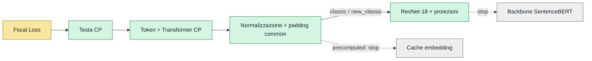
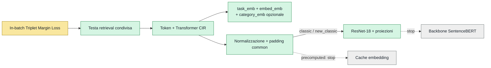

# Training

Documentazione collegata: [panoramica del modello](../model/README.md),
[embedding common](../model/common/README.md),
[modello Compatibility Prediction](../model/cp/README.md) e
[guida del training CP](CP/README.md),
[modello Complementary Item Retrieval](../model/CIR/README.md) e
[guida del training CIR](CIR/README.md).

## Indice

- [File](#file)
- [Panoramica dei task](#panoramica-dei-task)
- [Backpropagation CP](#backpropagation-cp)
- [Backpropagation CIR](#backpropagation-cir)
- [Modalità CP](#modalità-cp)
- [Modalità CIR](#modalità-cir)
- [Modello CP](#modello-cp)
- [Modello CIR](#modello-cir)
- [Ottimizzazione CP](#ottimizzazione-cp)
- [Ottimizzazione CIR](#ottimizzazione-cir)
- [Validazione e best model CP](#validazione-e-best-model-cp)
- [Validazione e best model CIR](#validazione-e-best-model-cir)
- [Riproducibilità e device](#riproducibilità-e-device)
- [Checkpoint e monitoraggio](#checkpoint-e-monitoraggio)
- [Avvio](#avvio)

## File

| Area | File | Responsabilità concettuale |
|---|---|---|
| Common | [`common/runtime.py`](common/runtime.py) | Gestisce seed riproducibile e scelta automatica del device. |
| Common | [`common/metrics.py`](common/metrics.py) | Accumula loss, accuracy e ROC AUC sull’intera epoca. |
| Common | [`common/checkpointing.py`](common/checkpointing.py) | Salva checkpoint e configurazione in modo atomico; legge e carica state dict validati. |
| Common | [`common/embeddings.py`](common/embeddings.py) | Legge e valida cache embedding tramite manifest e shard memory-mapped. |
| Common | [`common/README.md`](common/README.md) | Documenta file, API e responsabilità dei componenti condivisi. |
| CP | [`CP/config.py`](CP/config.py) | Definisce modalità, architettura e iperparametri validati. |
| CP | [`CP/data.py`](CP/data.py) | Costruisce pipeline runtime o precomputed per train e validation. |
| CP | [`CP/model.py`](CP/model.py) | Compone rappresentazione common, Transformer CP e classificatore. |
| CP | [`CP/trainer.py`](CP/trainer.py) | Coordina forward, backward, ottimizzazione, validazione e checkpoint. |
| CP | [`CP/plots.py`](CP/plots.py) | Produce grafici cumulativi dopo ogni epoca. |
| CP | [`CP/train_cp.py`](CP/train_cp.py) | Avvia run da CLI e collega configurazione, dati, modello e trainer. |
| CP | [`CP/README.md`](CP/README.md) | Documenta flag, default, preparazione e comandi CP. |
| CIR | [`CIR/config.py`](CIR/config.py) | Definisce profili, Triplet Loss, categoria opzionale e runtime validato. |
| CIR | [`CIR/data.py`](CIR/data.py) | Costruisce coppie casuali di training, FITB fissi raw/precomputed e sampler DDP senza duplicati in validation. |
| CIR | [`CIR/model.py`](CIR/model.py) | Compone rappresentazione common, Transformer CIR e testa retrieval. |
| CIR | [`CIR/pretraining.py`](CIR/pretraining.py) | Trasferisce `common.*`, Transformer completo e task embedding da CP a CIR. |
| CIR | [`CIR/trainer.py`](CIR/trainer.py) | Coordina loss in-batch, ranking FITB, AMP, DDP e checkpoint. |
| CIR | [`CIR/plots.py`](CIR/plots.py) | Produce grafici loss, FITB accuracy, MRR e Recall@2. |
| CIR | [`CIR/train_cir.py`](CIR/train_cir.py) | Avvia run CIR da CLI. |
| CIR | [`CIR/README.md`](CIR/README.md) | Documenta flag, metriche, categoria, DDP e comandi CIR. |

## Panoramica dei task

CP usa outfit compatibili e incompatibili, ottimizza Binary Focal Loss e
produce una probabilità di compatibilità. Il best checkpoint usa `val_auc` per
default; può usare anche `val_accuracy` o `val_loss`.

CIR mantiene profili feature e funzioni operative comuni al CP, ma sostituisce
Focal Loss e metriche binarie con In-batch Triplet Margin Loss e ranking FITB.
Il best checkpoint è fisso sulla massima `val_fitb_accuracy`; validation registra
anche `val_mrr` e `val_recall@2`.

Flag `--category-emb` abilita token
`[task_emb | embed_emb + category_emb]`. AMP CUDA e DDP tramite `torchrun` sono
opzionali. `--pretrained-cp` inizializza `common.*`, tutti i layer del Transformer
e la parte condivisa del token da un checkpoint CP compatibile. Dettagli completi sono nella
[guida CIR](CIR/README.md).

## Backpropagation CP

```mermaid
flowchart LR
    LOSS["Focal Loss"] --> HEAD["Testa CP"]
    HEAD --> CP["Token + Transformer CP"]
    CP --> COMMON["Normalizzazione + padding common"]

    COMMON -->|classic / new_classic| RAW["ResNet-18 + proiezioni"]
    RAW -.->|stop| SBERT["Backbone SentenceBERT"]

    COMMON -.->|precomputed: stop| CACHE["Cache embedding"]

    classDef trainable fill:#d5f5e3,stroke:#1e8449,color:#17202a;
    classDef frozen fill:#eeeeee,stroke:#616a6b,color:#17202a;
    classDef loss fill:#f9e79f,stroke:#9a7d0a,color:#17202a;

    class HEAD,CP,COMMON,RAW trainable;
    class SBERT,CACHE frozen;
    class LOSS loss;
```

Le frecce partono dalla loss e seguono il gradiente all'indietro. Il verde
indica ciò che viene aggiornato. Il grigio indica dove la backpropagation si
ferma: backbone SentenceBERT in `classic` e `new_classic`; cache in
`precomputed`.

## Backpropagation CIR

```mermaid
flowchart LR
    LOSS["In-batch Triplet Margin Loss"] --> HEAD["Testa retrieval condivisa"]
    HEAD --> CIR["Token + Transformer CIR"]
    CIR --> TOKEN["task_emb + embed_emb<br/>+ category_emb opzionale"]
    CIR --> COMMON["Normalizzazione + padding common"]

    COMMON -->|classic / new_classic| RAW["ResNet-18 + proiezioni"]
    RAW -.->|stop| SBERT["Backbone SentenceBERT"]

    COMMON -.->|precomputed: stop| CACHE["Cache embedding"]

    classDef trainable fill:#d5f5e3,stroke:#1e8449,color:#17202a;
    classDef frozen fill:#eeeeee,stroke:#616a6b,color:#17202a;
    classDef loss fill:#f9e79f,stroke:#9a7d0a,color:#17202a;

    class HEAD,CIR,TOKEN,COMMON,RAW trainable;
    class SBERT,CACHE frozen;
    class LOSS loss;
```

Loss aggiorna Transformer CIR, testa condivisa dei rami query/item, `task_emb`,
`embed_emb` e, quando abilitato, `category_emb`. In `classic` e `new_classic`
gradienti raggiungono anche ResNet-18 e proiezioni; SentenceBERT resta
congelato. In `precomputed` si fermano alla cache.

## Modalità CP

| Aspetto | `classic` | `new_classic` | `precomputed` |
|---|---|---|---|
| Sorgente | Immagini e testi | Immagini e testi | Cache da modello compatibile |
| Visuale | ResNet-18 → 64 | ResNet-18 → 512 | Precomputata |
| Testo | SentenceBERT → 64 | SentenceBERT → 512 | Precomputata |
| Item embedding | 128 | 1024 | 1024 |
| Data augmentation | Attiva | Attiva | Assente nel training |
| Costo encoder | Ogni epoca | Ogni epoca | Solo precomputazione |
| Backpropagation | ResNet + proiezioni | ResNet + proiezioni | Si ferma alla cache |

Ogni cache è separata per subset e split. Manifest e shard vengono
controllati prima del training: schema, quantità, dimensione, valori finiti,
duplicati, dataset, subset, split e fingerprint modello devono essere coerenti.

## Modalità CIR

| Aspetto | `classic` | `new_classic` | `precomputed` |
|---|---|---|---|
| Sorgente | Immagini e testi | Immagini e testi | Cache da modello compatibile |
| Visuale | ResNet-18 → 64 | ResNet-18 → 512 | Precomputata |
| Testo | SentenceBERT → 64 | SentenceBERT → 512 | Precomputata |
| Item embedding | 128 | 1024 | 1024 |
| Data augmentation | Attiva | Attiva | Assente nel training |
| Costo encoder | Ogni epoca | Ogni epoca | Solo precomputazione |
| Backpropagation | ResNet + proiezioni | ResNet + proiezioni | Si ferma alla cache |

Profili feature coincidono con CP. Nel training CIR, a ogni accesso viene
estratto un capo casuale da un outfit completo di `train.json`: il resto forma
la query e i negativi provengono dal microbatch. Validation usa query, positivo
e tre distrattori dei FITB ufficiali fissi. `--category-emb` usa la categoria
del target corrente solo nel token query. Cache train deve coprire tutti gli
item degli outfit; cache validation copre query, positivi e distrattori.
Il campionamento resta dinamico anche con feature precomputate.

## Modello CP

Common normalizza gli item, applica padding e costruisce la mask. CP aggiunge un
token composto da `task_emb` e `predict_emb`, normalizzato L2 dopo la
concatenazione; il Transformer CP, senza positional
embedding, esegue la contestualizzazione e ignora il padding. La testa finale
converte lo stato del token in probabilità tramite sigmoid.

Focal Loss riduce peso degli esempi già facili e concentra gradienti su quelli
incerti o errati. In `classic` e `new_classic`, gradienti attraversano
la pipeline common fino a ResNet-18 e alle proiezioni, ma non entrano nel
backbone SentenceBERT. In `precomputed`, cache non appartiene al grafo e modello
embedding resta fuori dal run.

## Modello CIR

Common normalizza item, applica padding e costruisce mask. Ramo query aggiunge
token `[task_emb | embed_emb]`; con `--category-emb` usa
`[task_emb | embed_emb + category_emb]`. Il token completo viene normalizzato L2.
Transformer CIR contestualizza token e
outfit parziale. Ramo item usa stesso Transformer e stessa testa retrieval,
senza token CIR, così query e candidati arrivano nello stesso spazio vettoriale.

Training confronta ogni query col proprio positivo e usa come negativo più
difficile il positivo di un'altra riga del microbatch. Accumulo gradienti non
allarga pool dei negativi: mining resta interno a ogni microbatch.

## Ottimizzazione CP

| Aspetto | Default | Significato |
|---|---:|---|
| Dataset | `nondisjoint` | Variante Polyvore usata se non specificata diversamente. |
| Epoche | 200 | Limite massimo del run. |
| Microbatch | 512 | Outfit elaborati per forward/backward. |
| Accumulo | 4 | Un optimizer step ogni quattro microbatch. |
| Batch effettivo | 2048 | `512 × 4`, salvo ultimo gruppo incompleto. |
| Ottimizzatore | AdamW | Aggiorna parametri con weight decay `0.01`. |
| Learning rate | `2e-5` | Valore massimo del ciclo. |
| Scheduler | OneCycleLR | Cambia LR dopo ogni optimizer step, non dopo ogni epoca. |
| Gradient clipping | `1.0` | Limita sempre norma globale dei gradienti CP. |

Loss viene divisa per numero reale di microbatch nel gruppo di accumulo. Anche
ultimo gruppo incompleto mantiene quindi scala corretta. Dopo backward:
clipping, optimizer step, scheduler step e azzeramento gradienti.

## Ottimizzazione CIR

| Aspetto | Default | Significato |
|---|---:|---|
| Dataset | `nondisjoint` | Variante Polyvore usata se non specificata diversamente. |
| Epoche | 200 | Limite massimo del run. |
| Microbatch | 64 per processo | Query/positivi elaborati insieme; minimo 2 per mining negativo. |
| Accumulo | 4 | Un optimizer step ogni quattro microbatch. |
| Batch effettivo | 256 per processo | Con DDP viene moltiplicato per `world_size`. |
| Ottimizzatore | AdamW | Aggiorna parametri con weight decay `0.01`. |
| Learning rate | `2e-5` | Valore massimo OneCycleLR. |
| Scheduler | OneCycleLR | Cambia LR dopo ogni optimizer step. |
| Gradient clipping | `1.0` | Limita norma globale dei gradienti CIR. |
| Triplet margin | `2.0` | Distanza minima richiesta tra positivo e hardest negative. |
| Spazio retrieval | 128 | Dimensione condivisa da query e item; normalizzazione disattiva. |

Loss viene scalata sul numero reale di microbatch accumulati. Training usa
`drop_last=True`: ultimo microbatch con meno di 64 esempi viene scartato,
garantendo dimensione piena e negativi in-batch.
AMP FP16 è opzionale su CUDA; DDP sincronizza gradienti tra processi, mentre
hardest-negative mining resta locale al singolo processo.

## Validazione e best model CP

Ogni epoca produce metriche complete su train e validation:

- loss media pesata per numero di esempi;
- accuracy con soglia probabilità `0.5`;
- ROC AUC calcolata sui punteggi dell’intera epoca.

Best checkpoint usa `val_auc` per default. Può usare anche `val_accuracy` o
`val_loss`; prime due vengono massimizzate, loss minimizzata. `min_delta`
stabilisce miglioramento minimo. Early stopping è disabilitato per default e,
se attivato, termina dopo numero configurato di epoche senza miglioramento.

## Validazione e best model CIR

Validation confronta ogni query con positivo e tre distrattori ufficiali FITB:

- `val_fitb_accuracy`: positivo al rank 1; seleziona sempre `best.pt`;
- `val_mrr`: media del reciproco del rank positivo;
- `val_recall@2`: quota di positivi nelle prime due posizioni;
- `val_loss`: Triplet Margin Loss con hardest negative tra distrattori ufficiali.

Ranking usa distanza euclidea crescente. Parità esatte favoriscono candidati
concorrenti, evitando risultati ottimistici con embedding collassati. Early
stopping, se attivato, monitora `val_fitb_accuracy`; metrica best non è
configurabile nel CIR.

## Riproducibilità e device

Seed predefinito 42 controlla Python, NumPy, PyTorch, CUDA e shuffle del
DataLoader. Su cuDNN vengono preferiti percorsi deterministici.

Device `auto` sceglie CUDA, poi MPS, infine CPU. `pin_memory` è opzionale e
riduce costo trasferimenti verso GPU. Device scelto viene mostrato in console e
registrato nella configurazione del run.

CIR aggiunge AMP FP16 opzionale su CUDA e DDP tramite `torchrun`. Ogni rank usa
un offset del seed, mentre validation distribuita assegna ogni esempio a un
solo processo senza duplicati. CP resta su singolo processo senza AMP.

## Checkpoint e monitoraggio

| Artefatto | CP | CIR |
|---|---|---|
| `config.json` | Dataset, feature, modello CP, training e runtime. | Dataset, feature, modello CIR, training, DDP e runtime. |
| Checkpoint epoca | `epochs/cp_epoch_NNN.pt` con pesi, metriche e history. | `epochs/cir_epoch_NNN.pt` con pesi, metriche e history. |
| `best.pt` | Migliore `val_auc`, `val_accuracy` o `val_loss`, secondo configurazione. | Massima `val_fitb_accuracy`, sempre. |
| Grafici loss | Train/validation loss cumulative. | Train/validation loss cumulative. |
| Grafici metriche | Accuracy, ROC AUC e confronto validation; tacche score da `0.10` a `1.00`. | FITB accuracy, MRR, Recall@2 e confronto validation. |
| Console | Loss, LR e riepilogo metriche per epoca. | Loss, LR, rank DDP e riepilogo metriche per epoca. |

Salvataggi sono atomici: file temporaneo viene sostituito solo a scrittura
completata. Ogni epoca conserva proprio checkpoint. Directory contenente già
un run non viene sovrascritta.

Resume carica esclusivamente pesi. Optimizer, OneCycleLR, contatore epoche e
history ripartono da zero; modalità e architettura devono coincidere. Stato di
optimizer e scheduler non viene quindi salvato nei checkpoint.

Nel CIR, `--pretrained-cp` è distinto da `--resume`:

- `--pretrained-cp <checkpoint-CP>` carica `common.padding_embedding`, tutti i
  parametri e buffer `common.visual_encoder.*`, `common.text_encoder.*` e delle
  proiezioni presenti nelle modalità raw, più
  `cp.task_embedding.embedding` in `cir.task_embedding.embedding` e tutti i
  layer `cp.encoder.layers.*` in `cir.encoder.layers.*`;
- in modalità `precomputed` carica padding, task embedding e Transformer
  completo; encoder e proiezioni runtime non esistono;
- `cp.predict_emb` e `cp.head.*` sono specifici della classificazione e non
  vengono trasferiti; `cir.embed_emb`, category embedding e testa retrieval
  partono da nuova inizializzazione perché assenti nel CP locale;
- dei vecchi CP ignora soltanto `cp.encoder.norm.weight` e
  `cp.encoder.norm.bias`, relativi alla LayerNorm finale rimossa, e lo segnala
  in console; gli altri pesi condivisi devono essere compatibili;
- `--resume <checkpoint-CIR>` non usa checkpoint CP: carica tutti i pesi
  `common.*` e `cir.*` da un modello CIR compatibile.

Entrambi avviano optimizer, scheduler, contatore epoche e history da zero. I
flag sono mutuamente esclusivi.
CP e CIR mantengono le LayerNorm interne dei layer, senza una LayerNorm finale
aggiuntiva. Il caricamento stretto `--resume` richiede checkpoint della nuova
architettura; la gestione della vecchia LayerNorm riguarda solo `--pretrained-cp`.

## Avvio

Dettagli su preparazione embedding, comandi, flag e relativi default sono in
[Training Compatibility Prediction](CP/README.md) e
[Training Complementary Item Retrieval](CIR/README.md).
