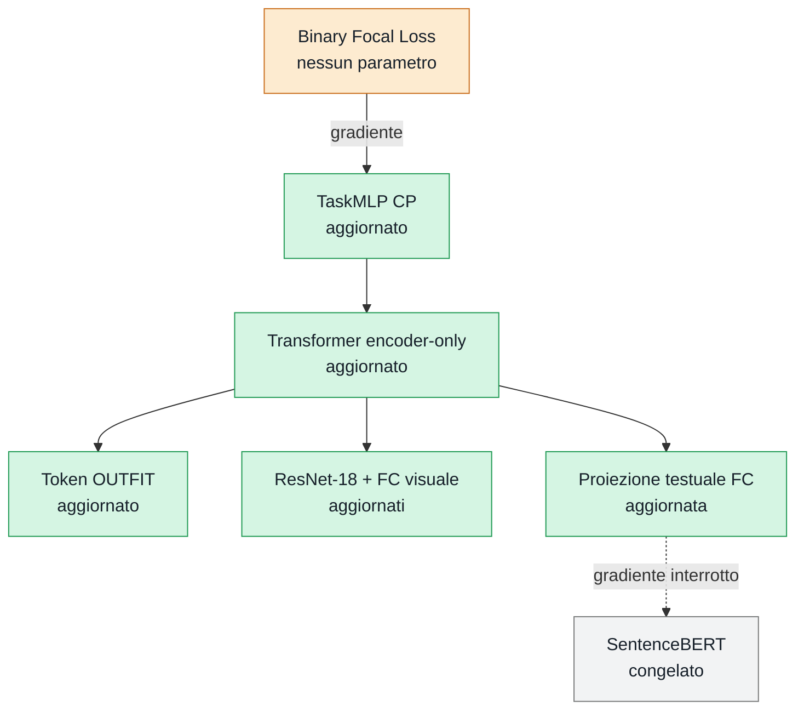

# Training CP

Guida operativa per allenare OutfitTransformer sul task di **Compatibility
Prediction (CP)**: dato un outfit, il modello predice se è compatibile (`1`) o
incompatibile (`0`).

- Torna alla [panoramica Training CP/CIR](../README.md).
- Consulta il [modello CP](../../model/cp/README.md).
- Consulta il [formato dei dati Polyvore](../../data/README.md).

## Indice

- [Flusso](#flusso)
  - [Cosa aggiorna la backpropagation](#cosa-aggiorna-la-backpropagation)
- [Avvio rapido](#avvio-rapido)
- [Flag della CLI](#flag-della-cli)
- [Iperparametri](#iperparametri)
  - [Ottimizzazione](#ottimizzazione)
  - [Architettura](#architettura)
  - [Preprocessing](#preprocessing)
- [Scheduler](#scheduler)
- [Training e validation](#training-e-validation)
- [Checkpoint e resume](#checkpoint-e-resume)
- [Valutazione sul test set](#valutazione-sul-test-set)
- [Comandi utili](#comandi-utili)
- [File](#file)

## Flusso

```text
immagini + descrizioni
        ↓
ResNet-18 + SentenceBERT/FC
        ↓
item embedding da 128 feature
        ↓
token OUTFIT + Transformer encoder-only
        ↓
TaskMLP → logit
        ↓
Binary Focal Loss
        ↓
backpropagation + Adam
```

### Cosa aggiorna la backpropagation



SentenceBERT produce le feature testuali dentro `torch.no_grad()`: il suo
backbone non cambia, mentre la proiezione FC successiva viene allenata.

## Avvio rapido

Eseguire dalla root del progetto:

```powershell
python -m pip install -r requirements.txt
hf auth login
python -m training.cp.train_cp
```

La configurazione predefinita usa la variante `disjoint`, 30 epoche, batch da
16 e il device CUDA quando disponibile.

## Flag della CLI

```powershell
python -m training.cp.train_cp --help
```

| Flag | Default | Funzione |
|---|---:|---|
| `-h`, `--help` | — | Mostra l'help |
| `--variant` | `disjoint` | Variante Polyvore: `disjoint` o `nondisjoint` |
| `--epochs` | `30` | Ultima epoca da eseguire |
| `--batch-size` | `16` | Numero di outfit per batch |
| `--learning-rate` | `5e-5` | Learning rate iniziale di Adam |
| `--weight-decay` | `1e-4` | Regolarizzazione L2 di Adam |
| `--lr-step-size` | `10` | Epoche tra due riduzioni del learning rate |
| `--lr-gamma` | `0.5` | Fattore moltiplicativo dello scheduler |
| `--focal-alpha` | `0.5` | Bilanciamento della classe positiva |
| `--focal-gamma` | `2.0` | Riduzione del peso degli esempi facili |
| `--max-grad-norm` | `1.0` | Limite della norma globale dei gradienti |
| `--workers` | `0` | Processi del DataLoader |
| `--seed` | `42` | Seed Python, PyTorch e CUDA |
| `--log-interval` | `50` | Stampa ogni N batch; `0` disabilita i log batch |
| `--device` | automatico | `cuda` se disponibile, altrimenti `cpu` |
| `--cache-dir` | cache Hugging Face | Posizione della cache dataset e Hub |
| `--checkpoint` | `checkpoints/cp_best.pt` | Checkpoint con validation loss minima |
| `--checkpoint-dir` | `checkpoints/cp_epochs` | Directory dei checkpoint per epoca |
| `--resume` | disabilitato | Riprende training, optimizer e scheduler |
| `--text-model` | `sentence-transformers/all-MiniLM-L6-v2` | SentenceBERT Hub o locale |
| `--no-pretrained-image` | falso | Non usa i pesi ImageNet di ResNet-18 |

## Iperparametri

### Ottimizzazione

| Iperparametro | Default |
|---|---:|
| optimizer | Adam |
| learning rate | `5e-5` |
| weight decay | `1e-4` |
| batch size | `16` |
| epoche | `30` |
| gradient clipping | `1.0` |
| Focal Loss alpha | `0.5` |
| Focal Loss gamma | `2.0` |

La Focal Loss concentra il training sugli outfit incerti o classificati male.
Il clipping viene applicato dopo `loss.backward()` e prima
di `optimizer.step()`.

### Architettura

| Iperparametro | Valore |
|---|---:|
| image embedding | `64` |
| text embedding | `64` |
| item embedding | `128` |
| Transformer encoder layer | `6` |
| teste di self-attention | `16` |
| feed-forward interno | `512` |
| dropout | `0.1` |
| attivazione Transformer | ReLU |
| TaskMLP | `128 → 128 → 1` |
| positional encoding | assente |

Questi valori arrivano da `OutfitEncoderConfig` e non sono esposti come flag
della CLI.

### Preprocessing

| Impostazione | Valore |
|---|---|
| dimensione immagine | `224 × 224` |
| normalizzazione | media e deviazione standard ImageNet |
| ResNet-18 | pesi ImageNet, salvo `--no-pretrained-image` |
| SentenceBERT | congelato |
| padding | a destra |
| train shuffle | attivo |
| validation shuffle | attivo |

## Scheduler

Lo scheduler modifica il learning rate durante il training. Il progetto usa
`StepLR`:

```python
scheduler = StepLR(
    optimizer,
    step_size=10,
    gamma=0.5,
)
```

Con il learning rate predefinito:

```text
epoche 1–10:   0.000050
epoche 11–20:  0.000025
epoche 21–30:  0.0000125
```

Alla fine di ogni epoca viene chiamato `scheduler.step()`. Lo scheduler:

- non calcola gradienti;
- non modifica direttamente i pesi;
- riduce il learning rate di Adam secondo una scadenza fissa;
- non sceglie il checkpoint migliore: quello dipende dalla validation loss.

Il suo stato viene salvato nei checkpoint e ripristinato con `--resume`.

## Training e validation

Ogni epoca esegue:

1. training con forward, Focal Loss, backward e aggiornamento dei pesi;
2. validation con `model.eval()` e gradienti disabilitati;
3. step dello scheduler;
4. salvataggio dei checkpoint.

I log batch mostrano:

```text
loss=... running_loss=... running_accuracy=... examples=...
```

- `loss`: loss del batch corrente;
- `running_loss`: media cumulativa dell'epoca;
- `running_accuracy`: accuracy cumulativa;
- `examples`: outfit elaborati fino a quel momento.

A fine epoca vengono stampate `train_loss`, `train_accuracy`, `val_loss`,
`val_accuracy` e learning rate.

## Checkpoint e resume

Vengono salvati:

```text
checkpoints/cp_epochs/cp_epoch_001.pt
checkpoints/cp_epochs/cp_epoch_002.pt
...
checkpoints/cp_best.pt
```

- `cp_epoch_NNN.pt` conserva ogni epoca;
- `cp_best.pt` viene aggiornato solo quando la validation loss raggiunge un
  nuovo minimo.

Ogni checkpoint contiene modello, optimizer, scheduler, epoca e metriche.

Per riprendere:

```powershell
python -m training.cp.train_cp `
  --epochs 40 `
  --resume checkpoints\cp_best.pt
```

`--epochs` indica l'ultima epoca totale, non quante epoche aggiungere.

## Valutazione sul test set

Il test set non viene usato durante il training. Dopo avere scelto
`cp_best.pt`:

```powershell
python evaluate_cp.py `
  --variant disjoint `
  --checkpoint checkpoints\cp_best.pt
```

La valutazione non aggiorna i pesi e stampa test loss, accuracy ed esempi.
Variante, SentenceBERT e parametri della Focal Loss devono coincidere con il
training.

## Comandi utili

```powershell
# Variante nondisjoint
python -m training.cp.train_cp --variant nondisjoint

# GPU specifica
python -m training.cp.train_cp --device cuda:0

# VRAM limitata
python -m training.cp.train_cp --batch-size 8

# Cache personalizzata
python -m training.cp.train_cp --cache-dir D:\datasets\huggingface

# SentenceBERT locale
python -m training.cp.train_cp `
  --text-model D:\models\all-MiniLM-L6-v2

# Disabilita i log batch
python -m training.cp.train_cp --log-interval 0
```

## File

```text
training/cp/
  train_cp.py   CLI e configurazione della run
  trainer.py    epoche, metriche, validation e checkpoint
  README.md     questa guida
```
