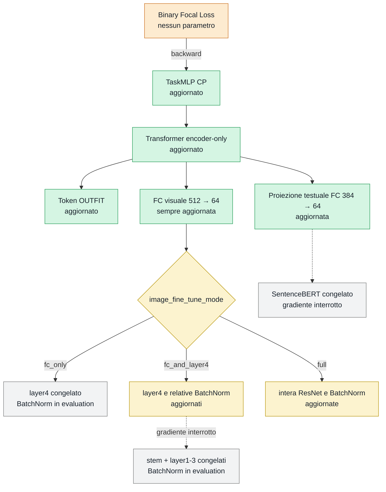
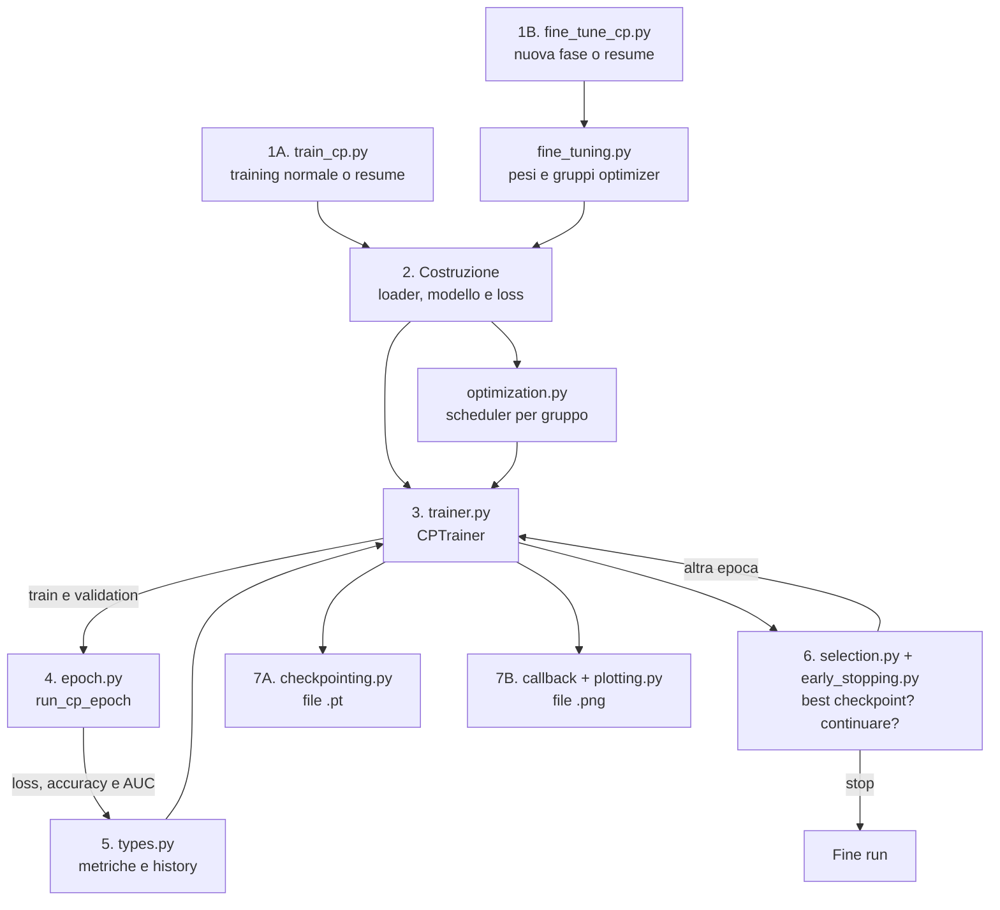

# Training CP

Pipeline modulare per allenare OutfitTransformer sul task di **Compatibility
Prediction (CP)**. Il modello riceve un outfit e predice se è compatibile
(`1`) oppure incompatibile (`0`).

- [Training generale](../README.md)
- [Modello CP](../../model/cp/README.md)
- [Loader Polyvore](../../data/polyvore_loader/README.md)
- [Valutazione](../../evaluate/README.md)
- [Serie di training CP](../run_trianing_series/README.md)

## Indice

- [Avvio rapido](#avvio-rapido)
- [Cosa viene aggiornato nel training](#cosa-viene-aggiornato-nel-training)
- [Fine-tuning ResNet-18](#fine-tuning-resnet-18)
  - [Pesi iniziali](#pesi-iniziali)
  - [Modalità di fine-tuning](#modalità-di-fine-tuning)
- [Grafici](#grafici)
- [Checkpoint e resume](#checkpoint-e-resume)
- [Early stopping](#early-stopping)
- [fine-tuning](#fine-tuning)
- [Flag CLI fine-tuning](#flag-cli-fine-tuning)
- [Flag CLI training normale](#flag-cli-training-normale)
- [File e flusso dei moduli](#file-e-flusso-dei-moduli)
  - [Flusso tra i file](#flusso-tra-i-file)
  - [Responsabilità di ogni file](#responsabilità-di-ogni-file)
  - [Come sostituire il runner](#come-sostituire-il-runner-senza-perdere-gli-altri-componenti)
- [Esempi](#esempi)
  - [Avvio e configurazione](#avvio-e-configurazione)
  - [Artefatti e grafici](#artefatti-e-grafici)
  - [Resume](#resume)
  - [Fase di fine-tuning](#fase-di-fine-tuning)
  - [Help CLI](#help-cli)

## Avvio rapido

```powershell
python -m pip install -r requirements.txt
hf auth login
```

Il comando di training predefinito è riportato nella sezione
[Esempi](#esempi). La configurazione predefinita usa:

- Polyvore `disjoint`;
- batch size 50;
- ResNet-18 inizializzata con ImageNet;
- fine-tuning completo della ResNet, come dichiarato nel paper;
- Adam con learning rate `1e-5` e StepLR ogni 10 epoche con fattore `0.5`;
- Binary Focal Loss;
- validation ROC AUC per scegliere il checkpoint migliore, configurabile con
  `--best-metric`;
- early stopping disabilitato finché non viene richiesto via CLI;
- gradient clipping disabilitato finché non viene richiesto via CLI;
- ROC AUC calcolata su train e validation a ogni epoca;
- quattro grafici cumulativi salvati dopo ogni epoca.

Batch size, ResNet-18 preaddestrata, fine-tuning dell'image encoder, Adam,
learning rate e scheduler sono dichiarati nel paper. Il paper non specifica
numero di epoche, weight decay, criterio del best checkpoint, seed, gradient
clipping né iperparametri della focal loss: i default di progetto sono
rispettivamente 30, `0.0`, `val_auc`, 42, clipping disabilitato, alpha `0.5` e
gamma `2.0`.

## Cosa viene aggiornato nel training

Il grafo mostra il percorso del gradiente durante `loss.backward()`. Dopo il
backward viene applicato il gradient clipping soltanto quando configurato;
Adam aggiorna i parametri allenabili che hanno ricevuto un gradiente.


```mermaid
flowchart TD
    A["Binary Focal Loss<br/>nessun parametro"] -->|backward| B["TaskMLP CP<br/>aggiornato"]
    B --> C["Transformer encoder-only<br/>aggiornato"]

    C --> D["Token OUTFIT<br/>aggiornato"]
    C --> E["FC visuale 512 → 64<br/>sempre aggiornata"]
    C --> F["Proiezione testuale FC 384 → 64<br/>aggiornata"]

    E --> G{"image_fine_tune_mode"}
    G -->|fc_only| H["layer4 congelato<br/>BatchNorm in evaluation"]
    G -->|fc_and_layer4| I["layer4 e relative BatchNorm<br/>aggiornati"]
    I -.->|gradiente interrotto| J["stem + layer1-3 congelati<br/>BatchNorm in evaluation"]
    G -->|full| L["intera ResNet e BatchNorm<br/>aggiornate"]

    F -.-> K["SentenceBERT congelato<br/>gradiente interrotto"]

    classDef trained fill:#d5f5e3,stroke:#239b56,color:#17202a
    classDef conditional fill:#fcf3cf,stroke:#b7950b,color:#17202a
    classDef frozen fill:#f2f3f4,stroke:#7b7d7d,color:#17202a
    classDef loss fill:#fdebd0,stroke:#ca6f1e,color:#17202a

    class B,C,D,E,F trained
    class G,I,L conditional
    class H,J,K frozen
    class A loss
```

In tutte le modalità vengono quindi aggiornati:

- classificatore `TaskMLP` del CP;
- tutti i parametri del Transformer encoder-only;
- token apprendibile `OUTFIT`;
- FC visuale `Linear(512, 64)`;
- proiezione testuale `Linear(384, 64)`.

Con `fc_and_layer4` vengono aggiornati anche `layer4` e le sue BatchNorm. Con
`full` viene aggiornata l'intera ResNet, comprese tutte le BatchNorm. Con
`fc_only`, tutto il backbone prima della FC resta congelato. SentenceBERT resta
sempre congelato.

Durante validation il modello usa `eval()` e gradienti disabilitati: nessun
parametro e nessuna statistica BatchNorm vengono aggiornati.

## Fine-tuning ResNet-18

Inizializzazione e politica di fine-tuning sono configurazioni indipendenti.

### Pesi iniziali

| Flag | Comportamento |
|---|---|
| default | carica i pesi ImageNet |
| `--no-pretrained-image` | inizializza ResNet-18 con pesi casuali |

`--no-pretrained-image` non sblocca automaticamente il backbone. I blocchi
congelati dalla modalità di fine-tuning restano congelati anche quando hanno
pesi casuali. Combinandolo con `--image-fine-tune-mode full` si allena invece
l'intera ResNet da pesi casuali.

### Modalità di fine-tuning

| Modalità | Parametri ResNet aggiornati | BatchNorm |
|---|---|---|
| `fc_only` | solo FC `512 → 64` | tutti i blocchi feature restano in evaluation |
| `fc_and_layer4` | `layer4` e FC `512 → 64` | BatchNorm di `layer4` allenabili; precedenti congelate |
| `full` (default) | intera ResNet-18, inclusa la FC `512 → 64` | tutte allenabili |

SentenceBERT resta congelato in tutte le modalità. La sua proiezione FC,
il token `OUTFIT`, il Transformer e il classificatore CP restano allenabili.

## Grafici

Matplotlib usa il backend headless `Agg`. Dopo ogni epoca vengono salvati quattro
PNG. Ogni immagine contiene l'intera storia disponibile dall'inizio della run
fino all'epoca corrente:

```text
checkpoints/cp_plots/
  cp_loss_epoch_001.png
  cp_accuracy_epoch_001.png
  cp_auc_epoch_001.png
  cp_validation_accuracy_auc_epoch_001.png
  cp_loss_epoch_002.png
  cp_accuracy_epoch_002.png
  cp_auc_epoch_002.png
  cp_validation_accuracy_auc_epoch_002.png
  ...
```

Contenuto:

1. train loss e validation loss;
2. train accuracy e validation accuracy;
3. train ROC AUC e validation ROC AUC;
4. validation accuracy e validation ROC AUC.

I comandi per scegliere una directory personalizzata o disabilitare i plot sono
raccolti nella sezione [Esempi](#esempi).

Senza validation, il grafico ROC AUC contiene soltanto la curva train e il
grafico validation accuracy/AUC viene omesso.

## Checkpoint e resume

Il training conserva:

```text
checkpoints/cp_epochs/cp_epoch_001.pt
checkpoints/cp_epochs/cp_epoch_002.pt
...
checkpoints/cp_best.pt
```

Il checkpoint migliore usa la metrica scelta con `--best-metric`:

- `val_loss` minimizza la validation loss;
- `val_accuracy` massimizza la validation accuracy;
- `val_auc` massimizza la validation ROC AUC ed è il default.

Il confronto è stretto: in caso di parità resta migliore il checkpoint salvato
prima. `val_accuracy` e `val_auc` richiedono la validation; per compatibilità
con l'API precedente, `val_loss` usa la train loss solo quando la validation
non è disponibile e registra `source=train_fallback`.

Ogni nuovo checkpoint contiene:

| Campo | Contenuto |
|---|---|
| `checkpoint_schema_version` | versione del formato |
| `epoch` | ultima epoca completata |
| `model_state_dict` | stato del modello |
| `optimizer_state_dict` | stato dell'optimizer |
| `scheduler_state_dict` | stato dello scheduler, quando presente |
| `train_metrics` | metriche train correnti |
| `validation_metrics` | loss, accuracy e AUC validation correnti |
| `selection` | metrica, sorgente, direzione, valore corrente, migliore storico e `is_best` |
| `training_history` | curve complete con numeri di epoca reali |
| `run_config` | dataset, modello, modalità ResNet e iperparametri |
| `rng_state` | RNG Python, NumPy, PyTorch CPU e CUDA |

Il salvataggio avviene in modo atomico: un checkpoint completo sostituisce il
file finale solo dopo che la scrittura è terminata.

I comandi di resume sono raccolti nella sezione [Esempi](#esempi).

Con i nuovi checkpoint, `train_cp --resume` e `fine_tune_cp --resume`
ripristinano history, migliore metrica, optimizer, scheduler e RNG. I grafici
delle epoche successive includono anche le epoche precedenti. A parità di
ambiente e input, una run interrotta può continuare con la stessa sequenza di
shuffle e dropout.

Nel resume di `train_cp`, stato optimizer e scheduler del checkpoint è
autorevole. Eventuali
valori CLI diversi per learning rate, weight decay, `lr-step-size` e
`lr-gamma` non vengono applicati: il log mostra il valore ignorato e quello
effettivo. Batch size, loss e gradient clipping usano invece i valori della
nuova invocazione e ogni differenza dalla configurazione salvata viene
segnalata.

Nel resume di `fine_tune_cp`, l'intera configurazione salvata è autorevole:
dataset, batch size, modello, optimizer, learning rate dei gruppi, scheduler,
loss, clipping, seed, best metric, early stopping e numero finale di epoche.
Restano configurabili soltanto opzioni operative come device, worker, cache,
log, grafici e directory di output.

I checkpoint legacy restano caricabili come sorgente di una nuova fase e
`train_cp` ne consente un resume limitato. Non contengono però la storia
completa né il migliore storico né la modalità ResNet: `train_cp` può recuperare
soltanto le metriche dell'ultima epoca salvata, usa quella loss come riferimento
iniziale e applica la modalità scelta nella nuova CLI. Il log segnala
`history=legacy_partial`. `fine_tune_cp --resume` li rifiuta perché non potrebbe
garantire un ripristino esatto.


Se `--best-metric` cambia durante il resume, il migliore storico viene
ricalcolato dalla `training_history`; con un checkpoint legacy privo di history
completa il log segnala che le epoche precedenti non sono ricostruibili.

Cambiare `--image-fine-tune-mode` durante un resume di `train_cp` è consentito
per supportare strategie a fasi, ma viene segnalato nel log. Il resume esatto di
`fine_tune_cp` mantiene invece la modalità salvata.

## Early stopping

Training normale e fine-tuning accettano gli stessi flag:

```powershell
--early-stopping-patience 4 --early-stopping-min-delta 0.0001
```

`--early-stopping-patience N` interrompe dopo `N` epoche di validation
consecutive senza miglioramento sufficiente. La metrica osservata è quella
scelta con `--best-metric`; `min-delta` è il miglioramento minimo richiesto per
azzerare la patience. Senza `--early-stopping-patience` la funzione resta
disabilitata. Checkpoint, grafici e callback dell'ultima epoca vengono
completati prima dell'interruzione.

Nel resume esatto di `train_cp` e `fine_tune_cp`, lo stato viene ricostruito
dalla history del checkpoint. Una nuova fase `fine_tune_cp --source-checkpoint`
parte invece con history e patience nuove.

## fine-tuning

`fine_tune_cp` offre due modalità mutuamente esclusive:

- `--source-checkpoint` apre una nuova fase;
- `--resume` continua esattamente una fase di fine-tuning interrotta.

Con `--source-checkpoint` la CLI:

- carica dal checkpoint soltanto i pesi del modello e il numero di epoca;
- crea optimizer, scheduler, loss, history, RNG e migliore metrica nuovi;
- permette di cambiare tutti gli iperparametri di training;
- può assegnare un learning rate inferiore ai blocchi ResNet allenabili;
- salva la nuova fase in una directory indipendente.

Il numero di epoca continua dal checkpoint sorgente. Con un checkpoint di epoca
6 e `--additional-epochs 10`, la nuova fase esegue le epoche 7–16. History e
best comprendono soltanto queste dieci nuove epoche.

```powershell
python -m training.cp.fine_tune_cp `
  --source-checkpoint checkpoints\experiment_01\best.pt `
  --additional-epochs 10 `
  --output-dir checkpoints\experiment_01_stage2 `
  --image-fine-tune-mode fc_and_layer4 `
  --learning-rate 1e-5 `
  --image-backbone-learning-rate 1e-6 `
  --optimizer adamw `
  --scheduler cosine `
  --loss focal `
  --focal-gamma 1.0 `
  --best-metric val_auc
```

Esempio con scheduler e parametri indipendenti:

```powershell
python -m training.cp.fine_tune_cp `
  --source-checkpoint checkpoints\experiment_01\best.pt `
  --transformer-scheduler cosine `
  --transformer-min-learning-rate 1e-7 `
  --resnet-scheduler step `
  --resnet-lr-step-size 5 `
  --resnet-lr-gamma 0.2
```

Per riprendere il fine-tuning da una sua epoca:

```powershell
python -m training.cp.fine_tune_cp `
  --resume checkpoints\experiment_01_stage2\epochs\cp_epoch_012.pt
```

Il resume ripristina modello, optimizer, scheduler, history, migliore metrica,
patience e RNG. Senza `--output-dir`, riconosce la directory della run dalla
cartella `epochs` e continua a scrivere lì. Mantiene anche l'epoca finale
originariamente pianificata: `--additional-epochs` non apre un nuovo ciclo e
non estende una run già completata. Per estenderla o cambiare iperparametri,
avviare una nuova fase con `--source-checkpoint`.

Il resume esatto richiede un checkpoint moderno con `run_config`, history e
RNG completi. Un checkpoint legacy può ancora iniziare una nuova fase.

Nelle nuove fasi sono disponibili optimizer `adam` e `adamw`, scheduler `none`,
`step` e `cosine`, loss `focal` e `bce`, gradient clipping configurabile,
override di
dropout, batch size, seed, dataset e politica ResNet. `--focal-alpha none` e
`--max-grad-norm none` disabilitano rispettivamente alpha e clipping. Il
clipping è già disabilitato per default; un valore come
`--max-grad-norm 1.0` lo abilita.

Cambiare dropout è sicuro perché non modifica le shape dei pesi. Dimensioni
embedding, numero di layer Transformer e numero di teste vengono invece
ereditati dal checkpoint: cambiarli renderebbe lo state dict incompatibile.
Per evitare sovrascritture accidentali, una nuova fase rifiuta una
`--output-dir` che contiene già file `.pt`; il resume può invece riutilizzare
la directory originale.


## Flag CLI fine-tuning

```powershell
python -m training.cp.fine_tune_cp --help
```

| Flag | Default | Funzione |
|---|---:|---|
| `-h`, `--help` | — | mostra help completo |
| `--source-checkpoint` | alternativo a `--resume` | checkpoint CP da cui iniziare una nuova fase |
| `--resume` | alternativo a `--source-checkpoint` | checkpoint di fine-tuning da riprendere con stato completo |
| `--additional-epochs` | `10` nuova fase; checkpoint nel resume | numero di epoche della fase; non estende un resume |
| `--output-dir` | `checkpoints/cp_fine_tune` nuova fase; directory originale nel resume | directory per `best.pt`, checkpoint epoca e grafici |
| `--variant` | checkpoint, altrimenti `disjoint` | variante Polyvore: `disjoint` o `nondisjoint` |
| `--batch-size` | `50` | outfit per batch |
| `--learning-rate` | `1e-5` | LR base per FC visuale, proiezione testo, token e classificatore |
| `--transformer-learning-rate` | valore di `--learning-rate` | LR separato per il Transformer |
| `--resnet-learning-rate` | valore di `--learning-rate` | LR separato per i blocchi ResNet allenabili; alias legacy `--image-backbone-learning-rate` |
| `--optimizer` | `adam` | optimizer: `adam` o `adamw` |
| `--weight-decay` | `1e-4` | weight decay del nuovo optimizer |
| `--adam-beta1` | `0.9` | primo coefficiente beta di Adam/AdamW |
| `--adam-beta2` | `0.999` | secondo coefficiente beta di Adam/AdamW |
| `--adam-eps` | `1e-8` | epsilon numerico di Adam/AdamW |
| `--scheduler` | `step` | scheduler: `none`, `step` o `cosine` |
| `--transformer-scheduler` | valore di `--scheduler` | scheduler separato del Transformer: `none`, `step` o `cosine` |
| `--resnet-scheduler` | valore di `--scheduler` | scheduler separato dei blocchi ResNet allenabili: `none`, `step` o `cosine` |
| `--lr-step-size` | `10` | epoche tra riduzioni LR con scheduler `step` |
| `--lr-gamma` | `0.5` | fattore di riduzione LR con scheduler `step` |
| `--min-learning-rate` | `0.0` | LR minimo `eta_min` con scheduler `cosine` |
| `--transformer-lr-step-size` | valore di `--lr-step-size` | periodo StepLR separato del Transformer |
| `--transformer-lr-gamma` | valore di `--lr-gamma` | fattore StepLR separato del Transformer |
| `--transformer-min-learning-rate` | valore di `--min-learning-rate` | LR minimo cosine separato del Transformer |
| `--resnet-lr-step-size` | valore di `--lr-step-size` | periodo StepLR separato dei blocchi ResNet |
| `--resnet-lr-gamma` | valore di `--lr-gamma` | fattore StepLR separato dei blocchi ResNet |
| `--resnet-min-learning-rate` | valore di `--min-learning-rate` | LR minimo cosine separato dei blocchi ResNet |
| `--loss` | `focal` | loss: `focal` o `bce` |
| `--focal-alpha` | `0.5` | alpha Focal Loss; `none` lo disabilita |
| `--focal-gamma` | `1.0` | gamma Focal Loss |
| `--best-metric` | `val_auc` | selezione best: `val_loss`, `val_accuracy` o `val_auc` |
| `--early-stopping-patience` | disabilitato | epoche senza miglioramento prima dello stop |
| `--early-stopping-min-delta` | `0.0` | miglioramento minimo; richiede patience |
| `--max-grad-norm` | disabilitato | gradient clipping globale; un numero positivo lo abilita |
| `--image-fine-tune-mode` | `fc_and_layer4` | politica ResNet: `fc_only`, `fc_and_layer4` o `full` |
| `--dropout` | valore del checkpoint | override dropout senza cambiare shape dei pesi |
| `--text-model` | valore del checkpoint | override percorso SentenceBERT; architettura deve restare compatibile |
| `--workers` | `0` | worker DataLoader |
| `--seed` | `42` | nuovo seed Python, NumPy e PyTorch CPU/CUDA |
| `--device` | automatico | CUDA quando disponibile, altrimenti CPU |
| `--cache-dir` | cache HF | cache dataset e Hub |
| `--log-interval` | `50` | intervallo log batch; `0` disabilita |
| `--no-plots` | falso | disabilita grafici della fase |

I parametri specifici di Transformer e ResNet sono opzionali. Ogni valore non
specificato eredita il parametro base corrispondente; impostarne anche uno solo
crea una policy separata per quel gruppo.

I default degli iperparametri nella tabella descrivono una nuova fase. Con
`--resume`, i valori salvati nel checkpoint sono autorevoli anche se vengono
passati flag diversi.

## Flag CLI training normale

Il comando per visualizzare l'help completo è riportato nella sezione
[Esempi](#esempi).

| Flag | Default | Funzione |
|---|---:|---|
| `--variant` | `disjoint` | variante Polyvore |
| `--epochs` | `30` | ultima epoca totale |
| `--batch-size` | `50` | outfit per batch |
| `--learning-rate` | `1e-5` | learning rate Adam del gruppo base |
| `--transformer-learning-rate` | valore di `--learning-rate` | learning rate separato del Transformer |
| `--resnet-learning-rate` | valore di `--learning-rate` | learning rate separato dei blocchi ResNet allenabili |
| `--weight-decay` | `0.0` | weight decay Adam |
| `--scheduler` | `step` | scheduler base: `none`, `step` o `cosine` |
| `--transformer-scheduler` | valore di `--scheduler` | scheduler separato del Transformer |
| `--resnet-scheduler` | valore di `--scheduler` | scheduler separato dei blocchi ResNet allenabili |
| `--lr-step-size` | `10` | periodo StepLR |
| `--lr-gamma` | `0.5` | fattore StepLR |
| `--min-learning-rate` | `0.0` | LR minimo per scheduler cosine |
| `--transformer-lr-step-size` | valore di `--lr-step-size` | periodo StepLR separato del Transformer |
| `--transformer-lr-gamma` | valore di `--lr-gamma` | fattore StepLR separato del Transformer |
| `--transformer-min-learning-rate` | valore di `--min-learning-rate` | LR minimo cosine separato del Transformer |
| `--resnet-lr-step-size` | valore di `--lr-step-size` | periodo StepLR separato dei blocchi ResNet |
| `--resnet-lr-gamma` | valore di `--lr-gamma` | fattore StepLR separato dei blocchi ResNet |
| `--resnet-min-learning-rate` | valore di `--min-learning-rate` | LR minimo cosine separato dei blocchi ResNet |
| `--focal-alpha` | `0.5` | alpha Focal Loss |
| `--focal-gamma` | `2.0` | gamma Focal Loss |
| `--dropout` | `0.1` | dropout del Transformer |
| `--pre-norm` | disabilitato | LayerNorm prima dei blocchi attention/FFN |
| `--post-norm` | abilitato | LayerNorm dopo i collegamenti residui |
| `--max-grad-norm` | disabilitato | gradient clipping globale; un numero positivo lo abilita |
| `--workers` | `0` | worker DataLoader |
| `--seed` | `42` | seed Python, NumPy e PyTorch CPU/CUDA |
| `--log-interval` | `50` | intervallo log batch; `0` disabilita |
| `--device` | automatico | CUDA quando disponibile, altrimenti CPU |
| `--cache-dir` | cache HF | cache dataset e Hub |
| `--checkpoint` | `checkpoints/cp_best.pt` | checkpoint migliore |
| `--best-metric` | `val_auc` | `val_loss`, `val_accuracy` o `val_auc` |
| `--early-stopping-patience` | disabilitato | epoche senza miglioramento prima dello stop |
| `--early-stopping-min-delta` | `0.0` | miglioramento minimo; richiede patience |
| `--checkpoint-dir` | `checkpoints/cp_epochs` | checkpoint per epoca |
| `--resume` | disabilitato | checkpoint da riprendere |
| `--plot-dir` | `checkpoints/cp_plots` | grafici cumulativi |
| `--no-plots` | falso | disabilita grafici |
| `--text-model` | `all-MiniLM-L6-v2` | SentenceBERT Hub o locale |
| `--no-pretrained-image` | falso | niente inizializzazione ImageNet |
| `--image-fine-tune-mode` | `full` | `fc_only`, `fc_and_layer4` o `full` |

Anche nel training normale, i parametri scheduler specifici ereditano i valori
base quando non sono indicati. Un override di ResNet richiede blocchi visuali
allenabili.


## File e flusso dei moduli

La cartella è divisa in tre livelli:

1. **entry point**: leggono la CLI e costruiscono la run;
2. **ciclo di training**: esegue train e validation per ogni epoca;
3. **servizi di supporto**: gestiscono scheduler, selezione del best, early
   stopping, checkpoint e grafici.

`train_cp.py` e `fine_tune_cp.py` preparano due tipi diversi di avvio, ma dopo
la costruzione di modello, optimizer e scheduler usano entrambi lo stesso
`CPTrainer`.

### Flusso tra i file


```mermaid
flowchart TD
    NORMAL["1A. train_cp.py<br/>training normale o resume"] --> SETUP["2. Costruzione<br/>loader, modello e loss"]
    FINE["1B. fine_tune_cp.py<br/>nuova fase o resume"] --> FT["fine_tuning.py<br/>pesi e gruppi optimizer"]
    FT --> SETUP

    SETUP --> OPT["optimization.py<br/>scheduler per gruppo"]
    SETUP --> TRAINER["3. trainer.py<br/>CPTrainer"]
    OPT --> TRAINER

    TRAINER -->|train e validation| EPOCH["4. epoch.py<br/>run_cp_epoch"]
    EPOCH -->|loss, accuracy e AUC| STATE["5. types.py<br/>metriche e history"]
    STATE --> TRAINER

    TRAINER --> DECISION["6. selection.py + early_stopping.py<br/>best checkpoint? continuare?"]
    TRAINER --> CHECKPOINT["7A. checkpointing.py<br/>file .pt"]
    TRAINER --> PLOT["7B. callback + plotting.py<br/>file .png"]

    DECISION -->|altra epoca| TRAINER
    DECISION -->|stop| END["Fine run"]
```

Il diagramma si legge dall'alto verso il basso. I due entry point convergono
nel trainer; da quel punto il ciclo è identico per training normale e
fine-tuning.

#### Prima della prima epoca

1. l'entry point legge e valida i flag;
2. costruisce DataLoader, modello e loss;
3. crea gruppi optimizer e scheduler, eventualmente distinti per base,
   Transformer e ResNet;
4. in caso di resume ripristina pesi, optimizer, scheduler, history e RNG;
5. passa tutte le dipendenze a `train_cp()` e quindi a `CPTrainer`.

#### Durante ogni epoca

1. `CPTrainer` chiama `run_cp_epoch` una volta per il train e una per la
   validation;
2. `epoch.py` esegue i batch e restituisce loss, accuracy e ROC AUC;
3. il trainer avanza lo scheduler e aggiunge le metriche alla history;
4. `checkpointing.py` salva il checkpoint dell'epoca e, se necessario, il best;
5. callback e `plotting.py` aggiornano log e grafici;
6. `early_stopping.py` decide se iniziare un'altra epoca o fermare la run.

### Responsabilità di ogni file

#### Avvio e composizione

| File | Responsabilità | Modificalo quando... |
|---|---|---|
| `train_cp.py` | CLI del training normale, costruzione delle dipendenze e resume | aggiungi flag, cambi default o modifichi la preparazione della run |
| `fine_tune_cp.py` | CLI per nuova fase di fine-tuning o resume esatto | aggiungi opzioni o regole specifiche del fine-tuning |

#### Ciclo di training

| File | Responsabilità | Modificalo quando... |
|---|---|---|
| `trainer.py` | Ordine delle epoche, train, validation, scheduler, checkpoint e callback | cambia il coordinamento generale tra le fasi |
| `epoch.py` | Elaborazione batch, forward, backward, clipping e metriche | cambia ciò che avviene dentro train o validation |
| `types.py` | Dataclass di metriche, history, progress e checkpoint | aggiungi dati condivisi tra i moduli |

#### Ottimizzazione, decisioni e artefatti

| File | Responsabilità | Modificalo quando... |
|---|---|---|
| `fine_tuning.py` | Lettura del checkpoint sorgente e gruppi optimizer del fine-tuning | cambi caricamento dei pesi o gruppi e learning rate |
| `optimization.py` | Scheduler base, Transformer e ResNet, incluso il loro stato | aggiungi una policy LR o cambi la gestione per gruppo |
| `selection.py` | Valore e direzione della metrica usata per scegliere il best | aggiungi una metrica di selezione |
| `early_stopping.py` | Patience, `min_delta` e decisione di stop | cambi la politica di interruzione |
| `checkpointing.py` | Salvataggio atomico e resume di modello, optimizer, scheduler, history e RNG | cambi schema o politica dei checkpoint |
| `plotting.py` | Generazione dei quattro grafici cumulativi dalla history | cambi contenuto o stile dei grafici |

#### API e documentazione

| File | Responsabilità | Modificalo quando... |
|---|---|---|
| `__init__.py` | API pubblica di `training.cp` | un componente deve essere importabile dal package |
| `README.md` | Uso, configurazione, flusso e artefatti | cambiano CLI, flusso o output |

### Come sostituire il runner senza perdere gli altri componenti

Scegli il punto di estensione più piccolo:

| Obiettivo | Punto di estensione |
|---|---|
| cambiare forward, backward o metriche di una fase | `epoch_runner` |
| eseguire un'azione a fine batch | `on_batch_end` |
| reagire a history, checkpoint, fine epoca o early stopping | `CPTrainingCallbacks` |
| cambiare l'ordine globale delle fasi | `CPTrainer` |

`CPTrainer` accetta un `epoch_runner` sostituibile. Il runner personalizzato
cambia la logica di train e validation, ma continua a riutilizzare history,
checkpoint, plotting ed early stopping:

```python
from training import CPTrainer, CPTrainerConfig

trainer = CPTrainer(
    model=model,
    optimizer=optimizer,
    criterion=criterion,
    scheduler=scheduler,
    epoch_runner=my_cp_epoch_runner,
)

history = trainer.fit(
    train_loader,
    validation_batches=validation_loader,
    config=CPTrainerConfig(epochs=20, device="cuda"),
)
```

Se cambia soltanto una reazione a un evento, usa `CPTrainingCallbacks` o gli
argomenti callback di `train_cp()`; non serve sostituire il runner.

## Esempi

Tutti i comandi di esempio del training CP sono raccolti qui e sono identici
nella guida generale e nella guida specifica CP.

### Avvio e configurazione

```powershell
# Configurazione predefinita
python -m training.cp.train_cp

# Allena layer4 e FC visuale
python -m training.cp.train_cp `
  --variant disjoint `
  --epochs 20 `
  --batch-size 50 `
  --image-fine-tune-mode fc_and_layer4

# Fine-tuning completo della ResNet
python -m training.cp.train_cp `
  --image-fine-tune-mode full

# Scheduler indipendenti: cosine per il Transformer e StepLR per ResNet
python -m training.cp.train_cp `
  --epochs 30 `
  --image-fine-tune-mode fc_and_layer4 `
  --learning-rate 1e-5 `
  --transformer-learning-rate 5e-6 `
  --resnet-learning-rate 1e-6 `
  --scheduler none `
  --transformer-scheduler cosine `
  --transformer-min-learning-rate 1e-7 `
  --resnet-scheduler step `
  --resnet-lr-step-size 5 `
  --resnet-lr-gamma 0.2

# Cambia dropout e usa pre-norm
python -m training.cp.train_cp `
  --dropout 0.2 `
  --pre-norm

# Sceglie il checkpoint migliore tramite validation AUC
python -m training.cp.train_cp `
  --best-metric val_auc

# Ferma il training dopo 4 epoche senza un aumento AUC superiore a 0.0001
python -m training.cp.train_cp `
  --early-stopping-patience 4 `
  --early-stopping-min-delta 0.0001

# Usa una GPU specifica e riduce la frequenza dei log batch
python -m training.cp.train_cp `
  --device cuda:0 `
  --log-interval 100

# Riduce il batch size quando la VRAM è limitata
python -m training.cp.train_cp --batch-size 8

# Usa un modello SentenceBERT locale
python -m training.cp.train_cp `
  --text-model D:\models\all-MiniLM-L6-v2
```

### Artefatti e grafici

```powershell
# Salva checkpoint e grafici di una nuova run in cartelle dedicate
python -m training.cp.train_cp `
  --epochs 30 `
  --checkpoint checkpoints\experiment_01\best.pt `
  --checkpoint-dir checkpoints\experiment_01\epochs `
  --plot-dir checkpoints\experiment_01\plots

# Cambia soltanto la directory dei grafici
python -m training.cp.train_cp `
  --plot-dir artifacts\cp_plots

# Disabilita i grafici
python -m training.cp.train_cp --no-plots
```

### Resume

```powershell
# Riprende dal checkpoint migliore
python -m training.cp.train_cp `
  --epochs 40 `
  --resume checkpoints\cp_best.pt `
  --image-fine-tune-mode fc_only

# Riprende da una specifica epoca
python -m training.cp.train_cp `
  --epochs 40 `
  --resume checkpoints\cp_epochs\cp_epoch_020.pt `
  --image-fine-tune-mode fc_and_layer4

# Riprende salvando i nuovi artefatti in cartelle separate
python -m training.cp.train_cp `
  --epochs 40 `
  --resume checkpoints\cp_best.pt `
  --image-fine-tune-mode fc_only `
  --checkpoint checkpoints\resume_01\best.pt `
  --checkpoint-dir checkpoints\resume_01\epochs `
  --plot-dir checkpoints\resume_01\plots
```

### Fase di fine-tuning

```powershell
# Sblocca layer4 con LR dieci volte inferiore al resto del modello
python -m training.cp.fine_tune_cp `
  --source-checkpoint checkpoints\experiment_01\best.pt `
  --additional-epochs 10 `
  --output-dir checkpoints\experiment_01_stage2 `
  --image-fine-tune-mode fc_and_layer4 `
  --learning-rate 1e-5 `
  --resnet-learning-rate 1e-6 `
  --best-metric val_auc `
  --early-stopping-patience 4 `
  --early-stopping-min-delta 0.0001

# Nuova fase BCE + AdamW + cosine scheduler
python -m training.cp.fine_tune_cp `
  --source-checkpoint checkpoints\cp_epochs\cp_epoch_005.pt `
  --additional-epochs 8 `
  --output-dir checkpoints\bce_finetune `
  --optimizer adamw `
  --scheduler cosine `
  --loss bce `
  --image-fine-tune-mode fc_only

# StepLR per il Transformer e cosine per ResNet nella nuova fase
python -m training.cp.fine_tune_cp `
  --source-checkpoint checkpoints\experiment_01\best.pt `
  --additional-epochs 12 `
  --output-dir checkpoints\experiment_01_group_schedulers `
  --image-fine-tune-mode fc_and_layer4 `
  --learning-rate 1e-5 `
  --transformer-learning-rate 5e-6 `
  --resnet-learning-rate 1e-6 `
  --scheduler none `
  --transformer-scheduler step `
  --transformer-lr-step-size 4 `
  --transformer-lr-gamma 0.5 `
  --resnet-scheduler cosine `
  --resnet-min-learning-rate 1e-8

# Riprende esattamente una fase di fine-tuning interrotta
python -m training.cp.fine_tune_cp `
  --resume checkpoints\experiment_01_stage2\epochs\cp_epoch_012.pt
```

### Help CLI

```powershell
python -m training.cp.train_cp --help
python -m training.cp.fine_tune_cp --help
```
