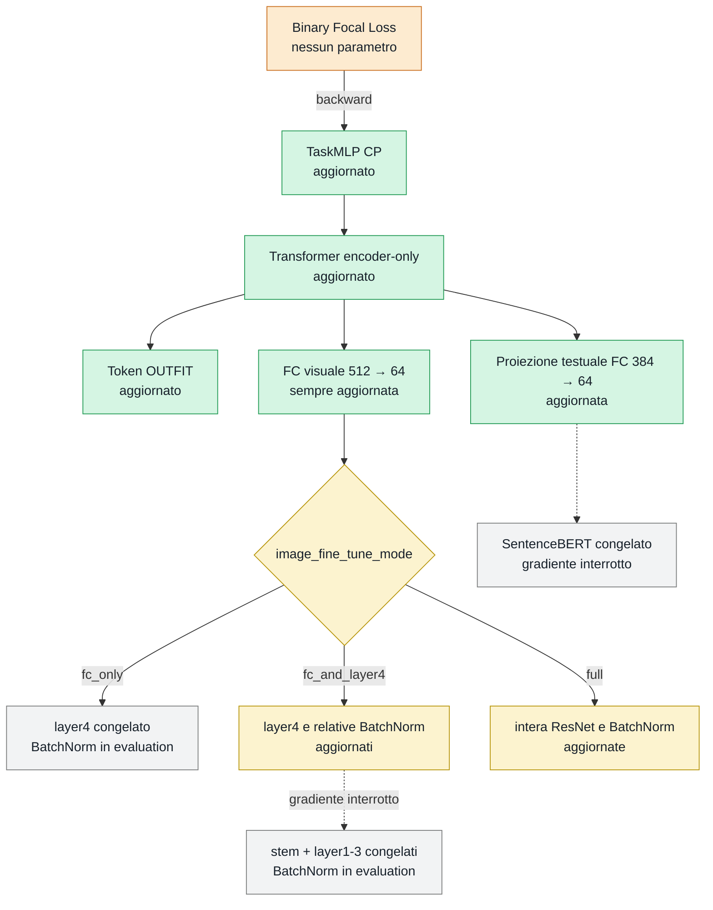
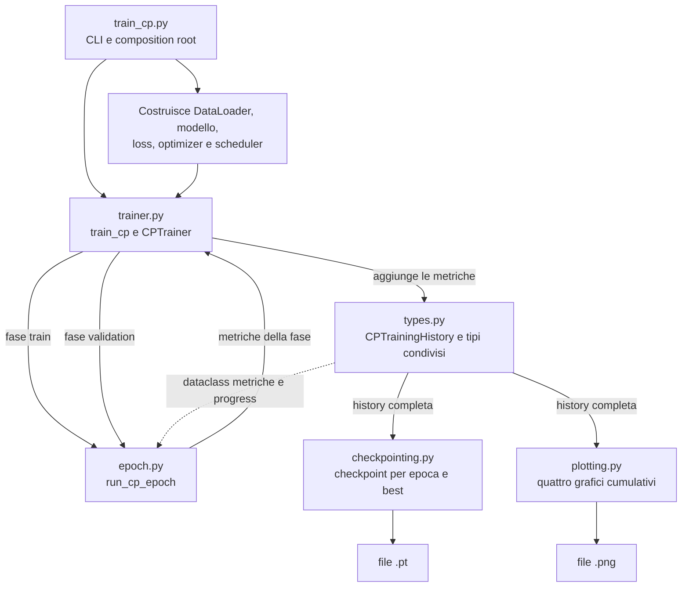

# Training CP

Pipeline modulare per allenare OutfitTransformer sul task di **Compatibility
Prediction (CP)**. Il modello riceve un outfit e predice se è compatibile
(`1`) oppure incompatibile (`0`).

- [Training generale](../README.md)
- [Modello CP](../../model/cp/README.md)
- [Loader Polyvore](../../data/polyvore_loader/README.md)
- [Valutazione](../../evaluate/README.md)

## Indice

- [Avvio rapido](#avvio-rapido)
- [Cosa viene aggiornato nel training](#cosa-viene-aggiornato-nel-training)
- [Fine-tuning ResNet-18](#fine-tuning-resnet-18)
  - [Pesi iniziali](#pesi-iniziali)
  - [Modalità di fine-tuning](#modalità-di-fine-tuning)
- [Grafici](#grafici)
- [Checkpoint e resume](#checkpoint-e-resume)
- [Flag CLI](#flag-cli)
- [Test](#test)
- [File e flusso dei moduli](#file-e-flusso-dei-moduli)
- [Esempi](#esempi)

## Avvio rapido

```powershell
python -m pip install -r requirements.txt
hf auth login
```

Il comando di training predefinito è riportato nella sezione
[Esempi](#esempi). La configurazione predefinita usa:

- Polyvore `disjoint`;
- 30 epoche e batch size 32;
- ResNet-18 inizializzata con ImageNet;
- fine-tuning ResNet in modalità `fc_only`;
- Binary Focal Loss e Adam;
- validation loss per scegliere il checkpoint migliore, configurabile con
  `--best-metric`;
- ROC AUC calcolata su train e validation a ogni epoca;
- quattro grafici cumulativi salvati dopo ogni epoca.

## Cosa viene aggiornato nel training

Il grafo mostra il percorso del gradiente durante `loss.backward()`. Dopo il
backward viene applicato il gradient clipping; Adam aggiorna soltanto i
parametri allenabili che hanno ricevuto un gradiente.


```mermaid
flowchart TD
    A["Binary Focal Loss<br/>nessun parametro"] -->|backward| B["TaskMLP CP<br/>aggiornato"]
    B --> C["Transformer encoder-only<br/>aggiornato"]

    C --> D["Token OUTFIT<br/>aggiornato"]
    C --> E["FC visuale 512 → 64<br/>sempre aggiornata"]
    C --> F["Proiezione testuale FC 384 → 64<br/>aggiornata"]

    E --> G{"image_fine_tune_mode"}
    G -->|fc_only| H["layer4 congelato<br/>BatchNorm in evaluation"]
    G -->|fc_and_layer4| I["layer4 e relative BatchNorm<br/>aggiornati"]
    I -.->|gradiente interrotto| J["stem + layer1-3 congelati<br/>BatchNorm in evaluation"]
    G -->|full| L["intera ResNet e BatchNorm<br/>aggiornate"]

    F -.-> K["SentenceBERT congelato<br/>gradiente interrotto"]

    classDef trained fill:#d5f5e3,stroke:#239b56,color:#17202a
    classDef conditional fill:#fcf3cf,stroke:#b7950b,color:#17202a
    classDef frozen fill:#f2f3f4,stroke:#7b7d7d,color:#17202a
    classDef loss fill:#fdebd0,stroke:#ca6f1e,color:#17202a

    class B,C,D,E,F trained
    class G,I,L conditional
    class H,J,K frozen
    class A loss
```

In tutte le modalità vengono quindi aggiornati:

- classificatore `TaskMLP` del CP;
- tutti i parametri del Transformer encoder-only;
- token apprendibile `OUTFIT`;
- FC visuale `Linear(512, 64)`;
- proiezione testuale `Linear(384, 64)`.

Con `fc_and_layer4` vengono aggiornati anche `layer4` e le sue BatchNorm. Con
`full` viene aggiornata l'intera ResNet, comprese tutte le BatchNorm. Con
`fc_only`, tutto il backbone prima della FC resta congelato. SentenceBERT resta
sempre congelato.

Durante validation il modello usa `eval()` e gradienti disabilitati: nessun
parametro e nessuna statistica BatchNorm vengono aggiornati.

## Fine-tuning ResNet-18

Inizializzazione e politica di fine-tuning sono configurazioni indipendenti.

### Pesi iniziali

| Flag | Comportamento |
|---|---|
| default | carica i pesi ImageNet |
| `--no-pretrained-image` | inizializza ResNet-18 con pesi casuali |

`--no-pretrained-image` non sblocca automaticamente il backbone. I blocchi
congelati dalla modalità di fine-tuning restano congelati anche quando hanno
pesi casuali. Combinandolo con `--image-fine-tune-mode full` si allena invece
l'intera ResNet da pesi casuali.

### Modalità di fine-tuning

| Modalità | Parametri ResNet aggiornati | BatchNorm |
|---|---|---|
| `fc_only` (default) | solo FC `512 → 64` | tutti i blocchi feature restano in evaluation |
| `fc_and_layer4` | `layer4` e FC `512 → 64` | BatchNorm di `layer4` allenabili; precedenti congelate |
| `full` | intera ResNet-18, inclusa la FC `512 → 64` | tutte allenabili |

SentenceBERT resta congelato in tutte le modalità. La sua proiezione FC,
il token `OUTFIT`, il Transformer e il classificatore CP restano allenabili.

## Grafici

Matplotlib usa il backend headless `Agg`. Dopo ogni epoca vengono salvati quattro
PNG. Ogni immagine contiene l'intera storia disponibile dall'inizio della run
fino all'epoca corrente:

```text
checkpoints/cp_plots/
  cp_loss_epoch_001.png
  cp_accuracy_epoch_001.png
  cp_auc_epoch_001.png
  cp_validation_accuracy_auc_epoch_001.png
  cp_loss_epoch_002.png
  cp_accuracy_epoch_002.png
  cp_auc_epoch_002.png
  cp_validation_accuracy_auc_epoch_002.png
  ...
```

Contenuto:

1. train loss e validation loss;
2. train accuracy e validation accuracy;
3. train ROC AUC e validation ROC AUC;
4. validation accuracy e validation ROC AUC.

I comandi per scegliere una directory personalizzata o disabilitare i plot sono
raccolti nella sezione [Esempi](#esempi).

Senza validation, il grafico ROC AUC contiene soltanto la curva train e il
grafico validation accuracy/AUC viene omesso.

## Checkpoint e resume

Il training conserva:

```text
checkpoints/cp_epochs/cp_epoch_001.pt
checkpoints/cp_epochs/cp_epoch_002.pt
...
checkpoints/cp_best.pt
```

Il checkpoint migliore usa la metrica scelta con `--best-metric`:

- `val_loss` minimizza la validation loss ed è il default;
- `val_accuracy` massimizza la validation accuracy;
- `val_auc` massimizza la validation ROC AUC.

Il confronto è stretto: in caso di parità resta migliore il checkpoint salvato
prima. `val_accuracy` e `val_auc` richiedono la validation; per compatibilità
con l'API precedente, `val_loss` usa la train loss solo quando la validation
non è disponibile e registra `source=train_fallback`.

Ogni nuovo checkpoint contiene:

| Campo | Contenuto |
|---|---|
| `checkpoint_schema_version` | versione del formato |
| `epoch` | ultima epoca completata |
| `model_state_dict` | stato del modello |
| `optimizer_state_dict` | stato dell'optimizer |
| `scheduler_state_dict` | stato dello scheduler, quando presente |
| `train_metrics` | metriche train correnti |
| `validation_metrics` | loss, accuracy e AUC validation correnti |
| `selection` | metrica, sorgente, direzione, valore corrente, migliore storico e `is_best` |
| `training_history` | curve complete con numeri di epoca reali |
| `run_config` | dataset, modello, modalità ResNet e iperparametri |
| `rng_state` | RNG Python, NumPy, PyTorch CPU e CUDA |

Il salvataggio avviene in modo atomico: un checkpoint completo sostituisce il
file finale solo dopo che la scrittura è terminata.

I comandi di resume sono raccolti nella sezione [Esempi](#esempi).

Con i nuovi checkpoint, history, migliore metrica, optimizer, scheduler e RNG
vengono ripristinati. I grafici delle epoche successive includono anche le
epoche precedenti. A parità di ambiente e input, una run interrotta può quindi
continuare con la stessa sequenza di shuffle e dropout.

Nel resume, stato optimizer e scheduler del checkpoint è autorevole. Eventuali
valori CLI diversi per learning rate, weight decay, `lr-step-size` e
`lr-gamma` non vengono applicati: il log mostra il valore ignorato e quello
effettivo. Batch size, loss e gradient clipping usano invece i valori della
nuova invocazione e ogni differenza dalla configurazione salvata viene
segnalata.

I checkpoint legacy restano caricabili. Non contengono però la storia completa
né il migliore storico né la modalità ResNet: il resume può recuperare soltanto
le metriche dell'ultima epoca salvata, usa quella loss come riferimento iniziale
e applica la modalità scelta nella nuova CLI. Il log segnala
`history=legacy_partial`.

I checkpoint schema 2 vengono interpretati come selezionati tramite `val_loss`.
Se `--best-metric` cambia durante il resume, il migliore storico viene
ricalcolato dalla `training_history`; con un checkpoint legacy privo di history
completa il log segnala che le epoche precedenti non sono ricostruibili.

Cambiare `--image-fine-tune-mode` durante un resume è consentito per supportare
strategie a fasi, ma viene segnalato nel log.

## Flag CLI

Il comando per visualizzare l'help completo è riportato nella sezione
[Esempi](#esempi).

| Flag | Default | Funzione |
|---|---:|---|
| `--variant` | `disjoint` | variante Polyvore |
| `--epochs` | `30` | ultima epoca totale |
| `--batch-size` | `32` | outfit per batch |
| `--learning-rate` | `5e-5` | learning rate Adam |
| `--weight-decay` | `1e-4` | weight decay Adam |
| `--lr-step-size` | `10` | periodo StepLR |
| `--lr-gamma` | `0.5` | fattore StepLR |
| `--focal-alpha` | `0.5` | alpha Focal Loss |
| `--focal-gamma` | `1.0` | gamma Focal Loss |
| `--max-grad-norm` | `1.0` | gradient clipping globale |
| `--workers` | `0` | worker DataLoader |
| `--seed` | `42` | seed Python, NumPy e PyTorch CPU/CUDA |
| `--log-interval` | `50` | intervallo log batch; `0` disabilita |
| `--device` | automatico | CUDA quando disponibile, altrimenti CPU |
| `--cache-dir` | cache HF | cache dataset e Hub |
| `--checkpoint` | `checkpoints/cp_best.pt` | checkpoint migliore |
| `--best-metric` | `val_loss` | `val_loss`, `val_accuracy` o `val_auc` |
| `--checkpoint-dir` | `checkpoints/cp_epochs` | checkpoint per epoca |
| `--resume` | disabilitato | checkpoint da riprendere |
| `--plot-dir` | `checkpoints/cp_plots` | grafici cumulativi |
| `--no-plots` | falso | disabilita grafici |
| `--text-model` | `all-MiniLM-L6-v2` | SentenceBERT Hub o locale |
| `--no-pretrained-image` | falso | niente inizializzazione ImageNet |
| `--image-fine-tune-mode` | `fc_only` | `fc_only`, `fc_and_layer4` o `full` |

## Test

I test non richiedono Polyvore né download di modelli:

```powershell
python -m unittest discover -v
```

Coprono runner train/validation, AUC, checkpoint nuovo e legacy, best storico,
schema checkpoint, equivalenza run continua/resume con RNG, grafici PNG, flag
ResNet, parametri allenabili e stato BatchNorm.

## File e flusso dei moduli

### Flusso tra i file


```mermaid
flowchart TD
    CLI["train_cp.py<br/>CLI e composition root"] --> BUILD["Costruisce DataLoader, modello,<br/>loss, optimizer e scheduler"]
    CLI --> TRAINER["trainer.py<br/>train_cp e CPTrainer"]
    BUILD --> TRAINER

    TRAINER -->|fase train| EPOCH["epoch.py<br/>run_cp_epoch"]
    TRAINER -->|fase validation| EPOCH
    EPOCH -->|metriche della fase| TRAINER

    TRAINER -->|aggiunge le metriche| TYPES["types.py<br/>CPTrainingHistory e tipi condivisi"]
    TYPES -->|history completa| CHECKPOINT["checkpointing.py<br/>checkpoint per epoca e best"]
    TYPES -->|history completa| PLOT["plotting.py<br/>quattro grafici cumulativi"]

    CHECKPOINT --> PT["file .pt"]
    PLOT --> PNG["file .png"]

    TYPES -.->|dataclass metriche e progress| EPOCH
```

Il flusso completo di ogni epoca è:

1. `train_cp.py` legge i flag e costruisce tutte le dipendenze concrete;
2. `trainer.py` chiede a `epoch.py` di eseguire la fase train;
3. `trainer.py` chiede allo stesso runner di eseguire la validation con AUC;
4. le metriche vengono aggiunte a `CPTrainingHistory` in `types.py`;
5. `checkpointing.py` salva stato corrente, best e history;
6. `plotting.py` legge la stessa history e genera i quattro grafici cumulativi;
7. callback e log ricevono i risultati dell'epoca completata.

### Responsabilità di ogni file

| File | Cosa contiene | Quando modificarlo |
|---|---|---|
| `train_cp.py` | Parser CLI, creazione loader, modello, loss, Adam, StepLR, resume e collegamento callback | Per aggiungere flag, cambiare default o cambiare la composizione della run |
| `trainer.py` | `CPTrainer`, `CPTrainerConfig`, callback e API breve `train_cp()` | Per cambiare l'ordine delle fasi o il comportamento generale tra le epoche |
| `epoch.py` | `run_cp_epoch()` e `CPEpochAccumulator`; forward, loss, backward, clipping, optimizer e metriche | Per cambiare ciò che accade dentro un batch o dentro una singola fase |
| `types.py` | `CPEpochMetrics`, `CPTrainingHistory`, progress batch e informazioni checkpoint | Per aggiungere nuove metriche o dati condivisi, senza introdurre I/O |
| `checkpointing.py` | Checkpoint atomici, schema, best loss, config, RNG e compatibilità legacy | Per cambiare formato o politica di salvataggio e resume |
| `plotting.py` | Backend `Agg` e generazione dei quattro PNG cumulativi | Per cambiare stile, nomi o contenuto dei grafici |
| `__init__.py` | Export pubblici del package `training.cp` | Quando un nuovo componente deve diventare parte dell'API pubblica |
| `README.md` | Documentazione operativa del training CP | Quando cambiano flusso, flag o formato degli artefatti |

I test aggiunti sono separati dal codice di produzione:

| File | Copertura |
|---|---|
| `tests/training/cp/test_epoch_and_trainer.py` | runner, AUC, history, best checkpoint, schema, RNG e resume |
| `tests/training/cp/test_plotting_and_resnet.py` | grafici PNG, flag ResNet, parametri allenabili e BatchNorm |

### Come sostituire il runner senza perdere gli altri componenti

`CPTrainer` accetta un `epoch_runner` sostituibile. Un runner personalizzato può
modificare la logica di train/validation riutilizzando comunque history,
checkpoint, plotting e callback:

```python
from training import CPTrainer, CPTrainerConfig

trainer = CPTrainer(
    model=model,
    optimizer=optimizer,
    criterion=criterion,
    scheduler=scheduler,
    epoch_runner=my_cp_epoch_runner,
)

history = trainer.fit(
    train_loader,
    validation_batches=validation_loader,
    config=CPTrainerConfig(epochs=20, device="cuda"),
)
```

Se cambia soltanto un'azione a fine epoca, è sufficiente aggiungere una
callback tramite `CPTrainingCallbacks` o tramite gli argomenti callback di
`train_cp()`; non serve riscrivere il runner.

## Esempi

Tutti i comandi di esempio del training CP sono raccolti qui e sono identici
nella guida generale e nella guida specifica CP.

### Avvio e configurazione

```powershell
# Configurazione predefinita
python -m training.cp.train_cp

# Allena layer4 e FC visuale
python -m training.cp.train_cp `
  --variant disjoint `
  --epochs 20 `
  --batch-size 32 `
  --image-fine-tune-mode fc_and_layer4

# Fine-tuning completo della ResNet
python -m training.cp.train_cp `
  --image-fine-tune-mode full

# Sceglie il checkpoint migliore tramite validation AUC
python -m training.cp.train_cp `
  --best-metric val_auc

# Usa una GPU specifica e riduce la frequenza dei log batch
python -m training.cp.train_cp `
  --device cuda:0 `
  --log-interval 100

# Riduce il batch size quando la VRAM è limitata
python -m training.cp.train_cp --batch-size 8

# Usa un modello SentenceBERT locale
python -m training.cp.train_cp `
  --text-model D:\models\all-MiniLM-L6-v2
```

### Artefatti e grafici

```powershell
# Salva checkpoint e grafici di una nuova run in cartelle dedicate
python -m training.cp.train_cp `
  --epochs 30 `
  --checkpoint checkpoints\experiment_01\best.pt `
  --checkpoint-dir checkpoints\experiment_01\epochs `
  --plot-dir checkpoints\experiment_01\plots

# Cambia soltanto la directory dei grafici
python -m training.cp.train_cp `
  --plot-dir artifacts\cp_plots

# Disabilita i grafici
python -m training.cp.train_cp --no-plots
```

### Resume

```powershell
# Riprende dal checkpoint migliore
python -m training.cp.train_cp `
  --epochs 40 `
  --resume checkpoints\cp_best.pt `
  --image-fine-tune-mode fc_only

# Riprende da una specifica epoca
python -m training.cp.train_cp `
  --epochs 40 `
  --resume checkpoints\cp_epochs\cp_epoch_020.pt `
  --image-fine-tune-mode fc_and_layer4

# Riprende salvando i nuovi artefatti in cartelle separate
python -m training.cp.train_cp `
  --epochs 40 `
  --resume checkpoints\cp_best.pt `
  --image-fine-tune-mode fc_only `
  --checkpoint checkpoints\resume_01\best.pt `
  --checkpoint-dir checkpoints\resume_01\epochs `
  --plot-dir checkpoints\resume_01\plots
```

### Help CLI

```powershell
python -m training.cp.train_cp --help
```
