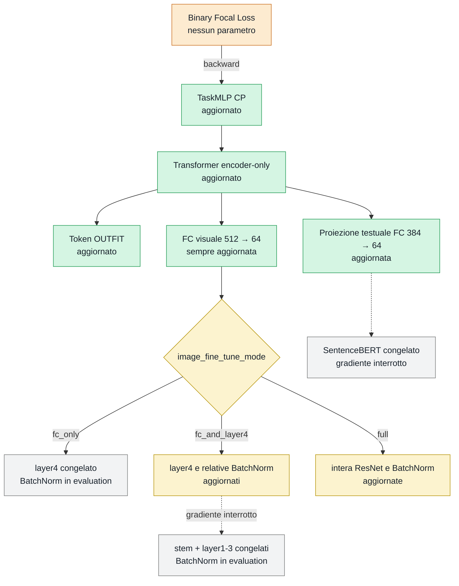
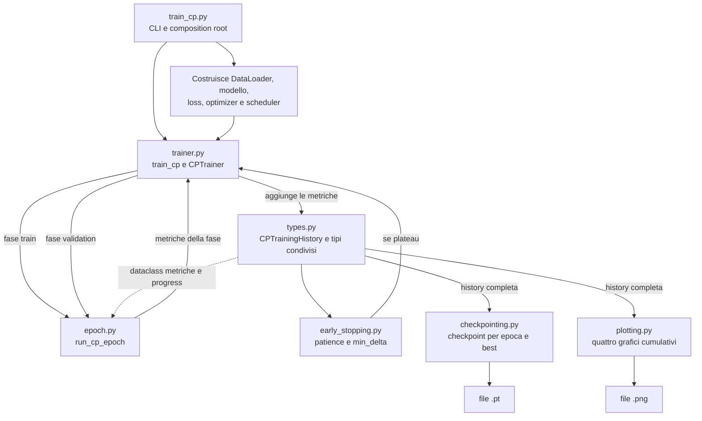

# Training CP

Pipeline modulare per allenare OutfitTransformer sul task di **Compatibility
Prediction (CP)**. Il modello riceve un outfit e predice se è compatibile
(`1`) oppure incompatibile (`0`).

- [Training generale](../README.md)
- [Modello CP](../../model/cp/README.md)
- [Loader Polyvore](../../data/polyvore_loader/README.md)
- [Valutazione](../../evaluate/README.md)

## Indice

- [Avvio rapido](#avvio-rapido)
- [Cosa viene aggiornato nel training](#cosa-viene-aggiornato-nel-training)
- [Fine-tuning ResNet-18](#fine-tuning-resnet-18)
  - [Pesi iniziali](#pesi-iniziali)
  - [Modalità di fine-tuning](#modalità-di-fine-tuning)
- [Grafici](#grafici)
- [Checkpoint e resume](#checkpoint-e-resume)
- [Early stopping](#early-stopping)
- [Nuova fase di fine-tuning](#nuova-fase-di-fine-tuning)
- [Serie di esperimenti](#serie-di-esperimenti)
- [Flag CLI training normale](#flag-cli-training-normale)
- [File e flusso dei moduli](#file-e-flusso-dei-moduli)
- [Esempi](#esempi)

## Avvio rapido

```powershell
python -m pip install -r requirements.txt
hf auth login
```

Il comando di training predefinito è riportato nella sezione
[Esempi](#esempi). La configurazione predefinita usa:

- Polyvore `disjoint`;
- batch size 50;
- ResNet-18 inizializzata con ImageNet;
- fine-tuning completo della ResNet, come dichiarato nel paper;
- Adam con learning rate `1e-5` e StepLR ogni 10 epoche con fattore `0.5`;
- Binary Focal Loss;
- validation ROC AUC per scegliere il checkpoint migliore, configurabile con
  `--best-metric`;
- early stopping disabilitato finché non viene richiesto via CLI;
- ROC AUC calcolata su train e validation a ogni epoca;
- quattro grafici cumulativi salvati dopo ogni epoca.

Batch size, ResNet-18 preaddestrata, fine-tuning dell'image encoder, Adam,
learning rate e scheduler sono dichiarati nel paper. Il paper non specifica
numero di epoche, weight decay, criterio del best checkpoint, seed, gradient
clipping né iperparametri della focal loss: i default di progetto sono
rispettivamente 30, `0.0`, `val_auc`, 42, `1.0`, alpha `0.5` e gamma `1.0`.

## Cosa viene aggiornato nel training

Il grafo mostra il percorso del gradiente durante `loss.backward()`. Dopo il
backward viene applicato il gradient clipping; Adam aggiorna soltanto i
parametri allenabili che hanno ricevuto un gradiente.


```mermaid
flowchart TD
    A["Binary Focal Loss<br/>nessun parametro"] -->|backward| B["TaskMLP CP<br/>aggiornato"]
    B --> C["Transformer encoder-only<br/>aggiornato"]

    C --> D["Token OUTFIT<br/>aggiornato"]
    C --> E["FC visuale 512 → 64<br/>sempre aggiornata"]
    C --> F["Proiezione testuale FC 384 → 64<br/>aggiornata"]

    E --> G{"image_fine_tune_mode"}
    G -->|fc_only| H["layer4 congelato<br/>BatchNorm in evaluation"]
    G -->|fc_and_layer4| I["layer4 e relative BatchNorm<br/>aggiornati"]
    I -.->|gradiente interrotto| J["stem + layer1-3 congelati<br/>BatchNorm in evaluation"]
    G -->|full| L["intera ResNet e BatchNorm<br/>aggiornate"]

    F -.-> K["SentenceBERT congelato<br/>gradiente interrotto"]

    classDef trained fill:#d5f5e3,stroke:#239b56,color:#17202a
    classDef conditional fill:#fcf3cf,stroke:#b7950b,color:#17202a
    classDef frozen fill:#f2f3f4,stroke:#7b7d7d,color:#17202a
    classDef loss fill:#fdebd0,stroke:#ca6f1e,color:#17202a

    class B,C,D,E,F trained
    class G,I,L conditional
    class H,J,K frozen
    class A loss
```

In tutte le modalità vengono quindi aggiornati:

- classificatore `TaskMLP` del CP;
- tutti i parametri del Transformer encoder-only;
- token apprendibile `OUTFIT`;
- FC visuale `Linear(512, 64)`;
- proiezione testuale `Linear(384, 64)`.

Con `fc_and_layer4` vengono aggiornati anche `layer4` e le sue BatchNorm. Con
`full` viene aggiornata l'intera ResNet, comprese tutte le BatchNorm. Con
`fc_only`, tutto il backbone prima della FC resta congelato. SentenceBERT resta
sempre congelato.

Durante validation il modello usa `eval()` e gradienti disabilitati: nessun
parametro e nessuna statistica BatchNorm vengono aggiornati.

## Fine-tuning ResNet-18

Inizializzazione e politica di fine-tuning sono configurazioni indipendenti.

### Pesi iniziali

| Flag | Comportamento |
|---|---|
| default | carica i pesi ImageNet |
| `--no-pretrained-image` | inizializza ResNet-18 con pesi casuali |

`--no-pretrained-image` non sblocca automaticamente il backbone. I blocchi
congelati dalla modalità di fine-tuning restano congelati anche quando hanno
pesi casuali. Combinandolo con `--image-fine-tune-mode full` si allena invece
l'intera ResNet da pesi casuali.

### Modalità di fine-tuning

| Modalità | Parametri ResNet aggiornati | BatchNorm |
|---|---|---|
| `fc_only` | solo FC `512 → 64` | tutti i blocchi feature restano in evaluation |
| `fc_and_layer4` | `layer4` e FC `512 → 64` | BatchNorm di `layer4` allenabili; precedenti congelate |
| `full` (default) | intera ResNet-18, inclusa la FC `512 → 64` | tutte allenabili |

SentenceBERT resta congelato in tutte le modalità. La sua proiezione FC,
il token `OUTFIT`, il Transformer e il classificatore CP restano allenabili.

## Grafici

Matplotlib usa il backend headless `Agg`. Dopo ogni epoca vengono salvati quattro
PNG. Ogni immagine contiene l'intera storia disponibile dall'inizio della run
fino all'epoca corrente:

```text
checkpoints/cp_plots/
  cp_loss_epoch_001.png
  cp_accuracy_epoch_001.png
  cp_auc_epoch_001.png
  cp_validation_accuracy_auc_epoch_001.png
  cp_loss_epoch_002.png
  cp_accuracy_epoch_002.png
  cp_auc_epoch_002.png
  cp_validation_accuracy_auc_epoch_002.png
  ...
```

Contenuto:

1. train loss e validation loss;
2. train accuracy e validation accuracy;
3. train ROC AUC e validation ROC AUC;
4. validation accuracy e validation ROC AUC.

I comandi per scegliere una directory personalizzata o disabilitare i plot sono
raccolti nella sezione [Esempi](#esempi).

Senza validation, il grafico ROC AUC contiene soltanto la curva train e il
grafico validation accuracy/AUC viene omesso.

## Checkpoint e resume

Il training conserva:

```text
checkpoints/cp_epochs/cp_epoch_001.pt
checkpoints/cp_epochs/cp_epoch_002.pt
...
checkpoints/cp_best.pt
```

Il checkpoint migliore usa la metrica scelta con `--best-metric`:

- `val_loss` minimizza la validation loss;
- `val_accuracy` massimizza la validation accuracy;
- `val_auc` massimizza la validation ROC AUC ed è il default.

Il confronto è stretto: in caso di parità resta migliore il checkpoint salvato
prima. `val_accuracy` e `val_auc` richiedono la validation; per compatibilità
con l'API precedente, `val_loss` usa la train loss solo quando la validation
non è disponibile e registra `source=train_fallback`.

Ogni nuovo checkpoint contiene:

| Campo | Contenuto |
|---|---|
| `checkpoint_schema_version` | versione del formato |
| `epoch` | ultima epoca completata |
| `model_state_dict` | stato del modello |
| `optimizer_state_dict` | stato dell'optimizer |
| `scheduler_state_dict` | stato dello scheduler, quando presente |
| `train_metrics` | metriche train correnti |
| `validation_metrics` | loss, accuracy e AUC validation correnti |
| `selection` | metrica, sorgente, direzione, valore corrente, migliore storico e `is_best` |
| `training_history` | curve complete con numeri di epoca reali |
| `run_config` | dataset, modello, modalità ResNet e iperparametri |
| `rng_state` | RNG Python, NumPy, PyTorch CPU e CUDA |

Il salvataggio avviene in modo atomico: un checkpoint completo sostituisce il
file finale solo dopo che la scrittura è terminata.

I comandi di resume sono raccolti nella sezione [Esempi](#esempi).

Con i nuovi checkpoint, history, migliore metrica, optimizer, scheduler e RNG
vengono ripristinati. I grafici delle epoche successive includono anche le
epoche precedenti. A parità di ambiente e input, una run interrotta può quindi
continuare con la stessa sequenza di shuffle e dropout.

Nel resume, stato optimizer e scheduler del checkpoint è autorevole. Eventuali
valori CLI diversi per learning rate, weight decay, `lr-step-size` e
`lr-gamma` non vengono applicati: il log mostra il valore ignorato e quello
effettivo. Batch size, loss e gradient clipping usano invece i valori della
nuova invocazione e ogni differenza dalla configurazione salvata viene
segnalata.

I checkpoint legacy restano caricabili. Non contengono però la storia completa
né il migliore storico né la modalità ResNet: il resume può recuperare soltanto
le metriche dell'ultima epoca salvata, usa quella loss come riferimento iniziale
e applica la modalità scelta nella nuova CLI. Il log segnala
`history=legacy_partial`.

I checkpoint schema 2 vengono interpretati come selezionati tramite `val_loss`.
Se `--best-metric` cambia durante il resume, il migliore storico viene
ricalcolato dalla `training_history`; con un checkpoint legacy privo di history
completa il log segnala che le epoche precedenti non sono ricostruibili.

Cambiare `--image-fine-tune-mode` durante un resume è consentito per supportare
strategie a fasi, ma viene segnalato nel log.

## Early stopping

Training normale e fine-tuning accettano gli stessi flag:

```powershell
--early-stopping-patience 4 --early-stopping-min-delta 0.0001
```

`--early-stopping-patience N` interrompe dopo `N` epoche di validation
consecutive senza miglioramento sufficiente. La metrica osservata è quella
scelta con `--best-metric`; `min-delta` è il miglioramento minimo richiesto per
azzerare la patience. Senza `--early-stopping-patience` la funzione resta
disabilitata. Checkpoint, grafici e callback dell'ultima epoca vengono
completati prima dell'interruzione.

Nel resume esatto di `train_cp`, lo stato viene ricostruito dalla history del
checkpoint. In `fine_tune_cp` la nuova fase parte invece con history e patience
nuove.

## Nuova fase di fine-tuning

`fine_tune_cp` differisce dal resume esatto di `train_cp`:

- carica dal checkpoint soltanto i pesi del modello e il numero di epoca;
- crea optimizer, scheduler, loss, history, RNG e migliore metrica nuovi;
- permette di cambiare tutti gli iperparametri di training;
- può assegnare un learning rate inferiore ai blocchi ResNet allenabili;
- salva la nuova fase in una directory indipendente.

Il numero di epoca continua dal checkpoint sorgente. Con un checkpoint di epoca
6 e `--additional-epochs 10`, la nuova fase esegue le epoche 7–16. History e
best comprendono soltanto queste dieci nuove epoche.

```powershell
python -m training.cp.fine_tune_cp `
  --source-checkpoint checkpoints\experiment_01\best.pt `
  --additional-epochs 10 `
  --output-dir checkpoints\experiment_01_stage2 `
  --image-fine-tune-mode fc_and_layer4 `
  --learning-rate 1e-5 `
  --image-backbone-learning-rate 1e-6 `
  --optimizer adamw `
  --scheduler cosine `
  --loss focal `
  --focal-gamma 1.0 `
  --best-metric val_auc
```

Per riprendere il fine-tuning da una sua epoca, usare quel checkpoint come
nuova sorgente e una directory di output nuova:

```powershell
python -m training.cp.fine_tune_cp `
  --source-checkpoint checkpoints\experiment_01_stage2\epochs\cp_epoch_012.pt `
  --additional-epochs 5 `
  --output-dir checkpoints\experiment_01_stage2_continued `
  --image-fine-tune-mode fc_and_layer4 `
  --learning-rate 5e-6 `
  --image-backbone-learning-rate 5e-7 `
  --optimizer adamw `
  --scheduler cosine `
  --best-metric val_auc
```

La numerazione continua dall'epoca sorgente, ma questa operazione apre una
nuova fase: optimizer, scheduler, history, RNG e best precedente non vengono
ripristinati. I relativi flag definiscono interamente il nuovo stato.

Sono disponibili optimizer `adam` e `adamw`, scheduler `none`, `step` e
`cosine`, loss `focal` e `bce`, gradient clipping configurabile, override di
dropout, batch size, seed, dataset e politica ResNet. `--focal-alpha none` e
`--max-grad-norm none` disabilitano rispettivamente alpha e clipping.

Cambiare dropout è sicuro perché non modifica le shape dei pesi. Dimensioni
embedding, numero di layer Transformer e numero di teste vengono invece
ereditati dal checkpoint: cambiarli renderebbe lo state dict incompatibile.
Per evitare sovrascritture accidentali, la CLI rifiuta una `--output-dir` che
contiene già file `.pt`.

## Serie di esperimenti

`run_training_series.py` richiama in successione le CLI esistenti; non duplica
training, loader o checkpointing:

1. `01_paper_end_to_end`: CP end-to-end con gli iperparametri dichiarati nel paper;
2. `02_fc_only_base`: base con sola FC ResNet;
3. `03_layer4_plateau`: `fc_and_layer4`, LR backbone `1e-6`, early stopping AUC;
4. `04_full_low_lr`: full per 4 epoche massime, LR backbone `3e-7`.

| Stage | ResNet | Epoche max | LR task | LR backbone | Weight decay | Scheduler | Early stopping |
|---|---|---:|---:|---:|---:|---|---|
| `01_paper_end_to_end` | `full` | 30 | `1e-5` | `1e-5` | `0.0` | StepLR, ogni 10 epoche × `0.5` | Disabilitato |
| `02_fc_only_base` | `fc_only` | 12 | `1e-5` | Backbone congelato | `1e-4` | StepLR, ogni 10 epoche × `0.5` | patience 3, delta `1e-4` |
| `03_layer4_plateau` | `fc_and_layer4` | 30 aggiuntive | `1e-5` | `1e-6` | `1e-4` | Cosine, `T_max=30`, minimo `0` | patience 4, delta `1e-4` |
| `04_full_low_lr` | `full` | 4 aggiuntive | `3e-6` | `3e-7` | `1e-4` | Cosine, `T_max=4`, minimo `0` | patience 2, delta `1e-4` |

### Iperparametri completi dei quattro training

I valori riportati sono i default effettivi di `run_training_series.py`.
Quelli indicati come ereditati provengono dal checkpoint dello stage
precedente.

| Iperparametro | `01_paper_end_to_end` | `02_fc_only_base` | `03_layer4_plateau` | `04_full_low_lr` |
|---|---|---|---|---|
| CLI | `training.cp.train_cp` | `training.cp.train_cp` | `training.cp.fine_tune_cp` | `training.cp.fine_tune_cp` |
| Sorgente pesi | ResNet-18 ImageNet e SentenceBERT preaddestrati; componenti CP inizializzati dal modello | ResNet-18 ImageNet e SentenceBERT preaddestrati; componenti CP inizializzati dal modello | `02_fc_only_base/best.pt` | `03_layer4_plateau/best.pt` |
| Dataset | `mvasil/polyvore-outfits` | `mvasil/polyvore-outfits` | `mvasil/polyvore-outfits` | `mvasil/polyvore-outfits` |
| Variante dataset | `disjoint` | `disjoint` | `disjoint` | `disjoint` |
| Epoche massime | 30 | 12 | 30 aggiuntive | 4 aggiuntive |
| Batch size | 50 | 50 | 50 | 50 |
| Modalità ResNet | `full` | `fc_only` | `fc_and_layer4` | `full` |
| Blocchi ResNet allenabili | intera ResNet, FC e BatchNorm | solo FC `512 → 64`; backbone e BatchNorm congelati | `layer4`, relative BatchNorm e FC | intera ResNet, FC e BatchNorm |
| Componenti CP allenabili | Transformer, token `OUTFIT`, proiezione testo e classificatore | Transformer, token `OUTFIT`, proiezione testo e classificatore | Transformer, token `OUTFIT`, proiezione testo e classificatore | Transformer, token `OUTFIT`, proiezione testo e classificatore |
| SentenceBERT | congelato | congelato | congelato, ereditato | congelato, ereditato |
| Modello testuale | `sentence-transformers/all-MiniLM-L6-v2` | `sentence-transformers/all-MiniLM-L6-v2` | ereditato dallo stage 2 | ereditato dallo stage 3 |
| Image embedding | 64 | 64 | 64, ereditato | 64, ereditato |
| Text embedding | 64 | 64 | 64, ereditato | 64, ereditato |
| Item embedding / `d_model` | 128 | 128 | 128, ereditato | 128, ereditato |
| Layer Transformer | 6 | 6 | 6, ereditati | 6, ereditati |
| Teste di attenzione | 16 | 16 | 16, ereditate | 16, ereditate |
| Dimensione feed-forward | 512 | 512 | 512, ereditata | 512, ereditata |
| Dropout | `0.1` | `0.1` | `0.1`, ereditato | `0.1`, ereditato |
| Loss | Binary Focal Loss | Binary Focal Loss | Binary Focal Loss | Binary Focal Loss |
| Focal alpha | `0.5` | `0.5` | `0.5` | `0.5` |
| Focal gamma | `1.0` | `1.0` | `1.0` | `1.0` |
| Optimizer | Adam | Adam | Adam | Adam |
| Adam beta1 | `0.9` | `0.9` | `0.9` | `0.9` |
| Adam beta2 | `0.999` | `0.999` | `0.999` | `0.999` |
| Adam epsilon | `1e-8` | `1e-8` | `1e-8` | `1e-8` |
| LR task | `1e-5` | `1e-5` | `1e-5` | `3e-6` |
| LR backbone ResNet | `1e-5` | non applicabile: congelato | `1e-6` | `3e-7` |
| Weight decay | `0.0` | `1e-4` | `1e-4` | `1e-4` |
| Scheduler | StepLR | StepLR | CosineAnnealingLR | CosineAnnealingLR |
| Step size | 10 | 10 | non applicabile | non applicabile |
| Gamma scheduler | `0.5` | `0.5` | non applicabile | non applicabile |
| `T_max` cosine | non applicabile | non applicabile | 30 | 4 |
| LR minimo cosine | non applicabile | non applicabile | `0.0` | `0.0` |
| Metrica best checkpoint | validation ROC AUC | validation ROC AUC | validation ROC AUC | validation ROC AUC |
| Early stopping | disabilitato | abilitato | abilitato | abilitato |
| Patience | non applicabile | 3 | 4 | 2 |
| `min_delta` | non applicabile | `1e-4` | `1e-4` | `1e-4` |
| Gradient clipping | norma massima `1.0` | norma massima `1.0` | norma massima `1.0` | norma massima `1.0` |
| Seed | 42 | 42 | 42 | 42 |
| DataLoader workers | 0 | 0 | 0 | 0 |
| Device | CUDA se disponibile, altrimenti CPU | CUDA se disponibile, altrimenti CPU | CUDA se disponibile, altrimenti CPU | CUDA se disponibile, altrimenti CPU |
| Log batch | ogni 50 batch | ogni 50 batch | ogni 50 batch | ogni 50 batch |
| Grafici | abilitati | abilitati | abilitati | abilitati |
| Checkpoint | best + uno per epoca | best + uno per epoca | best + uno per epoca | best + uno per epoca |

Lo stage 1 è un baseline indipendente. La catena progressiva usa invece
`02_fc_only_base → 03_layer4_plateau → 04_full_low_lr`.

```powershell
python -m training.cp.run_training_series
```

Anteprima senza allenare:

```powershell
python -m training.cp.run_training_series --dry-run
```

Gli artefatti finiscono in `checkpoints/cp_training_series/<nome-stage>/`.
`--start-stage 3` riparte dal confine di uno stage già completato e verifica
che il checkpoint sorgente esista. Directory contenenti checkpoint non vengono
sovrascritte. Poiché il paper non dichiara il numero di epoche, lo stage 1 usa
30 epoche per default, modificabili con `--paper-epochs`.

## Flag CLI fine-tuning

```powershell
python -m training.cp.fine_tune_cp --help
```

| Flag | Default | Funzione |
|---|---:|---|
| `-h`, `--help` | — | mostra help completo |
| `--source-checkpoint` | obbligatorio | checkpoint CP da cui caricare pesi e numero epoca |
| `--additional-epochs` | `10` | numero di nuove epoche da eseguire |
| `--output-dir` | `checkpoints/cp_fine_tune` | directory per `best.pt`, checkpoint epoca e grafici |
| `--variant` | checkpoint, altrimenti `disjoint` | variante Polyvore: `disjoint` o `nondisjoint` |
| `--batch-size` | `50` | outfit per batch |
| `--learning-rate` | `1e-5` | LR per FC visuale, proiezione testo, token, Transformer e classificatore |
| `--image-backbone-learning-rate` | valore di `--learning-rate` | LR separato per i blocchi ResNet allenabili |
| `--optimizer` | `adam` | optimizer: `adam` o `adamw` |
| `--weight-decay` | `1e-4` | weight decay del nuovo optimizer |
| `--adam-beta1` | `0.9` | primo coefficiente beta di Adam/AdamW |
| `--adam-beta2` | `0.999` | secondo coefficiente beta di Adam/AdamW |
| `--adam-eps` | `1e-8` | epsilon numerico di Adam/AdamW |
| `--scheduler` | `step` | scheduler: `none`, `step` o `cosine` |
| `--lr-step-size` | `10` | epoche tra riduzioni LR con scheduler `step` |
| `--lr-gamma` | `0.5` | fattore di riduzione LR con scheduler `step` |
| `--min-learning-rate` | `0.0` | LR minimo `eta_min` con scheduler `cosine` |
| `--loss` | `focal` | loss: `focal` o `bce` |
| `--focal-alpha` | `0.5` | alpha Focal Loss; `none` lo disabilita |
| `--focal-gamma` | `1.0` | gamma Focal Loss |
| `--best-metric` | `val_auc` | selezione best: `val_loss`, `val_accuracy` o `val_auc` |
| `--early-stopping-patience` | disabilitato | epoche senza miglioramento prima dello stop |
| `--early-stopping-min-delta` | `0.0` | miglioramento minimo; richiede patience |
| `--max-grad-norm` | `1.0` | gradient clipping globale; `none` lo disabilita |
| `--image-fine-tune-mode` | `fc_and_layer4` | politica ResNet: `fc_only`, `fc_and_layer4` o `full` |
| `--dropout` | valore del checkpoint | override dropout senza cambiare shape dei pesi |
| `--text-model` | valore del checkpoint | override percorso SentenceBERT; architettura deve restare compatibile |
| `--workers` | `0` | worker DataLoader |
| `--seed` | `42` | nuovo seed Python, NumPy e PyTorch CPU/CUDA |
| `--device` | automatico | CUDA quando disponibile, altrimenti CPU |
| `--cache-dir` | cache HF | cache dataset e Hub |
| `--log-interval` | `50` | intervallo log batch; `0` disabilita |
| `--no-plots` | falso | disabilita grafici della nuova fase |

## Flag CLI training normale

Il comando per visualizzare l'help completo è riportato nella sezione
[Esempi](#esempi).

| Flag | Default | Funzione |
|---|---:|---|
| `--variant` | `disjoint` | variante Polyvore |
| `--epochs` | `30` | ultima epoca totale |
| `--batch-size` | `50` | outfit per batch |
| `--learning-rate` | `1e-5` | learning rate Adam |
| `--weight-decay` | `0.0` | weight decay Adam |
| `--lr-step-size` | `10` | periodo StepLR |
| `--lr-gamma` | `0.5` | fattore StepLR |
| `--focal-alpha` | `0.5` | alpha Focal Loss |
| `--focal-gamma` | `1.0` | gamma Focal Loss |
| `--max-grad-norm` | `1.0` | gradient clipping globale |
| `--workers` | `0` | worker DataLoader |
| `--seed` | `42` | seed Python, NumPy e PyTorch CPU/CUDA |
| `--log-interval` | `50` | intervallo log batch; `0` disabilita |
| `--device` | automatico | CUDA quando disponibile, altrimenti CPU |
| `--cache-dir` | cache HF | cache dataset e Hub |
| `--checkpoint` | `checkpoints/cp_best.pt` | checkpoint migliore |
| `--best-metric` | `val_auc` | `val_loss`, `val_accuracy` o `val_auc` |
| `--early-stopping-patience` | disabilitato | epoche senza miglioramento prima dello stop |
| `--early-stopping-min-delta` | `0.0` | miglioramento minimo; richiede patience |
| `--checkpoint-dir` | `checkpoints/cp_epochs` | checkpoint per epoca |
| `--resume` | disabilitato | checkpoint da riprendere |
| `--plot-dir` | `checkpoints/cp_plots` | grafici cumulativi |
| `--no-plots` | falso | disabilita grafici |
| `--text-model` | `all-MiniLM-L6-v2` | SentenceBERT Hub o locale |
| `--no-pretrained-image` | falso | niente inizializzazione ImageNet |
| `--image-fine-tune-mode` | `full` | `fc_only`, `fc_and_layer4` o `full` |

## File e flusso dei moduli

### Flusso tra i file


```mermaid
flowchart TD
    CLI["train_cp.py<br/>CLI e composition root"] --> BUILD["Costruisce DataLoader, modello,<br/>loss, optimizer e scheduler"]
    CLI --> TRAINER["trainer.py<br/>train_cp e CPTrainer"]
    BUILD --> TRAINER

    TRAINER -->|fase train| EPOCH["epoch.py<br/>run_cp_epoch"]
    TRAINER -->|fase validation| EPOCH
    EPOCH -->|metriche della fase| TRAINER

    TRAINER -->|aggiunge le metriche| TYPES["types.py<br/>CPTrainingHistory e tipi condivisi"]
    TYPES --> EARLY["early_stopping.py<br/>patience e min_delta"]
    EARLY -->|se plateau| TRAINER
    TYPES -->|history completa| CHECKPOINT["checkpointing.py<br/>checkpoint per epoca e best"]
    TYPES -->|history completa| PLOT["plotting.py<br/>quattro grafici cumulativi"]

    CHECKPOINT --> PT["file .pt"]
    PLOT --> PNG["file .png"]

    TYPES -.->|dataclass metriche e progress| EPOCH
```

Il flusso completo di ogni epoca è:

1. `train_cp.py` legge i flag e costruisce tutte le dipendenze concrete;
2. `trainer.py` chiede a `epoch.py` di eseguire la fase train;
3. `trainer.py` chiede allo stesso runner di eseguire la validation con AUC;
4. le metriche vengono aggiunte a `CPTrainingHistory` in `types.py`;
5. `checkpointing.py` salva stato corrente, best e history;
6. `plotting.py` legge la stessa history e genera i quattro grafici cumulativi;
7. `early_stopping.py` aggiorna la patience sulla metrica di validation;
8. callback e log ricevono i risultati dell'epoca completata.

### Responsabilità di ogni file

| File | Cosa contiene | Quando modificarlo |
|---|---|---|
| `train_cp.py` | Parser CLI, creazione loader, modello, loss, Adam, StepLR, resume e collegamento callback | Per aggiungere flag, cambiare default o cambiare la composizione della run |
| `trainer.py` | `CPTrainer`, `CPTrainerConfig`, callback e API breve `train_cp()` | Per cambiare l'ordine delle fasi o il comportamento generale tra le epoche |
| `epoch.py` | `run_cp_epoch()` e `CPEpochAccumulator`; forward, loss, backward, clipping, optimizer e metriche | Per cambiare ciò che accade dentro un batch o dentro una singola fase |
| `types.py` | `CPEpochMetrics`, `CPTrainingHistory`, progress batch e informazioni checkpoint | Per aggiungere nuove metriche o dati condivisi, senza introdurre I/O |
| `checkpointing.py` | Checkpoint atomici, schema, best loss, config, RNG e compatibilità legacy | Per cambiare formato o politica di salvataggio e resume |
| `fine_tuning.py` | Lettura pesi sorgente e optimizer con gruppi LR distinti | Per cambiare semantica della nuova fase o gruppi di parametri |
| `fine_tune_cp.py` | CLI della nuova fase di fine-tuning | Per aggiungere flag specifici al fine-tuning |
| `early_stopping.py` | Stato puro di patience, `min_delta` e criterio di arresto | Per cambiare la politica di early stopping |
| `run_training_series.py` | Sequenza le quattro CLI di esperimento senza duplicare il training | Per cambiare ordine, nomi o iperparametri degli stage |
| `plotting.py` | Backend `Agg` e generazione dei quattro PNG cumulativi | Per cambiare stile, nomi o contenuto dei grafici |
| `__init__.py` | Export pubblici del package `training.cp` | Quando un nuovo componente deve diventare parte dell'API pubblica |
| `README.md` | Documentazione operativa del training CP | Quando cambiano flusso, flag o formato degli artefatti |

### Come sostituire il runner senza perdere gli altri componenti

`CPTrainer` accetta un `epoch_runner` sostituibile. Un runner personalizzato può
modificare la logica di train/validation riutilizzando comunque history,
checkpoint, plotting e callback:

```python
from training import CPTrainer, CPTrainerConfig

trainer = CPTrainer(
    model=model,
    optimizer=optimizer,
    criterion=criterion,
    scheduler=scheduler,
    epoch_runner=my_cp_epoch_runner,
)

history = trainer.fit(
    train_loader,
    validation_batches=validation_loader,
    config=CPTrainerConfig(epochs=20, device="cuda"),
)
```

Se cambia soltanto un'azione a fine epoca, è sufficiente aggiungere una
callback tramite `CPTrainingCallbacks` o tramite gli argomenti callback di
`train_cp()`; non serve riscrivere il runner.

## Esempi

Tutti i comandi di esempio del training CP sono raccolti qui e sono identici
nella guida generale e nella guida specifica CP.

### Avvio e configurazione

```powershell
# Configurazione predefinita
python -m training.cp.train_cp

# Allena layer4 e FC visuale
python -m training.cp.train_cp `
  --variant disjoint `
  --epochs 20 `
  --batch-size 50 `
  --image-fine-tune-mode fc_and_layer4

# Fine-tuning completo della ResNet
python -m training.cp.train_cp `
  --image-fine-tune-mode full

# Sceglie il checkpoint migliore tramite validation AUC
python -m training.cp.train_cp `
  --best-metric val_auc

# Ferma il training dopo 4 epoche senza un aumento AUC superiore a 0.0001
python -m training.cp.train_cp `
  --early-stopping-patience 4 `
  --early-stopping-min-delta 0.0001

# Usa una GPU specifica e riduce la frequenza dei log batch
python -m training.cp.train_cp `
  --device cuda:0 `
  --log-interval 100

# Riduce il batch size quando la VRAM è limitata
python -m training.cp.train_cp --batch-size 8

# Usa un modello SentenceBERT locale
python -m training.cp.train_cp `
  --text-model D:\models\all-MiniLM-L6-v2
```

### Artefatti e grafici

```powershell
# Salva checkpoint e grafici di una nuova run in cartelle dedicate
python -m training.cp.train_cp `
  --epochs 30 `
  --checkpoint checkpoints\experiment_01\best.pt `
  --checkpoint-dir checkpoints\experiment_01\epochs `
  --plot-dir checkpoints\experiment_01\plots

# Cambia soltanto la directory dei grafici
python -m training.cp.train_cp `
  --plot-dir artifacts\cp_plots

# Disabilita i grafici
python -m training.cp.train_cp --no-plots
```

### Resume

```powershell
# Riprende dal checkpoint migliore
python -m training.cp.train_cp `
  --epochs 40 `
  --resume checkpoints\cp_best.pt `
  --image-fine-tune-mode fc_only

# Riprende da una specifica epoca
python -m training.cp.train_cp `
  --epochs 40 `
  --resume checkpoints\cp_epochs\cp_epoch_020.pt `
  --image-fine-tune-mode fc_and_layer4

# Riprende salvando i nuovi artefatti in cartelle separate
python -m training.cp.train_cp `
  --epochs 40 `
  --resume checkpoints\cp_best.pt `
  --image-fine-tune-mode fc_only `
  --checkpoint checkpoints\resume_01\best.pt `
  --checkpoint-dir checkpoints\resume_01\epochs `
  --plot-dir checkpoints\resume_01\plots
```

### Fase di fine-tuning

```powershell
# Sblocca layer4 con LR dieci volte inferiore al resto del modello
python -m training.cp.fine_tune_cp `
  --source-checkpoint checkpoints\experiment_01\best.pt `
  --additional-epochs 10 `
  --output-dir checkpoints\experiment_01_stage2 `
  --image-fine-tune-mode fc_and_layer4 `
  --learning-rate 1e-5 `
  --image-backbone-learning-rate 1e-6 `
  --best-metric val_auc `
  --early-stopping-patience 4 `
  --early-stopping-min-delta 0.0001

# Nuova fase BCE + AdamW + cosine scheduler
python -m training.cp.fine_tune_cp `
  --source-checkpoint checkpoints\cp_epochs\cp_epoch_005.pt `
  --additional-epochs 8 `
  --output-dir checkpoints\bce_finetune `
  --optimizer adamw `
  --scheduler cosine `
  --loss bce `
  --image-fine-tune-mode fc_only

# Continua da un checkpoint prodotto da una fase di fine-tuning
python -m training.cp.fine_tune_cp `
  --source-checkpoint checkpoints\experiment_01_stage2\epochs\cp_epoch_012.pt `
  --additional-epochs 5 `
  --output-dir checkpoints\experiment_01_stage2_continued `
  --image-fine-tune-mode fc_and_layer4 `
  --learning-rate 5e-6 `
  --image-backbone-learning-rate 5e-7 `
  --best-metric val_auc
```

### Help CLI

```powershell
python -m training.cp.train_cp --help
python -m training.cp.fine_tune_cp --help
python -m training.cp.run_training_series --help
```
